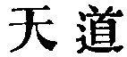

  
[Intangible Textual Heritage](../../index)  [Taoism](../index) 
[Index](index)  [Previous](sbe39083)  [Next](sbe39085) 

------------------------------------------------------------------------

### 77.

77\. 1. May not the Way (or Tâo) of Heaven be compared to the (method
of) bending a bow? The (part of the bow) which was high is brought low,
and what was low is raised up. (So Heaven) diminishes where there is
superabundance, and supplements where there is deficiency.

2\. It is the Way of Heaven to diminish superabundance, and to
supplement deficiency. It is not so with the way of man. He takes away
from those who have not enough to add to his own superabundance.

3\. Who can take his own superabundance and therewith serve all under
heaven? Only he who is in possession of the Tâo!

4\. Therefore the (ruling) sage acts without claiming the results as
his; he achieves his merit and does not rest (arrogantly) in it:--he
does not wish to display his superiority.

 , 'The Way of Heaven;'
but the chapter contrasts that way, unselfish and magnanimous, with the
way of man, selfish and contracted, and illustrates the point by the
method of stringing a bow. This must be seen as it is done in China
fully to understand the illustration. I have known great athletes in
this country tasked to the utmost

p. 120

of their strength to adjust and bend a large Chinese bow from Peking.

The 'sage' of par. 4 is the 'King' of ch. 25. Compare what is said of
him with ch. 2, par. 4, et al.

------------------------------------------------------------------------

[Next: Chapter 78](sbe39085)
