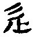

  
[Intangible Textual Heritage](../../index)  [Taoism](../index.md) 
[Index](index)  [Previous](sbe39088)  [Next](sbe39090.md) 

------------------------------------------------------------------------

p. 127

### THE

# WRITINGS OF KWANG-DZE.

## INTRODUCTION.

### BRIEF NOTICES OF THE DIFFERENT BOOKS.

### BOOK I. HSIÂO-YÂO YÛ.

The three characters which form the title of this Book have all of them
the ideagram  , (Ko),
which gives the idea, as the Shwo Wän explains it, of 'now walking, now
halting.' We might render the title by 'Sauntering or Rambling at Ease;'
but it is the untroubled enjoyment of the mind which the author has in
view. And this enjoyment is secured by the Tâo, though that character
does not once occur in the Book. Kwang-Sze illustrates his thesis first
by the cases of creatures, the largest and the smallest, showing that
however different they may be in size, they should not pass judgment on
one another, but may equally find their happiness in the Tâo. From this
he advances to men, and from the cases of Yung-dze and Lieh-dze proceeds
to that of one who finds his enjoyment in himself, independent of every
other being or instrumentality; and we have the three important
definitions of the accomplished Tâoist, as 'the Perfect Man,' 'the
Spirit-like Man,' and 'the Sagely Man.' Those definitions are then
illustrated;--the third in Yâo and Hsü Yû, and the second in the
conversation between Kien Wû and Lien Shû. The description given in this
conversation of the spirit-like man is very startling, and contains
statements that are true only of Him who is a 'Spirit,' 'the Blessed and
only Potentate,' 'Who covereth Himself with light as with a garment, Who
stretcheth out the heavens as a curtain,

p. 128

\[paragraph continues\] Who layeth the beams of His chambers in the
waters, Who maketh the clouds His chariot, Who walketh on the wings of
the wind,' 'Who rideth on a cherub,' 'Who inhabiteth eternity.' The most
imaginative and metaphorical expressions in the Tâo Teh King about the
power of the possessor of the Tâo are tame, compared with the language
of our author. I call attention to it here, as he often uses the same
extravagant style. There follows an illustration of 'the Perfect Man,'
which is comparatively feeble, and part of it, so far as I can see,
inappropriate, though Lin Hsî-kung says that all other interpretations
of the sentences are ridiculous.

In the seventh and last paragraph we have two illustrations that nothing
is really useless, if only used Tâoistically; 'to the same effect,' says
Ziâo Hung, 'as Confucius in the Analects, XVII, ii.' They hang loosely,
however, from what precedes.

An old view of the Book was that Kwang-dze intended himself by the great
phäng, 'which,' says Lû Shû-kih, 'is wide of the mark.'

------------------------------------------------------------------------

[Next: Book II. Khî Wû Lun](sbe39090.md)
