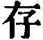
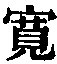
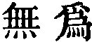

  
[Intangible Textual Heritage](../../index)  [Taoism](../index.md) 
[Index](index)  [Previous](sbe39098)  [Next](sbe39100.md) 

------------------------------------------------------------------------

### BOOK XI. ZÂI YÛ.

The two characters of the title are taken from the first sentence of the
Text, but they express the subject of the Book more fully than the other
titles in this Part do, and almost entitle it to a place in Part I. It
is not easy to translate them, and Mr. Balfour renders them by 'Leniency
towards Faults,' probably construing Zâi as equivalent to our
preposition 'in,' which it often is. But Kwang-dze uses both Zâi and Yû
as verbs, or blends them together, the chief force of the binomial
compound being derived from the significance of the Zâi. Zâi is defined
by Zhun ( ) which gives
the idea of 'preserving' or 'keeping intact,' and Yû by Khwan ( ),'being indulgent' or
'forbearing.' The two characters are afterwards exchanged for other two,
wû wei ( ) 'doing
nothing,' 'inaction,' a grand characteristic of the Tâo.

The following summary of the Book is taken from Hsüan Ying's
explanations of our author:--'The two characters Zâi Yû express the
subject-matter of the Book, and "governing" points out the opposite
error as the disease into which men are prone to fall. Let men be, and
the tendencies of their nature will be at rest, and there will be no
necessity for governing the world. Try to govern it, and the world will
be full of trouble; and men will not be able to rest in the tendencies
of their nature. These are the subjects of the first two paragraphs.

'In the third paragraph we have the erroneous view of Zhui Khü that by
government it was possible to make men's minds good. He did not know
that governing was a disturbing meddling with the minds of men; and how
Lâo-dze set forth the evil of such government, going on till it be
irretrievable. This long paragraph vigorously attacks the injury done by
governing.

'In the fourth paragraph, when Hwang-Tî questions

p. 143

Kwang Khäng-dze, the latter sets aside his inquiry about the government
of the world, and tells him about the government of himself; and in the
fifth, when Yün Kiang asks Hung Mung about governing men, the latter
tells him about the nourishing of the heart. These two great paragraphs
set forth clearly the subtlest points in the policy of Let-a-be. Truly
it is not an empty name.

'In the two last paragraphs, Kwang in his own words and way sets forth,
now by affirmation, and now by negation, the meaning of all that
precedes.'

This summary of the Book will assist the reader in understanding it. For
other remarks that will be helpful, I must refer him to the notes
appended to the Text. The Book is not easy to understand or to
translate; and a remark found in the Kiâ-khing edition of 'the Ten
Philosophers,' by Lû Hsiû-fû, who died in 1279, was welcome to me, 'If
you cannot understand one or two sentences of Kwang-dze, it does not
matter.'

------------------------------------------------------------------------

[Next: Book XII. Thien Tî](sbe39100.md)
