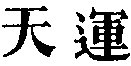
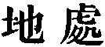

  
[Intangible Textual Heritage](../../index)  [Taoism](../index.md) 
[Index](index)  [Previous](sbe39101)  [Next](sbe39103.md) 

------------------------------------------------------------------------

### BOOK XIV. THIEN YÜN.

The contrast between the movement of the heavens ( ), and the resting of the earth
( ), requires the
translation of the characters of the title by 'The Revolution of
Heaven.' But that idea does not enter largely into the subject-matter of
the Book. 'The whole,' says Hsüan Ying, 'consists of eight paragraphs,
the first three of which show that under the sky there is nothing which
is not dominated by the Tâo, with which the Tîs and the Kings have only
to act in accordance; while the last five set forth how the Tâo is not
to be found in the material forms and changes of things, but in a
spirit-like energy working imperceptibly, developing and controlling all
phenomena.'

I have endeavoured in the notes on the former three paragraphs to make
their meaning less obscure and unconnected than it is on a first
perusal. The five illustrative paragraphs are, we may assume, all of
them factitious, and can hardly be received as genuine productions of
Kwang-dze. In the sixth paragraph, or at least a part of it, Lin
Hsî-kung acknowledges the hand of the forger, and not less unworthy of
credence are in my opinion the rest of it and much of the other four
paragraphs. If they may be

p. 146

taken as from the hand of our author himself, he was too much devoted to
his own system to hold the balance of judgment evenly between Lâo and
Khung.

------------------------------------------------------------------------

[Next: Book XV. Kho Î](sbe39103.md)
