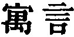
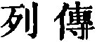
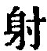

  
[Intangible Textual Heritage](../../index)  [Taoism](../index.md) 
[Index](index)  [Previous](sbe39121)  [Next](sbe39123.md) 

------------------------------------------------------------------------

p. 164

# THE

# WRITINGS OF KWANG-DZE.

## BOOK I.

### PART I. SECTION I.

### Hsiâo-yâo Yû, or 'Enjoyment in Untroubled Ease [1](#fn_41.md).'

1\. In the Northern Ocean there is a fish, the name of which is
Khwän [2](#fn_42.md),--I do not know how many lî in
size. It changes into a bird with the name of Phing, the back of which
is (also)--I do not know how many lî in extent. When this bird rouses
itself and flies, its wings are like clouds all round the sky. When the
sea is moved (so as to bear it along), it prepares to remove to the
Southern Ocean. The Southern Ocean is the Pool of Heaven.

p. 165

There is the (book called) Khî Hsieh [1](#fn_43.md),--a record of marvels. We have in it these
words:--'When the phäng is removing to the Southern Ocean it flaps (its
wings) on the water for 3000 lî. Then it ascends on a whirlwind 90,000
lî, and it rests only at the end of six months.' (But similar to this is
the movement of the breezes which we call) the horses of the fields, of
the dust (which quivers in the sunbeams), and of living things as they
are blown against one another by the air [2](#fn_44.md). Is its azure the proper colour of the
sky? Or is it occasioned by its distance and illimitable extent? If one
were looking down (from above), the very same appearance would just meet
his view.

2\. And moreover, (to speak of) the accumulation of water;--if it be not
great, it will not have strength to support a large boat. Upset a cup of
water in a cavity, and a straw will float on it as if it were a boat.
Place a cup in it, and it will stick fast;--the water is shallow and the
boat is large. (So it is with) the accumulation of wind; if it be not
great, it will not have strength to support great wings. Therefore (the
phäng ascended to) the height of 90,000 lî, and there was such a mass of
wind beneath it; thenceforth the accumulation of wind was sufficient. As
it seemed to bear the blue sky on its back, and there was nothing to
obstruct or arrest its course, it could pursue its way to the South.

p. 166

A cicada and a little dove laughed at it, saying, 'We make an effort and
fly towards an elm or sapan-wood tree; and sometimes before we reach it,
we can do no more but drop to the ground. Of what use is it for this
(creature) to rise 90,000 lî, and make for the South?' He who goes to
the grassy suburbs [1](#fn_45.md), returning to the
third meal (of the day), will have his belly as full as when he set out;
he who goes to a distance of 100 lî will have to pound his grain where
he stops for the night; he who goes a thousand lî, will have to carry
with him provisions for three months. What should these two small
creatures know about the matter? The knowledge of that which is small
does not reach to that which is great; (the experience of) a few years
does not reach to that of many. How do we know that it is so? The
mushroom of a morning does not know (what takes place between) the
beginning and end of a month; the short-lived cicada does not know (what
takes place between) the spring and autumn. These are instances of a
short term of life. In the south of Khû [2](#fn_46), there is the (tree.md) called
Ming-ling [3](#fn_47.md), whose spring is 500
years, and its autumn the same; in high antiquity there was that called
Tâ-khun [4](#fn_48.md),

p. 167

whose spring was 8000 years, and its autumn the same. And Phäng Zû [1](#fn_49.md) is the one man renowned to the present day
for his length of life:--if all men were (to wish) to match him, would
they not be miserable?

3\. In the questions put by Thang [2](#fn_50.md) to
Kî we have similar statements:--'In the bare and barren north there is
the dark and vast ocean,--the Pool of Heaven. In it there is a fish,
several thousand lî in breadth, while no one knows its length. Its name
is the khwän. There is (also) a bird named the phäng; its back is like
the Thâi mountain, while its wings are like clouds all round the sky. On
a whirlwind it mounts upwards as on the whorls of a goat's horn for
90,000 lî, till, far removed from the cloudy vapours, it bears on its
back the blue sky, and then it shapes its course for the South, and
proceeds to the ocean there.' A quail by the side of a marsh laughed at
it, and said, 'Where is it going to? I spring up with a bound, and come
down again when I have reached but a few fathoms, and then fly about
among the brushwood and bushes; and

p. 168

this is the perfection of flying. Where is that creature going to?' This
shows the difference between the small and the great.

Thus it is that men, whose wisdom is sufficient for the duties of some
one office, or whose conduct will secure harmony in some one district,
or whose virtue is befitting a ruler so that they could efficiently
govern some one state, are sure to look on themselves in this manner
(like the quail), and yet Yung-dze [1](#fn_51.md)
of Sung [1](#fn_51.md) would have smiled and
laughed at them. (This Yung-dze), though the whole world should have
praised him, would not for that have stimulated himself to greater
endeavour, and though the whole world should have condemned him, would
not have exercised any more repression of his course; so fixed was he in
the difference between the internal (judgment of himself) and the
external (judgment of others), so distinctly had he marked out the
bounding limit of glory and disgrace. Here, however, he stopped. His
place in the world indeed had become indifferent to him, but still he
had not planted himself firmly (in the right position).

There was Lieh-dze [2](#fn_52.md), who rode on the
wind and pursued his way, with an admirable indifference (to

p. 169

all external things), returning, however, after fifteen days, (to his
place). In regard to the things that (are supposed to) contribute to
happiness, he was free from all endeavours to obtain them; but though he
had not to walk, there was still something for which he had to wait. But
suppose one who mounts on (the ether of) heaven and earth in its normal
operation, and drives along the six elemental energies of the changing
(seasons), thus enjoying himself in the illimitable,--what has he to
wait for'? Therefore it is said, 'The Perfect man has no (thought of)
self; the Spirit-like man, none of merit; the Sagely-minded man, none of
fame [1](#fn_53.md).'

4\. Yâo [2](#fn_54.md), proposing to resign the
throne to Hsü Yû [3](#fn_55.md), said, 'When the
sun and moon have come forth, if the torches have not been put out,
would it not be difficult for them to give light? When the seasonal
rains are coming down, if we still keep watering the ground, will not
our toil be labour lost for all the good it will do? Do you, Master,
stand forth (as sovereign), and the kingdom will (at once) be well
governed. If I still (continue to) preside over it, I must look on
myself as vainly occupying the place;--I beg to resign the throne to
you.' Hsü

p. 170

\[paragraph continues\] Yû said, 'You, Sir, govern the kingdom, and the
kingdom is well governed. If I in these circumstances take your place,
shall I not be doing so for the sake of the name? But the name is but
the guest of the reality;--shall I be playing the part of the guest? The
tailor-bird makes its nest in the deep forest, but only uses a single
branch; the mole [1](#fn_56.md) drinks from the Ho,
but only takes what fills its belly. Return and rest in being ruler,--I
will have nothing to do with the throne. Though the cook were not
attending to his kitchen, the representative of the dead and the officer
of prayer would not leave their cups and stands to take his place.'

5\. Kien Wû [2](#fn_57.md) asked Lien Shû [2](#fn_57.md), saying, 'I heard Khieh-yû [3](#fn_58.md) talking words which were great, but had
nothing corresponding to them (in reality);-once gone, they could not be
brought back. I was frightened by them;--they were like the Milky
Way [4](#fn_59.md) which cannot be traced to its
beginning or end. They had no connexion with one another, and were not
akin to the experiences of men.' 'What were his words?' asked Lien
Shift, and the other replied, (He said) that 'Far away on the hill of
Kû-shih [5](#fn_60.md) there dwelt a Spirit-like
man whose flesh and skin

p. 171

were (smooth) as ice and (white) as snow; that his manner was elegant
and delicate as that of a virgin; that he did not eat any of the five
grains, but inhaled the wind and drank the dew; that he mounted on the
clouds, drove along the flying dragons, rambling and enjoying himself
beyond the four seas; that by the concentration of his spirit-like
powers he could save men from disease and pestilence, and secure every
year a plentiful harvest.' These words appeared to me wild and
incoherent and I did not believe them. 'So it is,' said Lien Shû. 'The
blind have no perception of the beauty of elegant figures, nor the deaf
of the sound of bells and drums. But is it only the bodily senses of
which deafness and blindness can be predicated? There is also a similar
defect in the intelligence; and of this your words supply an
illustration in yourself. That man, with those attributes, though all
things were one mass of confusion, and he heard in that condition the
whole world crying out to him to be rectified, would not have to address
himself laboriously to the task, as if it were his business to rectify
the world. Nothing could hurt that man; the greatest floods, reaching to
the sky, could not drown him, nor would he feel the fervour of the
greatest heats melting metals and stones till they flowed, and scorching
all the ground and hills. From the dust and chaff of himself, he could
still mould and fashion Yâos and Shuns [1](#fn_61.md);how should he be willing to occupy himself
with things [2](#fn_62.md)?'

p. 172

6\. A man of Sung, who dealt in the ceremonial caps (of Yin) [1](#fn_63.md), went with them to Yüeh [2](#fn_64.md), the people of which cut off their hair
and tattooed their bodies, so that they had no use for them. Yâo ruled
the people of the kingdom, and maintained a perfect government within
the four seas. Having gone to see the four (Perfect) Ones [3](#fn_65.md) on the distant hill of Kû-shih, when (he
returned to his capital) on the south of the Fän water [4](#fn_66.md), his throne appeared no more to his
deep-sunk oblivious eyes [5](#fn_67.md).

7\. Hui-dze [6](#fn_68.md) told Kwang-dze, saying,
'The king of Wei [7](#fn_69.md) sent me some seeds
of a large calabash, which I sowed. The fruit, when fully grown, could
contain five piculs (of anything). I used it to contain water,

p. 173

but it was so heavy that I could not lift it by myself. I cut it in two
to make the parts into drinking vessels; but the dried shells were too
wide and unstable and would not hold (the liquor); nothing but large
useless things! Because of their uselessness I knocked them to pieces.'
Kwang-dze replied, 'You were indeed stupid, my master, in the use of
what was large. There was a man of Sung who was skilful at making a
salve which kept the hands from getting chapped; and (his family) for
generations had made the bleaching of cocoon-silk their business. A
stranger heard of it, and proposed to buy the art of the preparation for
a hundred ounces of silver. The kindred all came together, and
considered the proposal. "We have," said they, "been bleaching
cocoon-silk for generations, and have only gained a little money. Now in
one morning we can sell to this man our art for a hundred ounces;--let
him have it." The stranger accordingly got it and went away with it to
give counsel to the king of Wû [1](#fn_70.md), who
was then engaged in hostilities with Yüeh. The king gave him the command
of his fleet, and in the winter he had an engagement with that of Yüeh,
on which he inflicted a great defeat [2](#fn_71.md), and was invested with a portion of
territory taken from Yüeh. The keeping the hands from getting chapped
was the same in both cases; but in the one case it led to the
investiture (of the possessor of the salve), and

p. 174

in the other it had only enabled its owners to continue their bleaching.
The difference of result was owing to the different use made of the art.
Now you, Sir, had calabashes large enough to hold five piculs;--why did
you not think of making large bottle-gourds of them, by means of which
you could have floated over rivers and lakes, instead of giving yourself
the sorrow of finding that they were useless for holding anything. Your
mind, my master, would seem to have been closed against all
intelligence!'

Hui-dze said to Kwang-dze, 'I have a large tree, which men call the
Ailantus [1](#fn_72.md). Its trunk swells out to a
large size, but is not fit for a carpenter to apply his line to it; its
smaller branches are knotted and crooked, so that the disk and square
cannot be used on them. Though planted on the wayside, a builder would
not turn his head to look at it. Now your words, Sir, are great, but of
no use;--all unite in putting them away from them.' Kwang-dze replied,
'Have you never seen a wildcat or a weasel? There it lies, crouching and
low, till the wanderer approaches; east and west it leaps about,
avoiding neither what is high nor what is low, till it is caught in a
trap, or dies in a net. Again there is the Yak [2](#fn_73.md), so large that it is like a cloud hanging
in the sky. It is large indeed, but it cannot catch mice. You, Sir, have
a large tree and are troubled because it is of no use;--why do you not
plant it in a tract where there is nothing else, or in a wide and barren
wild?

p. 175

\[paragraph continues\] There you might saunter idly by its side, or in
the enjoyment of untroubled case sleep beneath it. Neither bill nor axe
would shorten its existence; there would be nothing to injure it. What
is there in its uselessness to cause you distress?'

------------------------------------------------------------------------

### Footnotes

[164:1](sbe39122.htm#fr_41.md) See notice on pp.
127, 128, on the Title and Subject-matter of the Book.

[164:2](sbe39122.htm#fr_42.md) The khwän and the
phäng are both fabulous creatures, far transcending in size the
dimensions ascribed by the wildest fancy of the West to the kraken and
the roc. Kwang-dze represents them as so huge by way of contrast to the
small creatures which he is intending to introduce;--to show that size
has nothing to do with the Tâo, and the perfect enjoyment which the
possession of it affords. The passage is a good specimen of the Yü Yen
( ) metaphorical or
parabolical narratives or stories, which are the chief characteristic of
our author's writings; but the reader must keep in mind that the idea or
lesson in its 'lodging' is generally of a Tâoistic nature.

[165:1](sbe39122.htm#fr_43.md) There may have been
a book with this title, to which Kwang-dze appeals, as if feeling that
what he had said needed to be substantiated.

[165:2](sbe39122.htm#fr_44.md) This seems to be
interjected as an afterthought, suggesting to the reader that the phäng,
soaring along at such a height, was only an exaggerated form of the
common phenomena with which he was familiar.

[166:1](sbe39122.htm#fr_45.md) In Chinese, Mang
Zhan; but this is not the name of any particular place. The phrase
denotes the grassy suburbs (from their green colour), not far from any
city or town.

[166:2](sbe39122.htm#fr_46.md) The great state of
the South, having its capital Ying in the present Hû-pei, and afterwards
the chief competitor with Khin for the sovereignty of the kingdom.

[166:3](sbe39122.htm#fr_47.md) Taken by some as the
name of a tortoise.

[166:4](sbe39122.htm#fr_48.md) This and the
Ming-ling tree, as well as the mushroom mentioned above, together with
the khwän and phäng, are all mentioned in the fifth Book of the writings
of Lieh-dze, referred to in the next paragraph.

[167:1](sbe39122.htm#fr_49.md) Or 'the patriarch
Phäng.' Confucius compared himself to him (Analects, VII, i);-'our old
Phäng;' and Kû Hsî thinks he was a worthy officer of the Shang dynasty.
Whoever he was, the legends about him are a mass of Tâoistic fables. At
the end of the Shang dynasty (B. C. 1123) he was more than 767 years
old, and still in unabated vigour. We read of his losing 49 wives and 54
sons; and that he still left two sons, Wû and Î, who died in Fû-kien,
and gave their names to the Wû-î, or Bû-î hills, from which we get our
Bohea tea! See Mayers' 'Chinese Reader's Manual,' p. 175.

[167:2](sbe39122.htm#fr_50.md) The founder of the
Shang dynasty (B.C. 1766-1754). In Lieh-dze his interlocutor is called
Hsiâ Ko, and Dze-kî.

[168:1](sbe39122.htm#fr_52.md) We can hardly tell
who this Yung-dze was. Sung was a duchy, comprehending portions of the
present provinces of Ho-nan, An-hui, and Kiang-sû.

[168:2](sbe39122.htm#fr_53.md) See note on the
title of Book XXXII. Whether there ever was a personage called Lieh-dze
or Lieh Yü-khâu, and what is the real character of the writings that go
under his name, are questions that cannot be more than thus alluded to
in a note. He is often introduced by Kwang-dze, and many narratives are
common to their books. Here he comes before us, not as a thinker and
writer, but as a semi-supernatural being, who has only not yet attained
to the highest consummations of the Tâo.

[169:1](sbe39122.htm#fr_54.md) The description of a
master of the Tâo, exalted by it, unless the predicates about him be
nothing but the ravings of a wild extravagance, above mere mortal man.
In the conclusion, however, he is presented under three different
phrases, which the reader will do well to keep in mind.

[169:2](sbe39122.htm#fr_55.md) The great sovereign
with whom the documents of the Shû King commence:--B. C. 2357-2257.

[169:3](sbe39122.htm#fr_56.md) A counsellor of Yâo,
who is once mentioned by Sze-ma Khien in his account of Po-î,--in the
first Book of his Biographies (
). Hsü Yû is here the instance of 'the Sagely man,'
with whom the desire of a name or fame has no influence.

[170:1](sbe39122.htm#fr_57.md) Some say the tapir.

[170:2](sbe39122.htm#fr_59.md) Known to us only
through Kwang-dze.

[170:3](sbe39122.htm#fr_60.md) 'The madman of Khû'
of the Analects, XVIII, 5, who eschews intercourse with Confucius. See
Hwang-fû Mî's account of him, under the surname and name of Lû Thung, in
his Notices of Eminent Tâoists, 1, 25.

[170:4](sbe39122.htm#fr_61.md) Literally, 'the Ho
and the Han;' but the name of those rivers combined was used to denote
'the Milky Way.'

[170:5](sbe39122.htm#fr_62.md) See the Khang-hsî
Thesaurus under the character 
. All which is said about the hill is that it was 'in
the North Sea.'

[171:1](sbe39122.htm#fr_63.md) Shun was the
successor of Yâo, in the ancient kingdom.

[171:2](sbe39122.htm#fr_64.md) All this description
is to give us an idea of the 'Spirit-like man.' We have in it the
results of the Tâo in its fullest embodiment.

[172:1](sbe39122.htm#fr_65.md) See the Lî Kî, IX,
iii, 3.

[172:2](sbe39122.htm#fr_66.md) A state, part of the
present province of Kieh-kiang.

[172:3](sbe39122.htm#fr_67.md) Said to have been
Hsü Yû mentioned above, with Nieh Khüeh, Wang Î, and Phî-î, who will by
and by come before us.

[172:4](sbe39122.htm#fr_68.md) A river in Shan-hsî,
on which was the capital of Yâo;--a tributary of the Ho.

[172:5](sbe39122.htm#fr_69.md) This paragraph is
intended to give us an idea of 'the Perfect man,' who has no thought of
himself. The description, however, is brief and tame, compared with the
accounts of Hsü Yû and of the Spirit-like man.'

[172:6](sbe39122.htm#fr_70.md) Or Hui Shih, the
chief minister of 'king Hui of Liang (or Wei), (B. C. 370-333),' with an
interview between whom and Mencius the works of that philosopher
commence. He was a friend of Kwang-dze, and an eccentric thinker; and in
Book XXXIII there is a long account of several of his views. I do not
think that the conversations about 'the great calabash' and 'the great
tree' really took place; Kwan-dze probably invented them, to illustrate
his point that size had nothing to do with the Tâo, and that things
which seemed useless were not really so when rightly used.

[172:7](sbe39122.htm#fr_71.md) Called also Liang
from the name of its capital. Wei was one of the three states
(subsequently kingdoms), into which the great fief of Zin was divided
about B. C. 400.

[173:1](sbe39122.htm#fr_72.md) A great and ancient
state on the sea-board, north of Yüeh. The name remains in the district
of Wû-kiang in the prefecture of Sû-kâu.

[173:2](sbe39122.htm#fr_73.md) The salve gave the
troops of Wû a great advantage in a war on the Kiang, especially in
winter.

[174:1](sbe39122.htm#fr_74.md) The Ailantus
glandulosa, common in the north of China, called 'the fetid tree,' from
the odour of its leaves.

[174:2](sbe39122.htm#fr_75.md) The bos grunniens of
Thibet, the long tail of which is in great demand for making standards
and chowries.

------------------------------------------------------------------------

[Next: Book II: Khî Wû Lun, or 'The Adjustment of
Controversies'](sbe39123.md)
