  
[Intangible Textual Heritage](../../index)  [Taoism](../index.md) 
[Index](index)  [Previous](sbe39122)  [Next](sbe39124.md) 

------------------------------------------------------------------------

p. 176

## BOOK II.

### PART I. SECTION II.

### Khî Wû Lun, or 'The Adjustment of Controversies [1](#fn_74.md).'

1\. Nan-kwo Sze-khî [2](#fn_75.md) was seated,
leaning forward on his stool. He was looking up to heaven and breathed
gently, seeming to be in a trance, and to have lost all consciousness of
any companion. (His disciple), Yen Khäng Dze-yû [3](#fn_76.md), who was in attendance and standing before
him, said, 'What is this? Can the body be made to become thus like a
withered tree, and the mind to become like slaked lime? His appearance
as he leans forward on the stool to-day is such as I never saw him have
before in the same position.' Dze-khî said, 'Yen, you do well to ask
such a question, I had just now lost myself [4](#fn_77.md); but how should you understand it? You

p. 177

may have heard the notes [1](#fn_78.md) of Man, but
have not heard those of Earth; you may have heard the notes of Earth,
but have not heard those of Heaven.'

Dze-yû said, 'I venture to ask from you a description of all these.' The
reply was, 'When the breath of the Great Mass (of nature) comes
strongly, it is called Wind. Sometimes it does not come so; but when it
does, then from a myriad apertures there issues its excited noise;--have
you not heard it in a prolonged gale? Take the projecting bluff of a
mountain forest;--in the great trees, a hundred spans round, the
apertures and cavities are like the nostrils, or the mouth, or the ears;
now square, now round like a cup or a mortar; here like a wet footprint,
and there like a large puddle. (The sounds issuing from them are like)
those of fretted water, of the arrowy whizz, of the stern command, of
the inhaling of the breath, of the shout, of the gruff note, of the deep
wail, of the sad and piping note. The first notes are slight, and those
that follow deeper, but in harmony with them. Gentle winds produce a
small response; violent winds a great one. When the fierce gusts have
passed away, all the apertures

p. 178

are empty (and still);--have you not seen this in the bending and
quivering of the branches and leaves?'

Dze-yû said, 'The notes of Earth then are simply those which come from
its myriad apertures; and the notes of Man may just be compared to those
which (are brought from the tubes of) bamboo;--allow me to ask about the
notes of Heaven [1](#fn_79.md).' Dze-khî replied,
'When (the wind) blows, (the sounds from) the myriad apertures are
different, and (its cessation) makes them stop of themselves. Both of
these things arise from (the wind and the apertures) themselves:--should
there be any other agency that excites them?'

2\. Great knowledge is wide and comprehensive; small knowledge is
partial and restricted. Great speech is exact and complete; small speech
is (merely) so much talk [2](#fn_80.md). When we
sleep, the soul communicates with (what is external to us); when we
awake, the body is set free. Our intercourse with others then leads to
various activity, and daily there is the striving of mind with mind.
There are hesitancies; deep difficulties; reservations; small
apprehensions causing restless distress, and great

p. 179

apprehensions producing endless fears. Where their utterances are like
arrows from a bow, we have those who feel it their charge to pronounce
what is right and what is wrong.; where they are given out like the
conditions of a covenant, we have those who maintain their views,
determined to overcome. (The weakness of their arguments), like the
decay (of things) in autumn and winter, shows the failing (of the minds
of some) from day to day; or it is like their water which, once voided,
cannot be gathered up again. Then their ideas seem as if fast bound with
cords, showing that the mind is become like an old and dry moat, and
that it is nigh to death, and cannot be restored to vigour and
brightness.

Joy and anger, sadness and pleasure, anticipation and regret, fickleness
and fixedness, vehemence and indolence, eagerness and tardiness;--(all
these moods), like music from an empty tube, or mushrooms from the warm
moisture, day and night succeed to one another and come before us, and
we do not know whence they sprout. Let us stop! Let us stop! Can we
expect to find out suddenly how they are produced?

If there were not (the views of) another, I should not have mine; if
there were not I (with my views), his would be uncalled for:--this is
nearly a true, statement of the case, but we do not know what it is that
makes it be so. It might seem as if there would be a true Governor [1](#fn_81.md) concerned in it, but we do not find

p. 180

any trace (of his presence and acting). That such an One could act so I
believe; but we do not see His form. He has affections, but He has no
form.

Given the body, with its hundred parts, its nine openings, and its six
viscera, all complete in their places, which do I love the most? Do you
love them all equally? or do you love some more than others? Is it not
the case that they all perform the part of your servants and waiting
women? All of them being such, are they not incompetent to rule one
another? or do they take it in turns to be now ruler and now servants?
There must be a true Ruler (among them) [1](#fn_82.md) whether by searching you can find out His
character or not, there is neither advantage nor hurt, so far as the
truth of His operation is concerned. When once we have received the
bodily form complete, its parts do not fail to perform their functions
till the end comes. In conflict with things or in harmony with them,
they pursue their course to the end, with the speed of a galloping horse
which cannot be stopped;--is it not sad? To be constantly toiling all
one's lifetime, without seeing the fruit of one's labour, and to be
weary and worn out with his labour, without knowing where he is going
to:--is it not a deplorable case? Men may say, 'But it is not death;'
yet of what advantage is this? When the body is decomposed, the mind
will be the same along with it:--must not the case be pronounced very
deplorable [2](#fn_83.md)? Is the life

p. 181

of man indeed enveloped in such darkness? Is it I alone to whom it
appears so? And does it not appear to be so to other men?

3\. If we were to follow the judgments of the predetermined mind, who
would be left alone and without a teacher [1](#fn_84.md)? Not only would it be so with those who
know the sequences (of knowledge and feeling) and make their own
selection among them, but it would be so as well with the stupid and
unthinking. For one who has not this determined mind, to have his
affirmations and negations is like the case described in the saying, 'He
went to Yüeh to-day, and arrived at it yesterday [2](#fn_85.md).' It would be making what was not a fact
to be a fact. But even the spirit-like Yü [3](#fn_86.md) could not have known how to do this, and
how should one like me be able to do it?

But speech is not like the blowing (of the wind) the speaker has (a
meaning in) his words. If, however, what he says, be indeterminate (as
from a mind not made up), does he then really speak or not? He thinks
that his words are different from the chirpings of fledgelings; but is
there any distinction between them or not? But how can the Tâo be so
obscured, that there should be 'a True' and 'a False' in it? How can
speech be so obscured that there should be 'the Right' and 'the Wrong'
about them? Where shall the Tâo go to that it will not

p. 182

be found? Where shall speech be found that it will be inappropriate? Tâo
becomes obscured through the small comprehension (of the mind), and
speech comes to be obscure through the vain-gloriousness (of the
speaker). So it is that we have the contentions between the
Literati [1](#fn_87.md) and the Mohists [2](#fn_88.md), the one side affirming what the other
denies, and vice versâ. If we would decide on their several affirmations
and denials, no plan is like bringing the (proper) light (of the
mind) [3](#fn_89.md) to bear on them.

All subjects may be looked at from (two points of view),--from that and
from this. If I look at a thing from another's point of view, I do not
see it; only as I know it myself, do I know it. Hence it is said, 'That
view comes from this; and this view is a consequence of that:'--which is
the theory that that view and this--(the opposite views)-produce each
the other [4](#fn_90.md). Although it be so, there
is affirmed now life and now death; now death and now life; now the
admissibility of a thing and now its inadmissibility; now its
inadmissibility and now its admissibility. (The disputants) now affirm
and now deny; now deny and now affirm. Therefore the sagely man does not
pursue this method, but views things in the light of (his) Heaven [5](#fn_91) (-ly nature.md), and hence forms his judgment
of what is right.

p. 183

This view is the same as that, and that view is the same as this. But
that view involves both a right and a wrong; and this view involves also
a right and a wrong:--are there indeed, or are there not the two views,
that and this? They have not found their point of correspondency which
is called the pivot of the Tâo. As soon as one finds this pivot, he
stands in the centre of the ring (of thought), where he can respond
without end to the changing views;--without end to those affirming, and
without end to those denying. Therefore I said, 'There is nothing like
the proper light (of the mind).'

4\. By means of a finger (of my own) to illustrate that the finger (of
another) is not a finger is not so good a plan as to illustrate that it
is not so by means of what is (acknowledged to be) not a finger; and by
means of (what I call) a horse to illustrate that (what another calls) a
horse is not so, is not so good a plan as to illustrate that it is not a
horse, by means of what is (acknowledged to be) not a horse [1](#fn_92). (All things in.md) heaven and earth may be
(dealt with as) a finger; (each of) their myriads may be (dealt with as)
a horse. Does a thing seem so to me? (I say that) it is so. Does it seem
not so to me? (I say that) it is not so. A path is formed by (constant)

p. 184

treading on the ground. A thing is called by its name through the
(constant) application of the name to it. How is it so? It is so because
it is so. How is it not so? It is not so, because it is not so.
Everything has its inherent character and its proper capability. There
is nothing which has not these. Therefore, this being so, if we take a
stalk of grain [1](#fn_93) and a (large.md) pillar,
a loathsome (leper) and (a beauty like) Hsî Shih [2](#fn_94.md), things large and things insecure, things
crafty and things strange;--they may in the light of the Tâo all be
reduced to the same category (of opinion about them).

It was separation that led to completion; from completion ensued
dissolution. But all things, without regard to their completion and
dissolution, may again be comprehended in their unity;--it is only the
far reaching in thought who know how to comprehend them in this unity.
This being so, let us give up our devotion to our own views, and occupy
ourselves with the ordinary views. These ordinary views are grounded on
the use of things. (The study of that) use leads to the comprehensive
judgment, and that judgment secures the success (of the inquiry). That
success gained, we are near (to the object of our search), and there we
stop. When we stop, and yet we do not know how it is so, we have what is
called the Tâo.

When we toil our spirits and intelligence, obstinately

p. 185

determined (to establish our own view), and do not know the agreement
(which underlies it and the views of others), we have what is called 'In
the morning three.' What is meant by that 'In the morning three?' A
keeper of monkeys, in giving them out their acorns, (once) said, 'In the
morning I will give you three (measures) and in the evening four.' This
made them all angry, and he said, 'Very well. In the morning I will give
you four and in the evening three.' His two proposals were substantially
the same, but the result of the one was to make the creatures angry, and
of the other to make them pleased:--an illustration of the point I am
insisting on. Therefore the sagely man brings together a dispute in its
affirmations and denials, and rests in the equal fashioning of
Heaven [1](#fn_95.md). Both sides of the question
are admissible.

5\. Among the men of old their knowledge reached the extreme point. What
was that extreme point? Some held that at first there was not anything.
This is the extreme point, the utmost point to which nothing can be
added [2](#fn_96.md). A second class held that
there was something, but without any responsive recognition [3](#fn_97) of it (on the part of men.md).

A third class held that there was such recognition, but there had not
begun to be any expression of different opinions about it.

p. 186

It was through the definite expression of different opinions about it
that there ensued injury to (the doctrine of) the Tâo. It was this
injury to the (doctrine of the) Tâo which led to the formation of
(partial) preferences. Was it indeed after such preferences were formed
that the injury came? or did the injury precede the rise of such
preferences? If the injury arose after their formation, Kâo's method of
playing on the lute was natural. If the injury arose before their
formation, there would have been no such playing on the lute as
Kâo's [1](#fn_98.md).

Kâo Wän's playing on the lute, Shih Kwang's indicating time with his
staff, and Hui-dze's (giving his views), while leaning against a
dryandra tree (were all extraordinary). The knowledge of the three men
(in their several arts) was nearly perfect, and therefore they practised
them to the end of their lives. They loved them because they were
different from those of others. They loved them and wished to make them
known to others. But as they could not be made clear, though they tried
to make them so, they ended with the obscure (discussions) about 'the
hard' and 'the White.' And their sons [2](#fn_99.md), moreover, with all the threads of their
fathers' compositions, yet to the end of their lives accomplished
nothing. If they, proceeding in this way, could be said to have
succeeded, then am I also successful;

p. 187

if they cannot be pronounced successful, neither I nor any other can
succeed.

Therefore the scintillations of light from the midst of confusion and
perplexity are indeed valued by the sagely man; but not to use one's own
views and to take his position on the ordinary views is what is called
using the (proper) light.

6\. But here now are some other sayings  [1](#fn_100.md):--I do not know whether they are of the
same character as those which I have already given, or of a different
character. Whether they be of the same character or not when looked at
along with them, they have a character of their own, which cannot be
distinguished from the others. But though this be the case, let me try
to explain myself.

There was a beginning. There was a beginning before that beginning [2](#fn_101.md). There was a beginning previous to that
beginning before there was the beginning.

There was existence; there had been no existence. There was no existence
before the beginning of that no existence [2](#fn_101.md). There was no existence previous to the
no existence before there was the beginning of the no existence. If
suddenly there was nonexistence, we do not know whether it was really
anything existing, or really not existing. Now I have said what I have
said, but I do not know whether what I have said be really anything to
the point or not.

p. 188

Under heaven there is nothing greater than the tip of an autumn down,
and the Thâi mountain is small. There is no one more long-lived than a
child which dies prematurely, and Phäng Zû did not live out his time.
Heaven, Earth, and I were produced together, and all things and I are
one. Since they are one, can there be speech about them? But since they
are spoken of as one, must there not be room for speech? One and Speech
are two; two and one are three. Going on from this (in our enumeration),
the most skilful reckoner cannot reach (the end of the necessary
numbers), and how much less can ordinary people do so! Therefore from
non-existence we proceed to existence till we arrive at three;
proceeding from existence to existence, to how many should we reach? Let
us abjure such procedure, and simply rest here [1](#fn_102.md).

7\. The Tâo at first met with no responsive recognition. Speech at first
had no constant forms of expression. Because of this there came the
demarcations (of different views). Let me describe those
demarcations:--they are the Left and the Right [2](#fn_103.md); the Relations and their
Obligations [3](#fn_104.md); Classifications [4](#fn_105.md)

p. 189

and their Distinctions; Emulations and Contentions. These are what are
called 'the Eight Qualities.' Outside the limits of the world of
men [1](#fn_106.md), the sage occupies his
thoughts, but does not discuss about anything; inside those limits he
occupies his thoughts, but does not pass any judgments. In the Khun
Khiû [2](#fn_107.md), which embraces the history
of the former kings, the sage indicates his judgments, but does not
argue (in vindication of them). Thus it is that he separates his
characters from one another without appearing to do so, and argues
without the form of argument. How does he do so? The sage cherishes his
views in his own breast, while men generally state theirs
argumentatively, to show them to others. Hence we have the saying,
'Disputation is a proof of not seeing clearly.'

The Great Tâo [3](#fn_108.md) does not admit of
being praised. The Great Argument does not require words. Great
Benevolence is not (officiously) benevolent. Great Disinterestedness
does not vaunt its humility. Great Courage is not seen in stubborn
bravery.

The Tâo that is displayed is not the Tâo. Words that are argumentative
do not reach the point. Benevolence that is constantly exercised does
not accomplish its object. Disinterestedness that vaunts its purity is
not genuine. Courage that is most stubborn

p. 190

is ineffectual. These five seem to be round (and complete), but they
tend to become square (and immovable) [1](#fn_109.md). Therefore the knowledge that stops at
what it does not know is the greatest. Who knows the argument that needs
no words, and the Way that is not to be trodden [2](#fn_110.md)?

He who is able to know this has what is called 'The Heavenly
Treasure-house [3](#fn_111.md).' He may pour into
it without its being filled; he may pour from it without its being
exhausted; and all the while he does not know whence (the supply) comes.
This is what is called 'The Store of Light [3](#fn_111.md).'

Therefore of old Yâo asked Shun, saying, 'I wish to smite (the rulers
of) Zung, Kwei, and Hsü-âo [4](#fn_112.md). Even
when standing in my court, I cannot get them out of my mind. How is it
so?' Shun replied, 'Those three rulers live (in their little states) as
if they were among the mugwort and other brushwood;--how is it that you
cannot get them out of your mind? Formerly, ten suns came out together,
and all things were illuminated by them;--how much should (your) virtue
exceed (all) suns!'

8\. Nieh Khüeh [5](#fn_113.md) asked Wang Π[5](#fn_113.md), saying, 'Do you know, Sir, what all
creatures agree in approving and

p. 191

affirming?' 'How should I know it?' was the reply. 'Do you know what it
is that you do not know?' asked the other again, and he got the same
reply. He asked a third time,--'Then are all creatures thus without
knowledge?' and Wang Î answered as before, (adding however),
'Notwithstanding, I will try and explain my meaning. How do you know
that when I say "I know it," I really (am showing that) I do not know
it, and that when I say "I do not know it," I really am showing that I
do know it [1](#fn_114.md).' And let me ask you
some questions:--'If a man sleep in a damp place, he will have a pain in
his loins, and half his body will be as if it were dead; but will it be
so with an eel? If he be living in a tree, he will be frightened and all
in a tremble; but will it be so with a monkey? And does any one of the
three know his right place? Men eat animals that have been fed on grain
and grass; deer feed on the thickset grass; centipedes enjoy small
snakes; owls and crows delight in mice; but does any one of the four
know the right taste? The dog-headed monkey finds its mate in the female
gibbon; the elk and the axis deer cohabit; and the eel enjoys itself
with other fishes. Mâo Zhiang [2](#fn_115.md) and
Lî Kî [2](#fn_115.md) were accounted by men to be
most beautiful, but when fishes saw them, they dived deep in the water
from them; when birds, they flew from them aloft; and

p. 192

when deer saw them, they separated and fled away [1](#fn_116.md). But did any of these four know which in
the world is the right female attraction? As I look at the matter, the
first principles of benevolence and righteousness and the paths of
approval and disapproval are inextricably mixed and confused
together:--how is it possible that I should know how to discriminate
among them?'

Nieh Khüeh said (further), 'Since you, Sir, do not know what is
advantageous and what is hurtful, is the Perfect man also in the same
way without the knowledge of them?' Wang i replied, 'The Perfect man is
spirit-like. Great lakes might be boiling about him, and he would not
feel their heat; the Ho and the Han might be frozen up, and he would not
feel the cold; the hurrying thunderbolts might split the mountains, and
the wind shake the ocean, without being able to make him afraid. Being
such, he mounts on the clouds of the air, rides on the sun and moon, and
rambles at ease beyond the four seas. Neither death nor life makes any
change in him, and how much less should the considerations of advantage
and injury do so [2](#fn_117.md)!'

9\. Khü Zhiâo-dze [3](#fn_118.md) asked Khang-wû
Dze [3](#fn_118.md), saying,

p. 193

'I heard the Master (speaking of such language as the following):--"The
sagely man does not occupy himself with worldly affairs. He does not put
himself in the way of what is profitable, nor try to avoid what is
hurtful; he has no pleasure in seeking (for anything from any one); he
does not care to be found in (any established) Way; he speaks without
speaking; he does not speak when he speaks; thus finding his enjoyment
outside the dust and dirt (of the world)." The Master considered all
this to be a shoreless flow of mere words, and I consider it to describe
the course of the Mysterious Way.--What do you, Sir, think of it?'
Khang-wû dze replied, 'The hearing of such words would have perplexed
even Hwang-Tî, and how should Khiû be competent to understand them? And
you, moreover, are too hasty in forming your estimate (of their
meaning). You see the egg, and (immediately) look out for the cock (that
is to be hatched from it); you see the bow, and (immediately) look out
for the dove (that is to be brought down by it) being roasted. I will
try to explain the thing to you in a rough way; do you in the same way
listen to me.

'How could any one stand by the side of the sun and moon, and hold under
his arm all space and all time? (Such language only means that the
sagely man) keeps his mouth shut, and puts aside questions that are
uncertain and dark; making his inferior capacities unite with him in
honouring (the One Lord). Men in general bustle about and toil; the

p. 194

sagely man seems stupid and to know nothing [1](#fn_119.md). He blends ten thousand years together
in the one (conception of time); the myriad things all pursue their
spontaneous course, and they are all before him as doing so.

'How do I know that the love of life is not a delusion? and that the
dislike of death is not like a young person's losing his way, and not
knowing that he is (really) going home? Lî Kî [2](#fn_120.md) was a daughter of the border Warden of
Ai. When (the ruler of) the state of Zin first got possession of her,
she wept till the tears wetted all the front of her dress. But when she
came to the place of the king [3](#fn_121.md),
shared with him his luxurious couch, and ate his grain-and-grass-fed
meat, then she regretted that she had wept. How do I know that the dead
do not repent of their former craving for life?

'Those who dream of (the pleasures of) drinking may in the morning wail
and weep; those who dream of wailing and weeping may in the morning be
going out to hunt. When they were dreaming they did not know it was a
dream; in their dream they may even have tried to interpret it [4](#fn_122.md); but when they awoke they knew that it
was a dream. And

p. 195

there is the great awaking, after which we shall know that this life was
a great dream [1](#fn_123.md). All the while, the
stupid think they are awake, and with nice discrimination insist on
their knowledge; now playing the part of rulers, and now of grooms.
Bigoted was that Khiû! He and you are both dreaming. I who say that you
are dreaming am dreaming myself. These words seem very strange; but if
after ten thousand ages we once meet with a great sage who knows how to
explain them, it will be as if we met him (unexpectedly) some morning or
evening.

10\. 'Since you made me enter into this discussion with you, if you have
got the better of me and not I of you, are you indeed right, and I
indeed wrong? If I have got the better of you and not you of me, am I
indeed right and you indeed wrong? Is the one of us right and the other
wrong? are we both right or both wrong? Since we cannot come to a mutual
and common understanding, men will certainly continue in darkness on the
subject.

'Whom shall I employ to adjudicate in the matter? If I employ one who
agrees with you, how can he, agreeing with you, do so correctly? And the
same may be said, if I employ one who agrees with me. It will be the
same if I employ one who differs from us both or one who agrees with us
both. In this way I and you and those others would all not be able to
come to a mutual understanding; and shall we then wait for that (great
sage)? (We need not do so.) To wait on others to learn how conflicting
opinions are changed is simply like not so

p. 196

waiting at all. The harmonising of them is to be found in the invisible
operation of Heaven, and by following this on into the unlimited past.
It is by this method that we can complete our years (without our minds
being disturbed) [1](#fn_124.md).

'What is meant by harmonising (conflicting opinions) in the invisible
operation of Heaven? There is the affirmation and the denial of it; and
there is the assertion of an opinion and the rejection of it. If the
affirmation be according to the reality of the fact, it is certainly
different from the denial of it:--there can be no dispute about that. If
the assertion of an opinion be correct, it is certainly different from
its rejection:--neither can there be any dispute about that. Let us
forget the lapse of time; let us forget the conflict of opinions. Let us
make our appeal to the Infinite, and take up our position there [2](#fn_125.md).'

11\. The Penumbra asked the Shadow [3](#fn_126.md), saying, 'Formerly you were walking on,
and now you have stopped; formerly you were sitting, and now you have
risen up:--how is it that you are so without stability?' The Shadow
replied, 'I wait for the movements of something else to do what I do,
and that something else on which I wait waits further

p. 197

on another to do as it does [1](#fn_127.md). My
waiting,--is it for the scales of a snake, or the wings of a
cicada [2](#fn_128.md)? How should I know why I do
one thing, or do not do another [3](#fn_129.md)?

'Formerly, I, Kwang Kâu, dreamt that I was a butterfly, a butterfly
flying about, feeling that it was enjoying itself I did not know that it
was Kâu. Suddenly I awoke, and was myself again, the veritable Kâu. I
did not know whether it had formerly been Kâu dreaming that he was a
butterfly, or it was now a butterfly dreaming that it was Kâu. But
between Kâu and a butterfly there must be a difference [4](#fn_130.md). This is a case of what is called the
Transformation of Things [4](#fn_130.md).'

------------------------------------------------------------------------

### Footnotes

[176:1](sbe39123.htm#fr_76.md) See pp. 128-130.

[176:2](sbe39123.htm#fr_77.md) Nan-kwo, 'the
southern suburb,' had probably been the quarter where Dze-khî had
resided, and is used as his surname. He is introduced several times by
Kwang-dze in his writings:--Books IV, 7; XXVII, 4, and perhaps
elsewhere.

[176:3](sbe39123.htm#fr_78.md) We have the surname
of this disciple, Yen ( 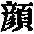);
his name, Yen ( 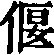); his
honorary or posthumous epithet (Khäng); and his ordinary appellation,
Dze-yû. The use of the epithet shows that he and his master had lived
before our author.

[176:4](sbe39123.htm#fr_79.md) 'He had lost
himself;' that is, he had become unconscious of all around him, and even
of himself, as if he were about to enter p.
177 into the state of Ian Immortal,' a mild form of the
Buddhistic samâdhi. But his attitude and appearance were intended by
Kwang-dze to indicate what should be the mental condition in reference
to the inquiry pursued in the Book;--a condition, it appears to me, of
agnosticism. See the account of Lâo-dze in a similar trance in Book XXI,
par. 4.

[177:1](sbe39123.htm#fr_80.md) The Chinese term
here (lâi) denotes a reed or pipe, with three holes, by a combination of
which there was formed the rudimentary or reed organ. Our author uses it
for the sounds or notes heard in nature, various as the various opinions
of men in their discussions about things.

[178:1](sbe39123.htm#fr_81.md) The sounds of Earth
have been described fully and graphically. Of the sounds of Man very
little is said, but they form the subject of the next paragraph. Nothing
is said in answer to the disciple's inquiry about the notes of Heaven.
It is intimated, however, that there is no necessity to introduce any
foreign Influence or Power like Heaven in connexion. with the notes of
Earth. The term Heaven, indeed, is about to pass with our author into a
mere synonym of Tâo, the natural 'course' of the phenomena of men and
things.

[178:2](sbe39123.htm#fr_82.md) Words are the
'sounds' of Man; and knowledge is the 'wind' by which they are excited.

[179:1](sbe39123.htm#fr_83.md) A true Governor'
would be a good enough translation for 'the true God.' But Kwang-dze did
not admit any supernatural Power or Being as working in man. His true
Governor was the Tâo; and this will be increasingly evident as we
proceed with the study of his Books.

[180:1](sbe39123.htm#fr_84.md) The name 'Ruler' is
different from 'Governor' above; but they both indicate the same concept
in the author's mind.

[180:2](sbe39123.htm#fr_85.md) The proper reply to
this would be that the mind is not dissolved with the body; and
Kwang-dze's real opinion, as we shall find, was that life and death were
but phases in the phenomenal development. But the course of his argument
suggests to us the question here, 'Is life worth living?'

[181:1](sbe39123.htm#fr_86.md) This 'teacher' is
'the Tâo.'

[181:2](sbe39123.htm#fr_87.md) Expressing the
absurdity of the case. This is one of the sayings of Hui-dze;--see Book
XXXIII, par. 7.

[181:3](sbe39123.htm#fr_88.md) The successor and
counsellor of Shun, who coped with and remedied the flood of Yâo.

[182:1](sbe39123.htm#fr_89.md) The followers of
Confucius.

[182:2](sbe39123.htm#fr_90.md) The disciples of
Mih-dze, or Mih Tî, the heresiarch, whom Mencius attacked so
fiercely;--see Mencius, V, 1, 5, e t al. His era must be assigned
between Confucius and Mencius.

[182:3](sbe39123.htm#fr_91.md) That is, the perfect
mind, the principle of the Tâo.

[182:4](sbe39123.htm#fr_92.md) As taught by
Hui-dze;--see XXXIII, 7; but it is doubtful if the quotation from Hui's
teaching be complete.

[182:5](sbe39123.htm#fr_93.md) Equivalent to the
Tâo. See on the use in Lâo-dze and Kwang-dze of the term 'Heaven,' in
the Introduction, pp. 16-18.

[183:1](sbe39123.htm#fr_94.md) The language of our
author here is understood to have reference to the views of Kung-sun
Lung, a contemporary of Hui-dze, and a sophist like him. One of his
treatises or arguments had the title of 'The White Horse,' and another
that of 'Pointing to Things.' If these had been preserved, we might have
seen more clearly the appropriateness of the text here. But the
illustration of the monkeys and their actions shows us the scope of the
whole paragraph to be that controversialists, whose views are
substantially the same, may yet differ, and that with heat, in words.

[184:1](sbe39123.htm#fr_95.md) The character in the
text means both 'a stalk of grain' and a horizontal beam.' Each meaning
has its advocates here.

[184:2](sbe39123.htm#fr_96.md) A famous beauty, a
courtezan presented by the king of Yüeh to his enemy, the king of Wû,
and who hastened on his progress to ruin and death, she herself
perishing at the same time.

[185:1](sbe39123.htm#fr_97.md) Literally, 'the
Heaven-Mould or Moulder,'--another name for the Tâo, by which all things
are fashioned.

[185:2](sbe39123.htm#fr_98.md) See the same passage
in Book XXIII, par. 10.

[185:3](sbe39123.htm#fr_99.md) The ordinary reading
here is fäng ( 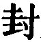) 'a
boundary' or 'distinctive limit.' Lin Hsî-hung adopts the reading  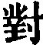, 'a response,' and I have
followed him.

[186:1](sbe39123.htm#fr_100.md) Kâo Wän and Shih
Kwang were both musicians of the state of Zin. Shih, which appears as
Kwang's surname, was his denomination as 'music-master.' It is difficult
to understand the reason why Kwang-dze introduces these men and their
ways, or how it helps his argument.

[186:2](sbe39123.htm#fr_101.md) Perhaps we should
read here 'son,' with special reference to the son of Hui-Sze.

[187:1](sbe39123.htm#fr_102.md) Referring, I
think, to those below commencing 'There was a beginning.'

[187:2](sbe39123.htm#fr_104.md) That is, looking
at things from the standpoint of an original non-existence, and
discarding all considerations of space and time.

[188:1](sbe39123.htm#fr_105.md) On this concluding
clause, Ziâo Hung says:--'Avoiding such procedure, there will be no
affirmations and denials (no contraries). The phrase  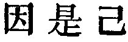 occurs in the Book several
times, and interpreters have missed its meaning from not observing that
 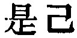 serve merely as a final
particle, and often have the 
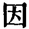 added to them, without affecting its meaning.' See
also Wang Yin on the usages of 
 in the 
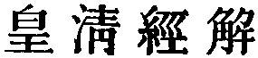, ch. 1208, art. 6.

[188:2](sbe39123.htm#fr_106.md) That is, direct
opposites.

[188:3](sbe39123.htm#fr_107.md) Literally
'righteousnesses;' the proper way of dealing with the relations.

[188:4](sbe39123.htm#fr_108.md) Literally,
'separations.'

[189:1](sbe39123.htm#fr_109.md) Literally, 'the
six conjunctions,' meaning the four cardinal points of space, with the
zenith and nadir; sometimes a name for the universe of space. Here we
must restrict the meaning as I have done.

[189:2](sbe39123.htm#fr_110.md) 'The Spring and
Autumn;'--Confucius's Annals of Lû, here complimented by Kwang-dze. See
in Mencius, IV, ii, 21.

[189:3](sbe39123.htm#fr_111.md) Compare the Tâo
Teh King, ch. 25, et al.

[190:1](sbe39123.htm#fr_112.md) Compare the use of
 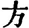 in the Shû King, I, iii,
11.

[190:2](sbe39123.htm#fr_113.md) The classic of
Lâo, in chaps. 1, 2.

[190:3](sbe39123.htm#fr_115.md) Names for the Tâo.

[190:4](sbe39123.htm#fr_116.md) Three small
states. Is Yao's wish to smite an instance of the 'quality' of
'emulation' or jealousy?

[190:5](sbe39123.htm#fr_118.md) Both Tâoistic
worthies of the time of Yâo, supposed to have been two of the Perfect
Ones whom Yâo visited on the distant hill of Kû-shih (I, par. 6).
According to Hwang Mî, Wang Î was the teacher of Nieh Khüeh, and he
again of Hsü Yû.

[191:1](sbe39123.htm#fr_119.md) Compare par. 1 of
Book XXII.

[191:2](sbe39123.htm#fr_121.md) Two famous
beauties;--the former, a contemporary of Hsî Shih (par. 4, note 2), and
like her also, of the state of Yüeh; the latter, the daughter of a
barbarian chief among the Western Jung. She was captured by duke Hsien
of Zin, in B. C. 672. He subsequently made her his wife,--to the great
injury of his family and state.

[192:1](sbe39123.htm#fr_122.md) Not thinking them
beautiful, as men did, but frightened and repelled by them.

[192:2](sbe39123.htm#fr_123.md) Compare Book 1,
pars. 3 and 5.

[192:3](sbe39123.htm#fr_125.md) We know nothing of
the former of these men, but what is mentioned here; the other appears
also in Book XXV, 6, q. v. If 'the master' that immediately follows be
Confucius they must have been contemporary with him. The Khiû in
Khang-wû's reply would seem to make it certain 'the master' was
Confucius, but the oldest critics, and some modern ones as well, think
that Khang-wû's name was also Khiû. But this view is attended with more
p. 193 difficulties than the other. By the
clause interjected in the translation after the first 'Master,' I have
avoided the incongruity of ascribing the long description of Tâoism to
Confucius.

[194:1](sbe39123.htm#fr_126.md) Compare Lâo-dze's
account of himself in his Work, ch. 20.

[194:2](sbe39123.htm#fr_127.md) See note 2 on page
191. The lady is there said to have been the daughter of a barbarian
chief; here she appears as the child of the border Warden of Aî. But her
maiden surname of Kî ( 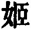)
shows her father must have been a scion of the royal family of Kâu. Had
he forsaken his wardenship, and joined one of the Tî tribes, which had
adopted him as its chief?

[194:3](sbe39123.htm#fr_128.md) Zin was only a
marquisate. How does Kwang-dze speak of its ruler as 'a king?'

[194:4](sbe39123.htm#fr_129.md) This could not be;
a man does not come to himself in his dream, and in that state try to
interpret it.

[195:1](sbe39123.htm#fr_130.md) Compare XVIII,
par. 4.

[196:1](sbe39123.htm#fr_131.md) See this passage
again in Book XXVII, par. i, where the phrase which I have called here
'the invisible operation of Heaven,' is said to be the same as 'the
Heavenly Mould or Moulder,' that is, the Heavenly Fashioner, one of the
Tâoistic names for the Tâo.

[196:2](sbe39123.htm#fr_132.md) That is, all
things being traced up to the unity of the Tâo, we have found the pivot
to which all conflicting opinions, all affirmations, all denials, all
positions and negatives converge, and bring to bear on them the proper
light of the mind. Compare paragraph 3.

[196:3](sbe39123.htm#fr_133.md) A story to the
same effect as this here, with some textual variations, occurs in Book
XXVII, immediately after par. 1 referred to above.

[197:1](sbe39123.htm#fr_134.md) The mind cannot
rest in second causes, and the first cause, if there be one, is
inscrutable.

[197:2](sbe39123.htm#fr_135.md) Even these must
wait for the will of the creature; but the case of the shadow is still
more remarkable.

[197:3](sbe39123.htm#fr_136.md) I have put this
interrogatively, as being more graphic, and because of the particle
 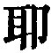, which is generally,
though not necessarily, interrogative.

[197:4](sbe39123.htm#fr_138.md) Hsüan Ying, in his
remarks on these two sentences, brings out the force of the story very
successfully:--'Looking at them in their ordinary appearance, there was
necessarily a difference between them, but in the delusion of the dream
each of them appeared the other, and they could not distinguish
themselves! Kâu could be a butterfly, and the butterfly could be
Kâu;--we may see that in the world all traces of that and this may pass
away, as they come under the influence of transformations.' For the
phrase, 'the transformation of things,' see in Book X1, par. 5, et al.
But the Tâoism here can hardly be distinguished from the Buddhism that
holds that all human experience is merely so much mâya or illusion.

------------------------------------------------------------------------

[Next: Book III: Yang Shang Kû, or 'Nourishing the Lord of
Life'](sbe39124.md)
