  
[Intangible Textual Heritage](../../index)  [Taoism](../index.md) 
[Index](index)  [Previous](sbe39126)  [Next](sbe39128.md) 

------------------------------------------------------------------------

p. 236

## BOOK VI.

### PART I. SECTION VI.

### Tâ Zung Shih, or 'The Great and Most Honoured Master [1](#fn_233.md).'

1\. He who knows the part which the Heavenly [2](#fn_234) (in him) plays, and knows(also.md)that
which the Human [2](#fn_234) (in him ought to.md)
play, has reached the perfection (of knowledge). He who knows the part
which the Heavenly plays (knows) that it is naturally born with him; he
who knows the part which the Human ought to play (proceeds) with the
knowledge which he possesses to nourish it in the direction of what he
does not (yet) know [3](#fn_235.md):--to complete
one's natural term of years and not come to an untimely end in the
middle of his course is the fulness of knowledge. Although it be so,
there is an evil (attending this condition). Such knowledge still awaits
the confirmation of it as correct; it does so because it is not yet
determined [4](#fn_236.md). How do we know that
what

p. 237

we call the Heavenly (in us) is not the Human? and that what we call the
Human is not the Heavenly? There must be the True man [1](#fn_237.md), and then there is the True knowledge.

2\. What is meant by 'the True Man [2](#fn_238.md)?' The True men of old did not reject
(the views of) the few; they did not seek to accomplish (their ends)
like heroes (before others); they did not lay plans to attain those
ends [3](#fn_239.md). Being such, though they
might make mistakes, they had no occasion for repentance; though they
might succeed, they had no self-complacency. Being such, they could
ascend the loftiest heights without fear; they could pass through water
without being made wet by it; they could go into fire without being
burnt; so it was

p. 238

that by their knowledge they ascended to and reached the Tâo [1](#fn_240.md).

The True men of old did not dream when they slept, had no anxiety when
they awoke, and did not care that their food should be pleasant. Their
breathing came deep and silently. The breathing of the true man comes
(even) from his heels, while men generally breathe (only) from their
throats. When men are defeated in argument, their words come from their
gullets as if they were vomiting. Where lusts and desires are deep, the
springs of the Heavenly are shallow.

The True men of old knew nothing of the love of life or of the hatred of
death. Entrance into life occasioned them no joy; the exit from it
awakened no resistance. Composedly they went and came. They did not
forget what their beginning had been, and they did not inquire into what
their end would be. They accepted (their life) and rejoiced in it; they
forgot (all fear of death), and returned (to their state before
life) [1](#fn_240.md). Thus there was in them what
is called the want of any mind to resist the Tâo, and of all attempts by
means of the Human to assist the Heavenly. Such were they who are called
the True men.

3\. Being such, their minds were free from all thought [2](#fn_241.md); their demeanour was still and unmoved;

p. 239

their foreheads beamed simplicity. Whatever coldness came from them was
like that of autumn; whatever warmth came from them was like that of
spring. Their joy and anger assimilated to what we see in the four
seasons. They did in regard to all things what was suitable, and no one
could know how far their action would go. Therefore the sagely man
might, in his conduct of war, destroy a state without losing the hearts
of the people [1](#fn_242.md); his benefits and
favours might extend to a myriad generations without his being a lover
of men. Hence he who tries to share his joys with others is not a sagely
man; he who manifests affection is not benevolent; he who observes times
and seasons (to regulate his conduct) is not a man of wisdom; he to whom
profit and injury are not the same is not a superior man; he who acts
for the sake of the name of doing so, and loses his (proper) self is not
the (right) scholar; and he who throws away his person in a way which is
not the true (way) cannot command the service of others. Such men as Hû
Pû-kieh, Wû Kwang, Po-î, Shû-khî, the count of Kî, Hsü-yü, Kî Thâ, and
Shän-thû Tî, all did service for other men, and sought to secure for
them what they desired, not seeking their own pleasure [2](#fn_243.md).

p. 240

4\. The True men of old presented the aspect of judging others aright,
but without being partisans; of feeling their own insufficiency, but
being without flattery or cringing. Their peculiarities were natural to
them, but they were not obstinately attached to them; their humility was
evident, but there was nothing of unreality or display about it. Their
placidity and satisfaction had the appearance of joy; their every
movement seemed to be a necessity to them. Their accumulated
attractiveness drew men's looks to them; their blandness fixed men's
attachment to their virtue. They seemed to accommodate themselves to the
(manners of their age), but with a certain severity; their haughty
indifference was beyond its control. Unceasing seemed their endeavours
to keep (their mouths) shut; when they looked down, they had forgotten
what they wished to say.

They considered punishments to be the substance (of government, and they
never incurred it); ceremonies to be its supporting wings (and they
always observed them); wisdom (to indicate) the time (for action, and
they always selected it); and virtue to be accordance (with others), and
they were all-accordant. Considering punishments to be the substance (of
government), yet their generosity appeared in the (manner of their)
infliction of death. Considering ceremonies to be its supporting wings,
they pursued

p. 241

by means of them their course in the world. Considering wisdom to
indicate the time (for action), they felt it necessary to employ it in
(the direction of) affairs. Considering virtue to be accordance (with
others), they sought to ascend its height along with all who had feet
(to climb it). (Such were they), and yet men really thought that they
did what they did by earnest effort [1](#fn_244.md).

5\. In this way they were one and the same in all their likings and
dislikings. Where they liked, they were the same; where they did not
like, they were the same. In the former case where they liked, they were
fellow-workers with the Heavenly (in them); in the latter where they
disliked, they were coworkers with the Human in them. The one of these
elements (in their nature) did not overcome the other. Such were those
who are called the True men.

Death and life are ordained, just as we have the constant succession of
night and day;--in both cases from Heaven. Men have no power to do
anything in reference to them;--such is the constitution of things [2](#fn_245.md). There are those who specially regard
Heaven [3](#fn_246.md) as their father, and they
still love It (distant as It is) [3](#fn_246.md);--how much more should they love

p. 242

That which stands out (Superior and Alone) [1](#fn_247.md)! Some specially regard their ruler as
superior to themselves, and will give their bodies to die for him; how
much more should they do so for That which is their true (Ruler) [1](#fn_247.md)! When the springs are dried up, the
fishes collect together on the land. Than that they should moisten one
another there by the damp about them, and keep one another wet by their
slime, it would be better for them to forget one another in the rivers
and lakes [2](#fn_248.md). And when men praise Yâo
and condemn Kieh, it would be better to forget them both, and seek the
renovation of the Tâo.

6\. There is the great Mass (of nature);--I find the support of my body
on it; my life is spent in toil on it; my old age seeks ease on it; at
death I find rest in it;--what makes my life a good makes my death also
a good [3](#fn_249.md). If you hide away a boat in
the ravine of a hill, and hide away the hill in a lake, you will say
that (the boat) is secure; but at midnight there shall come a strong man
and carry it off on his back, while you in the dark know nothing about
it. You may hide away anything, whether small or great, in the most
suitable place, and yet it shall disappear from it. But if you could
hide the world in the world [4](#fn_250.md), so
that there was nowhere to which it could be removed, this would be the
grand reality of the

p. 243

ever-during Thing [1](#fn_251.md). When the body
of man comes from its special mould [2](#fn_252.md), there is even then occasion for joy;
but this body undergoes a myriad transformations, and does not
immediately reach its perfection;--does it not thus afford occasion for
joys incalculable? Therefore the sagely man enjoys himself in that from
which there is no possibility of separation, and by which all things are
preserved. He considers early death or old age, his beginning and his
ending, all to be good, and in this other men imitate him;--how much
more will they do so in regard to That Itself on which all things
depend, and from which every transformation arises!

7\. This is the Tâo;--there is in It emotion and sincerity, but It does
nothing and has no bodily form [3](#fn_253.md). It
may be handed down (by the teacher), but may not be received (by his
scholars). It may be apprehended (by the mind), but It cannot be seen.
It has Its root and ground (of existence) in Itself. Before there were
heaven and earth, from of old, there It was, securely existing. From It
came the mysterious existences of spirits, from It the mysterious
existence of God [4](#fn_254.md). It produced
heaven; It produced earth. It was before the Thâi-kî [5](#fn_255.md), and

p. 244

yet could not be considered high [1](#fn_256.md);
It was below all space, and yet could not be considered deep [1](#fn_256.md). It was produced before heaven and
earth, and yet could not be considered to have existed long [1](#fn_256.md); It was older than the highest
antiquity, and yet could not be considered old [1](#fn_256.md).

Shih-wei got It [2](#fn_257.md), and by It
adjusted heaven and earth. Fû-hsî got It, and by It penetrated to the
mystery of the maternity of the primary matter. The Wei-tâu [3](#fn_258.md) got It, and from all antiquity has made
no eccentric movement. The Sun and Moon got It, and from all antiquity
have not intermitted (their bright shining). Khan-pei got It, and by It
became lord of Khwän-lun [4](#fn_259.md).
Fäng-î [5](#fn_260.md) got It, and by It enjoyed
himself in the Great River. Kien Wû [6](#fn_261.md) got It, and by It dwelt on mount Thâi.
Hwang-Tî [7](#fn_262.md) got It, and by It
ascended the cloudy sky. Kwan-hsü [8](#fn_263.md)

p. 245

got It, and by It dwelt in the Dark Palace. Yü-khiang [1](#fn_264.md) got It, and by It was set on the North
Pole. Hsî Wang-mû [2](#fn_265.md) got It, and by
It had her seat in (the palace of) Shâo-kwang. No one knows Its
beginning; no one knows Its end. Phäng Zû got It, and lived on from the
time of the lord of Yü to that of the Five Chiefs [3](#fn_266.md). Fû Yüeh [4](#fn_267.md) got It, and by It became chief minister
to Wû-ting [4](#fn_267), (who thus.md) in a trice
became master of the kingdom. (After his death), Fû Yüeh mounted to the
eastern portion of the Milky Way, where, riding on Sagittarius and
Scorpio, he took his place among the stars.

8\. Nan-po Dze-khwei [5](#fn_268.md), asked Nü
Yü [6](#fn_269.md), saying, 'You are old, Sir,
while your complexion is like that of a child;--how is it so?' The reply
was, 'I have become acquainted with the Tâo.' The other said, 'Can I
learn the Tâo?' Nü Yü said, 'No. How can you? You, Sir, are not the man
to do so. There was Pû-liang Π[7](#fn_270.md) who
had the abilities of a sagely man, but not the Tâo, while I had the Tâo,
but not the abilities. I wished, however, to teach him, if,
peradventure, he might

p. 246

become the sagely man indeed. If he should not do so, it was easy (I
thought) for one possessing the Tâo of the sagely man to communicate it
to another possessing his abilities. Accordingly, I proceeded to do so,
but with deliberation [1](#fn_271.md). After three
days, he was able to banish from his mind all worldly (matters). This
accomplished, I continued my intercourse with him in the same way; and
in seven days he was able to banish from his mind all thought of men and
things. This accomplished, and my instructions continued, after nine
days, he was able to count his life as foreign to himself. This
accomplished, his mind was afterwards clear as the morning; and after
this he was able to see his own individuality [2](#fn_272.md). That individuality perceived, he was
able to banish all thought of Past or Present. Freed from this, he was
able to penetrate to (the truth that there is no difference between)
life and death;--(how) the destruction of life is not dying, and the
communication of other life is not living. (The Tâo) is a thing which
accompanies all other things and meets them, which is present when they
are overthrown and when they obtain their completion. Its name is
Tranquillity amid all Disturbances, meaning that such Disturbances lead
to Its Perfection [3](#fn_273.md).'

'And how did you, being alone (without any teacher), learn all this?' 'I
learned it,' was the reply, 'from the son of Fû-mo [4](#fn_274.md); he learned it from

p. 247

the grandson of Lo-sung; he learned it from Shan-ming; he learned it
from Nieh-hsü; he, from Hsü-yî; he, from Wû-âo; he, from Hsüan-ming; he,
from Zhan-liâo; and he learned it from Î-shih.'

9\. Dze-sze [1](#fn_275.md), Dze-yü [1](#fn_275.md), Dze-1î [1](#fn_275.md), and Dze-lâi [1](#fn_275.md), these four men, were talking together,
when some one said, 'Who can suppose the head to be made from nothing,
the spine from life, and the rump-bone from death? Who knows how death
and birth, living on and disappearing, compose the one body?--I would be
friends with him [2](#fn_276.md).' The four men
looked at one another and laughed, but no one seized with his mind the
drift of the questions. All, however, were friends together.

Not long after Dze-yü fell ill, and Dze-sze went to inquire for him.
'How great,' said (the sufferer), 'is the Creator [3](#fn_277.md)! That He should have made me the
deformed object that I am!' He was a crooked hunchback; his five viscera
were squeezed into the

p. 248

upper part of his body; his chin bent over his navel; his shoulder was
higher than his crown; on his crown was an ulcer pointing to the sky;
his breath came and went in gasps [1](#fn_278.md):--yet he was easy in his mind, and made
no trouble of his condition. He limped to a well, looked at himself in
it, and said, 'Alas that the Creator should have made me the deformed
object that I am!' Dze said, 'Do you dislike your condition?' He
replied, 'No, why should I dislike it? If He were to transform my left
arm into a cock, I should be watching with it the time of the night; if
He were to transform my right arm into a cross-bow, I should then be
looking for a hsiâo to (bring down and) roast; if He were to transform
my rump-bone into a wheel, and my spirit into a horse, I should then be
mounting it, and would not change it for another steed. Moreover, when
we have got (what we are to do), there is the time (of life) in which to
do it; when we lose that (at death), submission (is what is required).
When we rest in what the time requires, and manifest that submission,
neither joy nor sorrow can find entrance (to the mind) [2](#fn_279.md). This would be what the ancients called
loosing the cord by which (the life) is suspended. But one hung up
cannot loose himself;--he is held fast by his bonds [3](#fn_280.md). And that creatures cannot overcome

p. 249

Heaven (the inevitable) is a long-acknowledged fact;-why should I hate
my condition?'

10\. Before long Dze-lâi fell ill, and lay gasping at the point of
death, while his wife and children stood around him wailing [1](#fn_281.md). Dze-lî went to ask for him, and said to
them, 'Hush! Get out of the way! Do not disturb him as he is passing
through his change.' Then, leaning against the door, he said (to the
dying man), 'Great indeed is the Creator! What will He now make you to
become? Where will He take you to? Will He make you the liver of a rat,
or the arm of an insect [2](#fn_282.md)?

Dze-lâi replied, 'Wherever a parent tells a son to go, east, west,
south, or north, he simply follows the command. The Yin and Yang are
more to a man than his parents are. If they are hastening my death, and
I do not quietly submit to them, I shall be obstinate and rebellious.
There is the great Mass (of nature);--I find the support of my body in
it; my life is spent in toil on it; my old age seeks ease on it; at
death I find rest on it:--what has made my life a good will make my
death also a good.

'Here now is a great founder, casting his metal. If the metal were to
leap up (in the pot), and say, "I must be made into a (sword like the)
Mo-yeh [3](#fn_283.md)."

p. 250

the great founder would be sure to regard it as uncanny. So, again, when
a form is being fashioned in the mould of the womb, if it were to say,
"I must become a man; I must become a man," the Creator would be sure to
regard it as uncanny. When we once understand that heaven and earth are
a great melting-pot, and the Creator a great founder, where can we have
to go to that shall not be right for us? We are born as from a quiet
sleep, and we die to a calm awaking.'

11\. Dze-sang Hû [1](#fn_284.md), Mäng
Dze-fan [1](#fn_284.md), and Dze-khin Kang [1](#fn_284.md), these three men, were friends together.
(One of them said), 'Who can associate together without any (thought of)
such association, or act together without any (evidence of) such
co-operation? Who can mount up into the sky and enjoy himself amidst the
mists, disporting beyond the utmost limits (of things) [2](#fn_285.md), and forgetting all others as if this
were living, and would have no end?' The three men looked at one another
and laughed, not perceiving the drift of the questions; and they
continued to associate together as friends.

Suddenly, after a time [3](#fn_286.md), Dze-sang
Hia died. Before he was buried, Confucius heard of the event, and

p. 251

sent Dze-kung to go and see if he could render any assistance. One of
the survivors had composed a ditty, and the other was playing on his
lute. Then they sang together in unison,

'Ah! come, Sang Hû ah! come, Sang Hû!  
Your being true you've got again,  
While we, as men, still here remain  
                               Ohone [1](#fn_287.md)!'

Dze-kung hastened forward to them, and said, 'I venture to ask whether
it be according to the rules to be singing thus in the presence of the
corpse?' The two men looked at each other, and laughed, saying, 'What
does this man know about the idea that underlies (our) rules?' Dze-kung
returned to Confucius, and reported to him, saying, 'What sort of men
are those? They had made none of the usual preparations [2](#fn_288.md), and treated the body as a thing foreign
to them. They were singing in the presence of the corpse, and there was
no change in their countenances. I cannot describe them;--what sort of
men are they?' Confucius replied, 'Those men occupy and enjoy themselves
in what is outside the (common) ways (of the world), while I occupy and
enjoy myself in what lies within those ways. There is no common ground
for those of such different ways; and when 1 sent you to condole with
those men, I was acting stupidly. They, moreover, make man to be the
fellow of the

p. 252

Creator, and seek their enjoyment in the formless condition of heaven
and earth. They consider life to be an appendage attached, an
excrescence annexed to them, and death to be a separation of the
appendage and a dispersion of the contents of the excrescence. With
these views, how should they know wherein death and life are to be
found, or what is first and what is last? They borrow different
substances, and pretend that the common form of the body is composed of
them [1](#fn_289.md). They dismiss the thought of
(its inward constituents like) the liver and gall, and (its outward
constituents), the ears and eyes. Again and again they end and they
begin, having no knowledge of first principles. They occupy themselves
ignorantly and vaguely with what (they say) lies outside the dust and
dirt (of the world), and seek their enjoyment in the business of doing
nothing. How should they confusedly address themselves to the ceremonies
practised by the common people, and exhibit themselves as doing so to
the ears and eyes of the multitude?'

Dze-kung said, 'Yes, but why do you, Master, act according to the
(common) ways (of the world)?' The reply was, 'I am in this under the
condemning sentence of Heaven [2](#fn_290.md).
Nevertheless, I will share

p. 253

with you (what I have attained to).' Dze-kung rejoined, 'I venture to
ask the method which you pursue;' and Confucius said, 'Fishes breed and
grow in the water; man developes in the Tâo. Growing in the water, the
fishes cleave the pools, and their nourishment is supplied to them.
Developing in the Tâo, men do nothing, and the enjoyment of their life
is secured. Hence it is said, "Fishes forget one another in the rivers
and lakes; men forget one another in the arts of the Tâo."'

Dze-kung said, 'I venture to ask about the man who stands aloof from
others [1](#fn_291.md).' The reply was, 'He stands
aloof from other men, but he is in accord with Heaven! Hence it is said,
"The small man of Heaven is the superior man among men; the superior man
among men is the small man of Heaven [2](#fn_292.md)!"'

12\. Yen Hui asked Kung-nî, saying, 'When the mother of Mäng-sun
Zhâi [3](#fn_293.md) died, in all his wailing for
her he did not shed a tear; in the core of his heart he felt no
distress; during all the mourning rites, he exhibited no sorrow. Without
these three things, he (was considered to have) discharged his mourning
well;--is it that in the state of Lû one who has not the reality may yet
get the reputation of having it? I think the matter very strange.'
Kung-nî

p. 254

said, 'That Mäng-sun carried out (his views) to the utmost. He was
advanced in knowledge; but (in this case) it was not possible for him to
appear to be negligent (in his ceremonial observances) [1](#fn_294.md), but he succeeded in being really so to
himself Mäng-sun does not know either what purposes life serves, or what
death serves; he does not know which should be first sought, and which
last [2](#fn_295.md). If he is to be transformed
into something else, he will simply await the transformation which he
does not yet know. This is all he does. And moreover, when one is about
to undergo his change, how does he know that it has not taken place? And
when he is not about to undergo his change, how does he know that it has
taken place [3](#fn_296.md)? Take the case of me
and you:--are we in a dream from which we have not begun to awake [4](#fn_297.md)?

'Moreover, Mäng-sun presented in his body the appearance of being
agitated, but in his mind he was conscious of no loss. The death was to
him like the issuing from one's dwelling at dawn, and no (more terrible)
reality. He was more awake than others were. When they wailed, he also
wailed, having in himself the reason why he did so. And we all have our
individuality which makes us what we are as compared together; but how
do we know that we

p. 255

determine in any case correctly that individuality? Moreover you dream
that you are a bird, and seem to be soaring to the sky; or that you are
a fish, and seem to be diving in the deep. But you do not know whether
we that are now speaking are awake or in a dream [1](#fn_298.md). It is not the meeting with what is
pleasurable that produces the smile; it is not the smile suddenly
produced that produces the arrangement (of the person). When one rests
in what has been arranged, and puts away all thought of the
transformation, he is in unity with the mysterious Heaven.'

13\. Î-*r* Dze [2](#fn_299.md) having gone to see
Hsü Yû, the latter said to him, 'What benefit have you received from
Yâo?' The reply was, 'Yâo says to me, You must yourself labour at
benevolence and righteousness, and be able to tell clearly which is
right and which wrong (in conflicting statements).' Hsü Yû rejoined,
'Why then have you come to me? Since Yâo has put on you the brand of his
benevolence and righteousness, and cut off your nose with his right and
wrong [3](#fn_300.md), how will you be able to
wander in the way of aimless enjoyment, of unregulated contemplation,
and the ever-changing forms (of dispute)?' Î-*r* dze said, 'That may be;
but I should

p. 256

like to skirt along its hedges.' 'But,' said the other, 'it cannot be.
Eyes without pupils can see nothing of the beauty of the eyebrows, eyes,
and other features; the blind have nothing to do with the green, yellow,
and variegated colours of the sacrificial robes.' Î-*r* dze rejoined,
'Yet, when Wû-kwang [1](#fn_301.md) lost his
beauty, Kü-liang [1](#fn_301.md) his strength, and
Hwang-Tî his wisdom, they all (recovered them) [2](#fn_302.md) under the moulding (of your
system);--how do you know that the Maker will not obliterate the marks
of my branding, and supply my dismemberment, so that, again perfect in
my form, I may follow you as my teacher?' Hsû Yü said, 'Ah! that cannot
yet be known. I will tell you the rudiments. O my Master! O my Master!
He gives to all things their blended qualities, and does not count it
any righteousness; His favours reach to all generations, and He does not
count it any benevolence; He is more ancient than the highest antiquity,
and does not count Himself old; He overspreads heaven and supports the
earth; He carves and fashions all bodily forms, and does not consider it
any act of skill;--this is He in whom I find my enjoyment.'

14\. Yen Hui said, 'I am making progress.' Kung-nî replied, 'What do you
mean?' 'I have ceased to think of benevolence and righteousness,' was
the reply. 'Very well; but that is not enough.'

Another day, Hui again saw Kung-nî, and said, 'I am making progress.'
'What do you mean?'

p. 257

\[paragraph continues\] 'I have lost all thought of ceremonies and
music.' 'Very well, but that is not enough.,

A third day, Hui again saw (the Master), and said, 'I am making
progress.' 'What do you mean?' 'I sit and forget everything [1](#fn_303.md).' Kung-nî changed countenance, and said,
'What do you mean by saying that you sit and forget (everything)?' Yen
Hui replied, 'My connexion with the body and its parts is dissolved; my
perceptive organs are discarded. Thus leaving my material form, and
bidding farewell to my knowledge, I am become one with the Great
Pervader [2](#fn_304.md) . This I call sitting and
forgetting all things.' Kung-nî said, 'One (with that Pervader), you are
free from all likings; so transformed, you are become impermanent. You
have, indeed, become superior to me! I must ask leave to follow in your
steps [3](#fn_305.md).'

15\. Dze-yü [4](#fn_306.md) and Dze-sang [4](#fn_306) were friends. (Once.md), when it had rained
continuously for ten days, Dze-yü said, 'I fear that Dze-sang may be in
distress.' So he wrapped up some rice, and went to give it to him to
eat. When he came to Dze-sang's door, there issued from it sounds
between singing and wailing;

p. 258

a lute was struck, and there came the words, 'O Father! O Mother! O
Heaven! O Men!' The voice could not sustain itself, and the line was
hurriedly pronounced. Dze-yü entered and said, 'Why are you singing,
Sir, this line of poetry in such a way?' The other replied, 'I was
thinking, and thinking in vain, how it was that I was brought to such
extremity. Would my parents have wished me to be so poor? Heaven
overspreads all without any partial feeling, and so does Earth sustain
all;--would Heaven and Earth make me so poor with any unkindly feeling?
I was trying to find out who had done it, and I could not do so. But
here I am in this extremity!--it is what was appointed for me [1](#fn_307.md)!'

------------------------------------------------------------------------

### Footnotes

[236:1](sbe39127.htm#fr_253.md) See pp. 134-136.

[236:2](sbe39127.htm#fr_255.md) Both 'Heaven' and
'Man' here are used in the Tâoistic sense;--the meaning which the terms
commonly have both with Lao and Kwang.

[236:3](sbe39127.htm#fr_256.md) The middle member
of this sentence is said to be the practical outcome of all that is said
in the Book; conducting the student of the Tâo to an unquestioning
submission to the experiences in his lot, which are beyond his
comprehension, and approaching nearly to what we understand by the
Christian virtue of Faith.

[236:4](sbe39127.htm#fr_257.md) That is, there may
be the conflict, to the end of life, between p.
237 faith and fact, so graphically exhibited in the Book of job,
and compendiously described in the seventy-third Psalm.

[237:1](sbe39127.htm#fr_258.md) Here we meet with
the True Man, a Master of the Tâo. He is the same as the Perfect Man,
the Spirit-like Man, and the Sagely Man (see pp. 127, 128), and the
designation is sometimes interchanged in the five paragraphs that follow
with 'the Sagely Man.' Mr. Balfour says here that this name 'is used in
the esoteric sense,--"partaking of the essence of divinity;"' and he
accordingly translates  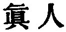
by 'the divine man.' But he might as well translate any one of the other
three names in the same way. The Shwo Wän dictionary defines the name by
 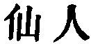, 'a recluse of the
mountain, whose bodily form has been changed, and who ascends to
heaven;' but when this account was made, Tâoism had entered into a new
phase, different from what it had in the time of our author.

[237:2](sbe39127.htm#fr_259.md) In this
description of 'the True Man,' and in what follows, there is what is
grotesque and what is exaggerated (see note on the title of the first
Book, p. 127). The most prominent characteristic of him was his perfect
comprehension of the Tâo and participation of it.

[237:3](sbe39127.htm#fr_260.md)  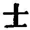 has here the sense of  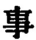.

[238:1](sbe39127.htm#fr_262.md) Was not this the
state of non-existence? We cannot say of Pantâoism. However we may
describe that, the Tâo operates in nature, but is not identical with it.

[238:2](sbe39127.htm#fr_263.md)  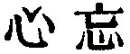 appears in the common editions
as  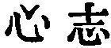, which must have got
into the text at a very early time. 'The mind forgetting,' or 'free from
all thought and purpose,' appears everywhere p.
239 in the Book as a characteristic of the True Man. Not a few
critics contend that it was this, and not the Tâo of which it is a
quality, that Kwang-dze intended by the 'Master' in the title.

[239:1](sbe39127.htm#fr_264.md) Such antithetic
statements are startling, but they are common with both Lâo-dze and our
author.

[239:2](sbe39127.htm#fr_265.md) The seven men
mentioned here are all adduced, I must suppose, as instances of good and
worthy men, but still inferior to the True Man. Of Hû Pû-kieh all that
we are told is that he was 'an ancient worthy.' One account of Wû Kwang
is that he p. 240 was of the time of
Hwang-Tî, with ears seven inches long; another, that he was of the time
of Thang, of the Shang dynasty. Po-î and Shû-khî are known to us from
the Analects; and also the count of Khî, whose name, it is said, was
Hsü-yü. I can find nothing about Kî Thâ;--his name in Ziâo Hung's text
is  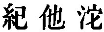 Shän-thû Tî was of
the Yin dynasty, a contemporary of Thang. He drowned himself in the Ho.
Most of these are referred to in other places.

[241:1](sbe39127.htm#fr_266.md) All this paragraph
is taken as illustrative of the True man's freedom from thought or
purpose in his course.

[241:2](sbe39127.htm#fr_267.md) See note 3 on par.
1, p. 236.

[241:3](sbe39127.htm#fr_269.md) Love is due to a
parent, and so such persons should love Heaven. There is in the text
here, I think, an unconscious reference to the earliest time, before the
views of the earliest Chinese diverged to Theism and Tâoism. We cannot
translate the  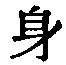 here.

[242:1](sbe39127.htm#fr_271.md) The great and most
honoured Master,--the Tâo.

[242:2](sbe39127.htm#fr_272.md) This sentence
contrasts the cramping effect on the mind of Confucianism with the
freedom given by the doctrine of the Tâo.

[242:3](sbe39127.htm#fr_273.md) The Tâo does this.
The whole paragraph is an amplification of the view given in the
preceding note.

[242:4](sbe39127.htm#fr_274.md) The Tâo cannot be
taken away. It is with its possessor, an ever-during thing.'

[243:1](sbe39127.htm#fr_275.md) See p. 242, note
4.

[243:2](sbe39127.htm#fr_276.md) Adopting the
reading of  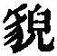 for  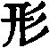, supplied by Hwâi-nan dze.

[243:3](sbe39127.htm#fr_277.md) Our author has
done with 'the True Man,' and now brings in the Tâo itself as his
subject. Compare the predicates of It here with Bk. II, par. 2. But
there are other, and perhaps higher, things said of it here.

[243:4](sbe39127.htm#fr_278.md) Men at a very
early time came to believe in the existence of their spirits after
death, and in the existence of a Supreme Ruler or God. It vas to the Tâo
that those concepts were owing.

[243:5](sbe39127.htm#fr_279.md) The primal ether
out of which all things were fashioned by the interaction of the Yin and
Yang. This was something like the p. 244
current idea of protoplasm; but while protoplasm lies down in the lower
parts of the earth, the Thâi-kî was imagined to be in the higher regions
of space.

[244:1](sbe39127.htm#fr_283.md) The Tâo is
independent both of space and time.

[244:2](sbe39127.htm#fr_284.md) A prehistoric
sovereign.

[244:3](sbe39127.htm#fr_285.md) A name for the
constellation of the Great Bear.

[244:4](sbe39127.htm#fr_286.md) Name of the spirit
of the Khwan-lun mountains in Thibet, the fairy-land of Tâoist writers,
very much in Tâoism what mount Sumêru is in Buddhism.

[244:5](sbe39127.htm#fr_287.md) The spirit
presiding over the Yellow River;--see Mayers's Manual, pp. 54, 55.

[244:6](sbe39127.htm#fr_288.md) Appears here as
the spirit of mount Thâi, the great eastern mountain; we met with him in
I, 5, but simply as one of Kwang-dze's fictitious personages.

[244:7](sbe39127.htm#fr_289.md) Appears before in
Bk. II; the first of Sze-mâ Khien's 'Five Tîs;' no doubt a very early
sovereign, to whom many important discoveries and inventions are
ascribed; is placed by many at the head of Tâoism itself.

[244:8](sbe39127.htm#fr_290.md) The second of the
'Five Tîs;' a grandson of Hwang-Tî. I do not know what to say of his
'Dark Palace.'

[245:1](sbe39127.htm#fr_291.md) The Spirit of the
Northern regions, with a man's face, and a bird's body, &c.

[245:2](sbe39127.htm#fr_292.md) A queen of the
Genii on mount Khwän-lun. See Mayers's Manual, pp. 178, 179.

[245:3](sbe39127.htm#fr_293.md) Phäng Zû has been
before us in Bk. I. Shun is intended by 'the Lord of Yü.' The five
Chiefs;--see Mencius, VI, ii, 7.

[245:4](sbe39127.htm#fr_295.md) See the Shû, IV,
viii; but we have nothing there of course about the Milky Way and the
stars.--This passage certainly lessens our confidence in Kwang-dze's
statements.

[245:5](sbe39127.htm#fr_296.md) Perhaps the same
as Nan-po Dze-khî in Bk. IV, par. 7.

[245:6](sbe39127.htm#fr_297.md) Must have been a
great Tâoist. Nothing more can be said of him or her.

[245:7](sbe39127.htm#fr_298.md) Only mentioned
here.

[246:1](sbe39127.htm#fr_299.md) So the  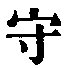 is explained.

[246:2](sbe39127.htm#fr_300.md) Standing by
himself, as it were face to face with the Tâo.

[246:3](sbe39127.htm#fr_301.md) Amid all changes,
in life and death, the possessor of the Tâo, has peace.

[246:4](sbe39127.htm#fr_302.md) Meaning writings;
literally, 'the son of the assisting pigment.' p.
247 We are not to suppose that by this and the other names that
follow individuals are intended. Kwang-dze seems to have wished to give,
in his own fashion, some notion of the genesis of the idea of the Tâo
from the first speculations about the origin of things.

[247:1](sbe39127.htm#fr_306.md) We need not
suppose that these are the names of real men. They are brought on the
stage by our author to serve his purpose. Hwâi-nan makes the name of the
first to have been Dze-shui (
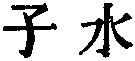).

[247:2](sbe39127.htm#fr_307.md) Compare the same
representation in Bk. XXIII, par. 10. Kû Teh-kih says on it here, 'The
head, the spine, the rump-bone mean simply the head and tail, the
beginning and end. All things begin from nothing and end in nothing.
Their birth and their death are only the creations of our thought, the
going and coming of the primary ether. When we have penetrated to the
non-reality of life and death, what remains of the body of so many
feet?'

[247:3](sbe39127.htm#fr_308.md) The 'Creator' or
'Maker' ( 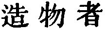) is the Tâo.

[248:1](sbe39127.htm#fr_309.md) Compare this
description of Dze-yü's deformity with that of the poor Shû, in IV, 8.

[248:2](sbe39127.htm#fr_310.md) Such is the
submission to one's lot produced by the teaching of Tâoism.

[248:3](sbe39127.htm#fr_311.md) Compare the same
phraseology in III, par. 4, near the end. In correcting Mr. Balfour's
mistranslation of the text, Mr. Giles himself falls into a
mistranslation through not observing that the  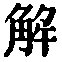 p.
249 is passive, having the 
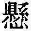 that precedes as its subject (observe the force of
the  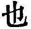 after  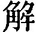 in the best editions), and not
active, or governing the  
that follows.

[249:1](sbe39127.htm#fr_312.md) Compare the
account of the scene at Lâo-dze's death, in III, par. 4.

[249:2](sbe39127.htm#fr_313.md) Here comes in the
belief in transformation.

[249:3](sbe39127.htm#fr_314.md) The name of a
famous sword, made for Ho-lü, the king of p.
250 Wû (B. C. 514-494). See the account of the forging of it in
the  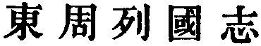, ch. 74. The mention
of it would seem to indicate that Dze-lâi and the other three men were
of the time of Confucius.

[250:1](sbe39127.htm#fr_317.md) These three men
were undoubtedly of the time of Confucius, and some would identify them
with the Dze-sang Po-dze of Ana. VI, i, Mäng Kih-fan of VI, 13, and the
Lâo of IX, vi, 4. This is very unlikely. They were Tâoists.

[250:2](sbe39127.htm#fr_318.md) Or, 'without end.'

[250:3](sbe39127.htm#fr_319.md) Or, 'Some time
went by silently, and.'

[251:1](sbe39127.htm#fr_320.md) In accordance with
the ancient and modern practice in China of calling the dead back. But
these were doing so in a song to the lute.

[251:2](sbe39127.htm#fr_321.md) Or, 'they do not
regulate their doings (in the usual way).'

[252:1](sbe39127.htm#fr_322.md) The idea that the
body is composed of the elements of earth, wind or air, fire, and water.

[252:2](sbe39127.htm#fr_323.md) A strange
description of himself by the sage. Literally, 'I am (one of) the people
killed and exposed to public view by Heaven;' referring, perhaps, to the
description of a living man as 'suspended by a string from God.'
Confucius was content to accept his life, and used it in pursuing the
path of duty, according to his conception of it, without aiming at the
transcendental method of the Tâoists. I can attach no other or better
meaning to the expression.

[253:1](sbe39127.htm#fr_324.md) Misled by the text
of Hsüang Ying, Mr. Balfour here reads 
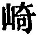 instead of 
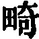.

[253:2](sbe39127.htm#fr_325.md) Here, however, he
aptly compares with the language of Christ in Matthew vii.
28.--Kwang-dze seems to make Confucius praise the system of Tâoism as
better than his own!

[253:3](sbe39127.htm#fr_326.md) Must have been a
member of the Ming or Ming-sun family of Lû, to a branch of which
Mencius belonged.

[254:1](sbe39127.htm#fr_327.md) The people set
such store by the mourning rites, that Mäng-sun felt he must present the
appearance of observing them. This would seem to show that Tâoism arose
after the earlier views of the Chinese.

[254:2](sbe39127.htm#fr_328.md) I adopt here, with
many of the critics, the reading of 
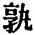 instead of the more common  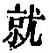.

[254:3](sbe39127.htm#fr_329.md) This is to me very
obscure.

[254:4](sbe39127.htm#fr_330.md) Are such dreams
possible? See what I have said on II, par. 9.

[255:1](sbe39127.htm#fr_331.md) This also is
obscure; but Confucius is again made to praise the Tâoistic system.

[255:2](sbe39127.htm#fr_332.md) Î-*r* is said by
Lî Î to have been 'a worthy scholar;' but Î-*r* is an old name for the
swallow, and there is a legend of a being of this name appearing to king
Mia, and then flying away as a swallow;--see the Khang-hsî Thesaurus
under  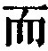. The personage is
entirely fabulous.

[255:3](sbe39127.htm#fr_333.md) Dismembered or
disfigured you.

[256:1](sbe39127.htm#fr_335.md) Names of parties,
of whom we know nothing. It is implied, we must suppose, that they had
suffered as is said by their own inadvertence.

[256:2](sbe39127.htm#fr_336.md) We must suppose
that they had done so.

[257:1](sbe39127.htm#fr_337.md) 'I sit and
forget;'--generally thus supplemented (
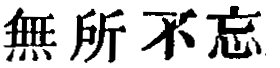). Hui proceeds to set forth the meaning he himself
attached to the phrase.

[257:2](sbe39127.htm#fr_338.md) Another
denomination, I think, of the Tâo. The 
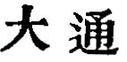 is also explained as meaning, 'the great void in
which there is no obstruction (
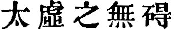).

[257:3](sbe39127.htm#fr_339.md) Here is another
testimony, adduced by our author, of Confucius's appreciation of Tâoism;
to which the sage would, no doubt, have taken exception.

[257:4](sbe39127.htm#fr_341.md) Two of the men in
pars. 9, 10.

[258:1](sbe39127.htm#fr_342.md) Here is the
highest issue of Tâoism;--unquestioning submission to what is beyond our
knowledge and control.

------------------------------------------------------------------------

[Next: Book VII: Ying Tî Wang, or 'The Normal Course for Rulers and
Kings'](sbe39128.md)
