  
[Intangible Textual Heritage](../../index)  [Taoism](../index.md) 
[Index](index)  [Previous](sbe39127)  [Next](sbe39129.md) 

------------------------------------------------------------------------

p. 259

## BOOK VII.

### PART I. SECTION VII.

### Ying Tî Wang [1](#fn_308), or 'The Normal Course for Rulers and Kings [1](#fn_308.md).'

1\. Nieh Khüeh [2](#fn_309.md) put four questions
to Wang Π[2](#fn_309.md), not one of which did he
know (how to answer). On this Nieh Khüeh leaped up, and in great delight
walked away and informed Phû-î-dze [3](#fn_310.md)
of it, who said to him, 'Do you (only) now know it? He of the line of
Yü [4](#fn_311.md) was not equal to him of the
line of Thâi [5](#fn_312.md). He of Yü still kept
in himself (the idea of) benevolence by which to constrain (the
submission of) men; and he did win men, but he had not begun to proceed
by what did not belong to him as a man. He of the line of Thâi would
sleep tranquilly, and awake in contented simplicity. He would consider
himself now (merely) as a horse, and now (merely) as an ox [6](#fn_313.md). His knowledge was real and untroubled

p. 260

by doubts; and his virtue was very true:--he had not begun to proceed by
what belonged to him as a man.

2\. Kien Wû [1](#fn_314.md) went to see the mad
(recluse), Khieh-yü [2](#fn_315.md), who said to
him, 'What did Zäh-kung Shih [3](#fn_316.md) tell
you?' The reply was, 'He told me that when rulers gave forth their
regulations according to their own views and enacted righteous measures,
no one would venture not to obey them, and all would be transformed.'
Khieh-yd said, 'That is but the hypocrisy of virtue. For the right
ordering of the world it would be like trying to wade through the sea
and dig through the Ho, or employing a musquito to carry a mountain on
its back. And when a sage is governing, does he govern men's outward
actions? He is (himself) correct, and so (his government) goes on;--this
is the simple and certain way by which he secures the success of his
affairs. Think of the bird which flies high, to avoid being hurt by the
dart on the string of the archer, and the little mouse which makes its
hole deep under Shän-khiû [4](#fn_317.md) to avoid
the danger of being smoked or dug out;-are (rulers) less knowing than
these two little creatures?'

3\. Thien Kän [5](#fn_318.md), rambling on the
south of (mount) Yin [6](#fn_319.md), came to the
neighbourhood of the Liâo-water.

p. 261

Happening there to meet with the man whose name is not known [1](#fn_320.md), he put a question to him, saying, 'I
beg to ask what should be done [2](#fn_321.md) in
order to (carry on) the government of the world.' The nameless man said,
'Go away; you are a rude borderer. Why do you put to me a question for
which you are unprepared [3](#fn_322.md)? I would
simply play the part of the Maker of (all) things [4](#fn_323.md). When wearied, I would mount on the bird
of the light and empty air, proceed beyond the six cardinal points, and
wander in the region of nonentity, to dwell in the wilderness of desert
space. What method have you, moreover, for the government of the world
that you (thus) agitate my mind?' (Thien Kän), however, again asked the
question, and the nameless man said, 'Let your mind find its enjoyment
in pure simplicity; blend yourself with (the primary) ether in idle
indifference; allow all things to take their natural course; and admit
no personal or selfish consideration:--do this and the world will be
governed.'

4\. Yang Dze-kü [5](#fn_324.md), having an
interview with Lao Tan, said to him, 'Here is a man, alert and vigorous

p. 262

in responding to all matters [1](#fn_325.md),
clearsighted and widely intelligent, and an unwearied student of the
Tâo;--can he be compared to one of the intelligent kings?' The reply
was, 'Such a man is to one of the intelligent kings but as the bustling
underling of a court who toils his body and distresses his mind with his
various contrivances [2](#fn_326.md). And
moreover, it is the beauty of the skins of the tiger and leopard which
makes men hunt them; the agility of the monkey, or (the sagacity of) the
dog that catches the yak, which make men lead them in strings; but can
one similarly endowed be compared to the intelligent kings?'

Yang dze-kü looked discomposed and said, 'I venture to ask you what the
government of the intelligent kings is.' Lâo Tan replied, 'In the
governing of the intelligent kings, their services overspread all under
the sky, but they did not seem to consider it as proceeding from
themselves; their transforming influence reached to all things, but the
people did not refer it to them with hope. No one could tell the name of
their agency, but they made men and things be joyful in themselves.
Where they took their stand could not be fathomed, and they found their
enjoyment in (the realm of) nonentity.'

5\. In Käng there was a mysterious wizard [3](#fn_327.md) called

p. 263

Ki-hsien. He knew all about the deaths and births of men, their
preservation and ruin, their misery and happiness, and whether their
lives would be long or short, foretelling the year, the month, the
decade and the day like a spirit. When the people of Käng saw him, they
all ran out of his way. Lieh-dze went to see him, and was
fascinated [1](#fn_328.md) by him. Returning, he
told Hû-dze of his interview, and said, 'I considered your doctrine, my
master, to be perfect, but I have found another which is superior to
it.' Hû-dze [2](#fn_329.md) replied, 'I have
communicated to you but the outward letter of my doctrine, and have not
communicated its reality and spirit; and do you think that you are in
possession of it? However many hens there be, if there be not the cock
among them, how should they lay (real) eggs [3](#fn_330.md)? When you confront the world with your
doctrine, you are sure to show in your countenance (all that is in your
mind) [4](#fn_331), and so enable (this.md) man to
succeed in interpreting your physiognomy. Try and come to me with him,
that I may show myself to him.'

On the morrow, accordingly, Lieh-dze came with the man and saw Ha-dze.
When they went out, the

p. 264

wizard said, 'Alas! your master is a dead man. He will not live;--not
for ten days more! I saw something strange about him;--I saw the ashes
(of his life) all slaked with water!' When Lieh-dze reentered, he wept
till the front of his jacket was wet with his tears, and told Hû-dze
what the man had said. Hû-dze said, 'I showed myself to him with the
forms of (vegetation beneath) the earth. There were the sprouts indeed,
but without (any appearance of) growth or regularity:--he seemed to see
me with the springs of my (vital) power closed up. Try and come to me
with him again.'

Next day, accordingly, Lieh-dze brought the man again and saw Hû-dze.
When they went out, the man said, 'It is a fortunate thing for your
master that he met with me. He will get better; he has all the signs of
living! I saw the balance (of the springs of life) that had been stopped
(inclining in his favour).' Lieh-dze went in, and reported these words
to his master, who said, 'I showed myself to him after the pattern of
the earth (beneath the) sky. Neither semblance nor reality entered (into
my exhibition), but the springs (of life) were issuing from beneath my
feet;--he seemed to see me with the springs of vigorous action in full
play. Try and come with him again.'

Next day Lieh-dze came with the man again, and again saw Hû-dze with
him. When they went out, the wizard said, 'Your master is never the
same. I cannot understand his physiognomy. Let him try to steady
himself, and I will again view him.' Lieh-dze went in and reported this
to Hû-dze, who said, 'This time I showed myself to him after the pattern
of the grand harmony (of the two elemental

p. 265

forces), with the superiority inclining to neither. He seemed to see me
with the springs of (vital) power in equal balance. Where the water
wheels about from (the movements of) a dugong [1](#fn_332.md), there is an abyss; where it does so
from the arresting (of its course), there is an abyss; where it does so,
and the water keeps flowing on, there is an abyss. There are nine
abysses with their several names, and I have only exhibited three of
them. Try and come with him again.'

Next day they came, and they again saw Hû-dze. But before he had settled
himself in his position, the wizard lost himself and ran away. 'Pursue
him,' said Hû-dze, and Lieh-dze did so, but could not come up with him.
He returned, and told Hû-dze, saying, 'There is an end of him; he is
lost; I could not find him.' Hû-dze rejoined, 'I was showing him myself
after the pattern of what was before I began to come from my author. I
confronted him with pure vacancy, and an easy indifference. He did not
know what I meant to represent. Now he thought it was the idea of
exhausted strength, and now that of an onward flow, and therefore he ran
away.

After this, Lieh-dze considered that he had not yet begun to learn (his
master's doctrine). He returned to his house, and for three years did
not go out. He did the cooking for his wife. He fed the pigs as if he
were feeding men. He took no part

p. 266

or interest in occurring affairs. He put away the carving and sculpture
about him, and returned to pure simplicity. Like a clod of earth he
stood there in his bodily presence. Amid all distractions he was
(silent) and shut up in himself. And in this way he continued to the end
of his life.

6\. Non-action (makes its exemplifier) the lord of all fame; non-action
(serves him as) the treasury of all plans; non-action (fits him for) the
burden of all offices; non-action (makes him) the lord of all
wisdom [1](#fn_333.md). The range of his action is
inexhaustible, but there is nowhere any trace of his presence. He
fulfils all that he has received from Heaven [2](#fn_334.md), but he does not see that he was the
recipient of anything. A pure vacancy (of all purpose) is what
characterises him. When the perfect man employs his mind, it is a
mirror. It conducts nothing and anticipates nothing; it responds to
(what is before it), but does not retain it. Thus he is able to deal
successfully with all things, and injures none.

7\. The Ruler [3](#fn_335.md) of the Southern
Ocean was Shû [4](#fn_336.md), the

p. 267

Ruler of the Northern Ocean was Hû [1](#fn_337.md), and the Ruler of the Centre was Chaos.
Shû and Hû were continually meeting in the land of Chaos, who treated
them very well. They consulted together how they might repay his
kindness, and said, 'Men all have seven orifices for the purpose of
seeing, hearing, eating, and breathing, while this (poor) Ruler alone
has not one. Let us try and make them for him.' Accordingly they dug one
orifice in him every day; and at the end of seven days Chaos died [2](#fn_338.md).

------------------------------------------------------------------------

### Footnotes

[259:1](sbe39128.htm#fr_344.md) See pp.
[136](sbe39094.htm#page_136)-[138](sbe39095.htm#page_138.md).

[259:2](sbe39128.htm#fr_346.md) See p. 190, note
 [5](sbe39123.htm#fn_113.md).

[259:3](sbe39128.htm#fr_347.md) An ancient Tâoist,
of the time of Shun. So, Hwang-fû Mî, who adds that Shun served him as
his master when he was eight years old. I suppose the name indicates
that his clothes were made of rushes.

[259:4](sbe39128.htm#fr_348.md) Shun. See p. 245,
note  [3](sbe39127.htm#fn_266.md).

[259:5](sbe39128.htm#fr_349.md) An ancient
sovereign, earlier, no doubt, than Fû-hsî; but nothing is known of him.

[259:6](sbe39128.htm#fr_350.md) He thought nothing
about his being, as a man, superior to the lower creatures. Shun in
governing employed his acquired knowledge; Thâi had not begun to do so.

[260:1](sbe39128.htm#fr_351.md) See p. 170, note
 [2](sbe39122.htm#fn_57.md).

[260:2](sbe39128.htm#fr_352.md) See p. 170, note
 [3](sbe39122.htm#fn_58.md).

[260:3](sbe39128.htm#fr_353.md) A name;--'a
worthy,' it is said.

[260:4](sbe39128.htm#fr_354.md) Name of some hill,
or height.

[260:5](sbe39128.htm#fr_355.md) A name ('Root of
the sky'), but probably mythical. There is a star so called.

[260:6](sbe39128.htm#fr_356.md) Probably the name
of a mountain, though this meaning of Yin is not given in the
dictionary.

[261:1](sbe39128.htm#fr_357.md) Or, 'a nameless
man.' We cannot tell whether Kwang-dze had any particular Being, so
named, in view or not.

[261:2](sbe39128.htm#fr_358.md) The objectionable
point in the question is the supposition that doing' was necessary in
the case.

[261:3](sbe39128.htm#fr_359.md) Or, 'I am
unprepared! But as Thien Kän repeats the question, it seems better to
supply the second pronoun. He had thought on the subject.

[261:4](sbe39128.htm#fr_360.md) See the same
phraseology in VI, par. 11. What follows is merely our author's way of
describing the non-action of the Tâo.

[261:5](sbe39128.htm#fr_361.md) The Yang Kû, whom
Mencius attacked so fiercely. He was, perhaps, a contemporary and
disciple of Lâo-dze.

[262:1](sbe39128.htm#fr_362.md) The  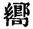 may be taken as =  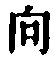 in which case we must
understand a   as its object;
or as =  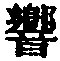, an echo,'
indicating the quickness of the man's response to things.

[262:2](sbe39128.htm#fr_363.md) Compare the
language of Lâo Tan, in Bk. XII, par. 8, near the beginning.

[262:3](sbe39128.htm#fr_364.md)  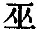 is generally feminine, meaning
'a witch.' We must take p. 263 it here as
masculine (=  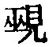). The
general meaning of the character is 'magical,' the antics of such
performers to bring down the spirits.

[263:1](sbe39128.htm#fr_365.md) Literally,
'intoxicated.'

[263:2](sbe39128.htm#fr_366.md) The teacher in
Tâoism of Lieh-dze, called also Hû Khiû, with the name Lin ( 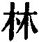). See the remarks on the whole
paragraph in the Introductory Notice of the Book.

[263:3](sbe39128.htm#fr_367.md) 'The hens' signify
the letter of the doctrine; 'the cock,' its spirit; 'the eggs,' a real
knowledge of it.

[263:4](sbe39128.htm#fr_368.md)  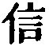 is here in the first tone, and
read as  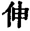, meaning 'to
stretch,', to set forth.'

[265:1](sbe39128.htm#fr_369.md) One of the dugong.
It has various names in Chinese, one being 
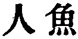, 'the Man-Fish,' from a fancied resemblance of its
head and face to a human being;--the origin perhaps of the idea of the
mermaid.

[266:1](sbe39128.htm#fr_370.md) The four members
of this sentence occasion the translator no small trouble. They are
constructed on the same lines, and seem to me to be indicative and not
imperative. Lin Hsî-kung observes that all the explanations that had
been offered of them were inappropriate. My own version is substantially
in accordance with his interpretations. The chief difficulty is with the
first member, which seems anti-Tâoistic; but our author is not speaking
of the purpose of any actor, but of the result of his non-action.  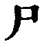 is to be taken in the sense of
 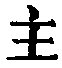, 'lord,' 'exercising
lordship.' The  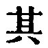 in the
third sentence indicates a person or persons in the author's mind in
what precedes.

[266:2](sbe39128.htm#fr_371.md) = the Heavenly or
self- determining nature.

[266:3](sbe39128.htm#fr_372.md) Perhaps 'god'
would be a better translation.

[266:4](sbe39128.htm#fr_373.md) Meaning
'Heedless.'

[267:1](sbe39128.htm#fr_374.md) Meaning 'Sudden.'

[267:2](sbe39128.htm#fr_375.md) The little
allegory is ingenious and amusing. 'It indicates,' says Lin, 'how action
(the opposite of non-inaction) injures the first condition of things.'
More especially it is in harmony with the Tâoistic opposition to the use
of knowledge in government. One critic says that an 'alas!' might well
follow the concluding 'died.' But surely it was better that Chaos should
give place to another state. 'Heedless' and 'Sudden' did not do a bad
work.

------------------------------------------------------------------------

[Next: Book VIII: Phien Mâu, or 'Webbed Toes.'](sbe39129.md)
