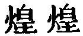
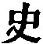

  
[Intangible Textual Heritage](../../index)  [Taoism](../index.md) 
[Index](index)  [Previous](sbe39128)  [Next](sbe39130.md) 

------------------------------------------------------------------------

p. 268

## BOOK VIII.

### PART II. SECTION I.

### Phien Mâu, or 'Webbed Toes [1](#fn_339.md).'

1\. A ligament uniting the big toe with the other toes and an extra
finger may be natural [2](#fn_340.md) growths, but
they are more than is good for use. Excrescences on the person and
hanging tumours are growths from the body, but they are unnatural
additions to it. There are many arts of benevolence and righteousness,
and the exercise of them is distributed among the five viscera [3](#fn_341.md); but this is not the correct method
according to the characteristics of the Tâo. Thus it is that the
addition to the foot is but the attachment to it of so much useless
flesh, and the addition to the hand is but the planting on it of a
useless finger. (So it is that) the connecting (the virtues) with the
five viscera renders, by excess or restraint, the action of benevolence
and righteousness bad, and leads to many arts as in the employment of
(great) powers of hearing or of vision.

2\. Therefore an extraordinary power of vision

p. 269

leads to the confusion of the five colours [1](#fn_342.md) and an excessive use of ornament. (Its
possessor), in the resplendence of his green and yellow, white and
black, black and green, will not stop till he has become a Lî Kû [2](#fn_343.md). An extraordinary power of hearing leads
to a confusion of the five notes [3](#fn_344.md),
and an excessive use of the six musical accords [4](#fn_345). (Its possessor.md), in bringing out the
tones from the instruments of metal, stone, silk, and bamboo, aided by
the Hwang-kung [4](#fn_345.md) and Tâ-lü [4](#fn_345) (tubes.md), will not stop till he has
become a Shih Khwang [5](#fn_346). (So.md),
excessive benevolence eagerly brings out virtues and restrains its
(proper) nature, that (its possessor) may acquire a famous reputation,
and cause all the organs and drums in the world to celebrate an
unattainable condition; and he will not stop till he has become a Zäng
(Shän) [6](#fn_347) or a Shih (Zhiû.md) [7](#fn_348.md). An extraordinary

p. 270

faculty in debating leads to the piling up of arguments like a builder
with his bricks, or a net-maker with his string. (Its possessor)
cunningly contrives his sentences and enjoys himself in discussing what
hardness is and what whiteness is, where views agree and where they
differ, and pressing on, though weary, with short steps, with (a
multitude of) useless words to make good his opinion; nor will he stop
till he has become a Yang (Kû) [1](#fn_349.md) or
Mo (Tî) [1](#fn_349.md). But in all these cases
the parties, with their redundant and divergent methods, do not proceed
by that which is the correct path for all under the sky. That which is
the perfectly correct path is not to lose the real character of the
nature with which we are endowed. Hence the union (of parts) should not
be considered redundance, nor their divergence superfluity; what is long
should not be considered too long, nor what is short too short. A duck's
legs, for instance, are short, but if we try to lengthen them, it
occasions pain; and a crane's legs are long, but if we try to cut off a
portion of them, it produces grief. Where a part is by nature long, we
are not to amputate, or where it is by nature short, we are not to
lengthen it. There is no occasion to try to remove any trouble that it
may cause.

3\. The presumption is that benevolence and righteousness are not
constituents of humanity; for to how much anxiety does the exercise of
them give rise! Moreover when another toe is united to the

p. 271

great toe, to divide the membrane makes you weep; and when there is an
extra finger, to gnaw it off makes you cry out. In the one case there is
a member too many, and in the other a member too few; but the anxiety
and pain which they cause is the same. The benevolent men of the present
age look at the evils of the world, as with eyes full of dust, and are
filled with sorrow by them, while those who are not benevolent, having
violently altered the character of their proper nature, greedily pursue
after riches and honours. The presumption therefore is that benevolence
and righteousness are contrary to the nature of man:--how full of
trouble and contention has the world been ever since the three
dynasties [1](#fn_350.md) began!

And moreover, in employing the hook and line, the compass and square, to
give things their correct form you must cut away portions of what
naturally belongs to them; in employing strings and fastenings, glue and
varnish to make things firm, you must violently interfere with their
qualities. The bendings and stoppings in ceremonies and music, and the
factitious expression in the countenance of benevolence and
righteousness, in order to comfort the minds of men:--these all show a
failure in observing the regular principles (of the human constitution).
All men are furnished with such regular principles; and according to
them what is bent is not made so by the hook, nor what is straight by
the line, nor what is round by the compass, nor what is square by the
carpenter's square. Nor is adhesion effected by

p. 272

the use of glue and varnish, nor are things bound together by means of
strings and bands. Thus it is that all in the world are produced what
they are by a certain guidance, while they do not know how they are
produced so; and they equally attain their several ends while they do
not know how it is that they do so. Anciently it was so, and it is so
now; and this constitution of things should not be made of none effect.
Why then should benevolence and righteousness be employed as connecting
(links), or as glue and varnish, strings and bands, and the enjoyment
arising from the Tâo and its characteristics be attributed to them?--it
is a deception practised upon the world. Where the deception is small,
there will be a change in the direction (of the objects pursued); where
it is great, there will be a change of the nature itself. How do I know
that it is so? Since he of the line of Yü called in his benevolence and
righteousness to distort and vex the world, the world has not ceased to
hurry about to execute their commands;--has not this been by means of
benevolence and righteousness to change (men's views) of their nature?

4\. I will therefore try and discuss this matter. From the commencement
of the three dynasties downwards, nowhere has there been a man who has
not under (the influence of external) things altered (the course of) his
nature. Small men for the sake of gain have sacrificed their persons;
scholars for the sake of fame have done so; great officers, for the sake
of their families; and sagely men, for the sake of the kingdom. These
several classes, with different occupations, and different reputations,

p. 273

have agreed in doing injury to their nature and sacrificing their
persons. Take the case of a male and female slave [1](#fn_351.md);--they have to feed the sheep together,
but they both lose their sheep. Ask the one what he was doing, and you
will find that he was holding his bamboo tablets and reading. Ask the
other, and you will find that she was amusing herself with some
game [2](#fn_352.md). They were differently
occupied, but they equally lose their sheep. (So), Po-î [3](#fn_353.md) died at the foot of Shâu-yang [4](#fn_354.md) to maintain his fame, and the robber
Kih [5](#fn_355.md) died on the top of
Tung-ling [6](#fn_356.md) in his eagerness for
gain. Their deaths were occasioned by different causes, but they equally
shortened their lives and did violence to their nature;--why must we
approve of Po-î, and condemn the robber Kih? In cases of such sacrifice
all over the world, when one makes it for the sake of benevolence and
righteousness, the common people style him 'a superior man,' but when
another does it for the sake of goods and riches, they style him 'a
small man.' The action of sacrificing is the same, and yet we have 'the
superior man' and 'the small man!' In the matter of destroying his life,
and doing injury to his nature, the robber Kih simply did the same as
Po-î;-why must we make the distinction of 'superior man' and 'small man'
between them?

p. 274

5\. Moreover, those who devote their nature to (the pursuit) of
benevolence and righteousness, though they should attain to be like Zäng
(Shän) and Shih (Zhiû), I do not pronounce to be good; those who devote
it to (the study of) the five flavours, though they attain to be like
Shû-*r* [1](#fn_357.md), I do not pronounce to be
good; those who devote it to the (discrimination of the) five notes,
though they attain to be like Shih Khwang, I do not pronounce to be
quick of hearing; those who devote it to the (appreciation of the) five
colours, though they attain to be like Lî Kû, I do not pronounce to be
clear of vision. When I pronounce men to be good, I am not speaking of
their benevolence and righteousness;--the goodness is simply (their
possession of) the qualities (of the Tâo). When I pronounce them to be
good, I am not speaking of what are called benevolence and
righteousness; but simply of their allowing the nature with which they
are endowed to have its free course. When I pronounce men to be quick of
hearing, I do not mean that they hearken to anything else, but that they
hearken to themselves; when I pronounce them to be clear of vision, I do
not mean that they look to anything else, but that they look to
themselves. Now those who do not see themselves but see other things,
who do not get possession of themselves but get possession of other
things, get possession of what belongs to others, and not of what is
their own; and they reach forth to what attracts others, and not to that
in themselves which should attract them. But

p. 275

thus reaching forth to what attracts others and not to what should
attract them in themselves, be they like the robber Kih or like Po-î,
they equally err in the way of excess or of perversity. What I am
ashamed of is erring in the characteristics of the Tâo, and therefore,
in the higher sphere, I do not dare to insist on the practice of
benevolence and righteousness, and, in the lower, I do not dare to allow
myself either in the exercise of excess or perversity.

------------------------------------------------------------------------

### Footnotes

[268:1](sbe39129.htm#fr_376.md) See pp.
[138](sbe39095.htm#page_138), [139](sbe39096.htm#page_139.md).

[268:2](sbe39129.htm#fr_377.md) Come out from the
nature,' but 'nature' must be taken here as in the translation. The
character is not Tâo.

[268:3](sbe39129.htm#fr_378.md) The five viscera
are the heart, the liver, the stomach, the lungs, and the kidneys. To
the liver are assigned the element 'wood,' and the virtue of
benevolence; to the lungs, the element 'metal,' and the virtue of
righteousness.

[269:1](sbe39129.htm#fr_379.md) Black, red, azure
(green, blue, or black), white, and yellow.

[269:2](sbe39129.htm#fr_380.md) The same as the Lî
Lâu of Mencius (IV, i, 1),--of the time of Hwang-Tî. It is not easy to
construe the text here, and in the analogous sentences below. Hsüan
Ying, having read on to the 
 as the uninterrupted predicate of the sharp seer,
says, 'Is not this a proof of the extraordinary gift?' What follows
would be, 'But it was exemplified in Lî Kû.' The meaning that is given
in the version was the first that occurred to myself.

[269:3](sbe39129.htm#fr_381.md) The five notes of
the Chinese musical scale.

[269:4](sbe39129.htm#fr_384.md) There are twelve
of these musical notes, determined by the twelve regulating tubes; six,
represented here by Hwang-kung, the name of the first tube, giving the
sharp notes; and six, represented by Tâ-lü, giving the flat notes.

[269:5](sbe39129.htm#fr_385.md) See in II, par. 5.

[269:6](sbe39129.htm#fr_386.md) The famous
Zäng-dze, or Zäng Shän, one of Confucius's ablest disciples.

[269:7](sbe39129.htm#fr_387.md) An officer of Wei
in the sixth century B. C. He belonged to a family of historiographers,
and hence the surname Shih (
). Confucius mentions him in the most honourable terms
in the p. 270 Analect XV, vi, by the name
Shih Yü. 'Righteousness' was his great attribute.

[270:1](sbe39129.htm#fr_389.md) The two
heresiarchs so much denounced by Mencius. Both have appeared in previous
Books.

[271:1](sbe39129.htm#fr_390.md) Those of Hsiâ,
Shang, and Kâu;--from the twenty-third century B. C. to our author's own
time.

[273:1](sbe39129.htm#fr_391.md) See the Khang-hsî
dictionary under the character 
.

[273:2](sbe39129.htm#fr_392.md) Playing at some
game with dice.

[273:3](sbe39129.htm#fr_393.md) See VI, par. 3.

[273:4](sbe39129.htm#fr_394.md) A mountain in the
present Shan-hsî, probably in the department of Phû-kâu.

[273:5](sbe39129.htm#fr_395.md) A strange
character, but not historical, represented as a brother of Liû-hsiâ Hui.
See Bk. XXIX.

[273:6](sbe39129.htm#fr_396.md) 'The Eastern
Height,' = the Thâi mountain in the present Shan-tung.

[274:1](sbe39129.htm#fr_397.md) Different from
Yih-ya, the famous cook of duke Hwan of Khî. This is said to have been
of the time of Hwang-Tî. But there are different readings of the name.

------------------------------------------------------------------------

[Next: Book IX: Mâ Thî, or 'Horses's Hoofs'](sbe39130.md)
