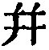
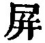
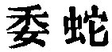
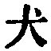
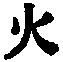
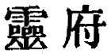
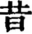
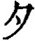
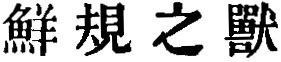

  
[Intangible Textual Heritage](../../index)  [Taoism](../index.md) 
[Index](index)  [Previous](sbe39134)  [Next](sbe39136.md) 

------------------------------------------------------------------------

p. 345

## BOOK XIV.

### PART II. SECTION VII.

### Thien Yün, or 'The Revolution of Heaven [1](#fn_502.md).'

1\. How (ceaselessly) heaven revolves! Flow (constantly) earth abides at
rest! And do the sun and moon contend about their (respective) places?
Who presides over and directs these (things)? Who binds and connects
them together? Who is it that, without trouble or exertion on his part,
causes and maintains them? Is it, perhaps, that there is some secret
spring, in consequence of which they cannot be but as they are? Or is
it, perhaps, that they move and turn as they do, and cannot stop of
themselves?

(Then) how the clouds become rain! And how the rain again forms the
clouds! Who diffuses them so abundantly? Who is it that, without trouble
or exertion on his part, produces this elemental enjoyment, and seems to
stimulate it?

The winds rise in the north; one blows to the west, and another to the
east; while some rise upwards, uncertain in their direction. By whose
breathing are they produced? Who is it that, without any trouble and
exertion of his own, effects all their undulations? I venture to ask
their cause [2](#fn_503.md).

p. 346

Wû-hsien Thiâo [1](#fn_504.md) said, 'Come, and I
will tell you. To heaven there belong the six Extreme Points, and the
five Elements [2](#fn_505.md). When the Tîs and
Kings acted in accordance with them, there was good government; when
they acted contrary to them, there was evil. Observing the things
(described) in the nine divisions (of the writing) of Lo [3](#fn_506.md), their government was perfected and
their virtue was complete. They inspected and enlightened the kingdom
beneath them, and all under the sky acknowledged and sustained them.
Such was the condition under the august (sovereigns [4](#fn_507) .md) and those before them.'

2\. Tang [5](#fn_508.md), the chief administrator
of Shang [5](#fn_508.md), asked Kwang-dze about
Benevolence [6](#fn_509.md), and the answer was,
'Wolves and tigers are benevolent.' 'What do you mean?' said Tang.
Kwang-dze replied, 'Father and son (among them) are affectionate to one
another. Why should they be considered as not benevolent?'

p. 347

'Allow me to ask about perfect benevolence,' pursued the other.
Kwang-dze said, 'Perfect benevolence [1](#fn_510) does not admit (the feeling.md) of
affection.' The minister said, 'I have heard that, without (the feeling
of) affection there is no love, and without love there is not filial
duty;--is it permissible to say that the perfectly benevolent are not
filial?' Kwang-dze rejoined, 'That is not the way to put the case.
Perfect Benevolence is the very highest thing;--filial duty is by no
means sufficient to describe it. The saying which you quote is not to
the effect that (such benevolence) transcends filial duty;--it does not
refer to such duty at all. One, travelling to the south, comes (at last)
to Ying [2](#fn_511.md), and there, standing with
his face to the north, he does not see mount Ming [3](#fn_512.md). Why does he not see it? Because he is
so far from it. Hence it is said, "Filial duty as a part of reverence is
easy, but filial duty as a part of love is difficult. If it be easy as a
part of love, yet it is difficult to forget [4](#fn_513.md) one's parents. It may be easy for me to
forget my parents, but it is difficult to make my parents forget me. If
it were easy to make my parents forget me, it is difficult for me to
forget all men in the world. If it were easy to forget all men in the
world, it is difficult to make them all forget me."

'This virtue might make one think light of Yâo and Shun, and not wish to
be they [5](#fn_514.md). The profit

p. 348

and beneficial influences of it extend to a myriad ages, and no one in
the world knows whence they come. How can you simply heave a great sigh,
and speak (as you do) of benevolence and filial duty? Filial duty,
fraternal respect, benevolence, righteousness, loyalty, sincerity,
firmness, and purity;--all these may be pressed into the service of this
virtue, but they are far from sufficient to come up to it. Therefore it
is said, "To him who has what is most noble [1](#fn_515.md), all the dignities of a state are as
nothing [2](#fn_516.md); to him who has what is
the greatest riches, all the wealth of a state is as nothing; to him who
has all that he could wish, fame and praise are as nothing." It is thus
that the Tâo admits of no substitute.'

3\. Pei-män Khäng [3](#fn_517.md) asked Hwang-Tî,
saying, 'You were celebrating, O Tî, a performance of the music of the
Hsien-khih [4](#fn_518.md), in the open country
near the Thung-thing lake. When I heard the first part of it, I was
afraid; the next made me weary; and the last perplexed me. I became
agitated and unable to speak, and lost my self-possession.' The Tî said,
'It was likely that it should so affect you! It was performed with (the
instruments of) men, and all attuned according to (the influences of)
Heaven. It

p. 349

proceeded according to (the principles of) propriety and righteousness,
and was pervaded by (the idea of) the Grand Purity.

'The Perfect Music first had its response in the affairs of men, and was
conformed to the principles of Heaven; it indicated the action of the
five virtues, and corresponded to the spontaneity (apparent in nature).
After this it showed the blended distinctions of the four seasons, and
the grand harmony of all things;--the succession of those seasons one
after another, and the production of things in their proper order. Now
it swelled, and now it died away, its peaceful and military strains
clearly distinguished and given forth. Now it was clear, and now rough,
as if the contracting and expanding of the elemental processes blended
harmoniously (in its notes). Those notes then flowed away in waves of
light, till, as when the hibernating insects first begin to move, I
commanded the terrifying crash of thunder. Its end was marked by no
formal conclusion, and it began again without any prelude. It seemed to
die away, and then it burst into life; it came to a close, and then it
rose again. So it went on regularly and inexhaustibly, and without the
intervention of any pause:--it was this which made you afraid.

'In the second part (of the performance), I made it describe the harmony
of the Yin and Yang, and threw round it the brilliance of the sun and
moon. Its notes were now short and now long, now soft and now hard.
Their changes, however, were marked by an unbroken unity, though not
dominated by a fixed regularity. They filled every valley and ravine;
you might shut up every crevice, and guard your spirit (against their
entrance), yet

p. 350

there was nothing but gave admission to them. Yea, those notes resounded
slowly, and might have been pronounced high and clear. Hence the shades
of the dead kept in their obscurity; the sun and moon, and all the stars
of the zodiac, pursued their several courses. I made (my instruments)
leave off, when (the performance) came to an end, and their (echoes)
flowed on without stopping. You thought anxiously about it, and were not
able to understand it; you looked for it, and were not able to see it;
you pursued it, and were not able to reach it. All amazed, you stood in
the way all open around you, and then you leant against an old rotten
dryandra tree and hummed. The power of your eyes was exhausted by what
you wished to see; your strength failed in your desire to pursue it,
while I myself could not reach it. Your body was but so much empty
vacancy while you endeavoured to retain your self-possession [1](#fn_519.md):--it was that endeavour which made you
weary.

'In the last part (of the performance), I employed notes which did not
have that wearying effect. I blended them together as at the command of
spontaneity. Hence they came as if following one another in confusion,
like a clump of plants springing from one root, or like the music of a
forest produced by no visible form. They spread themselves all around
without leaving a trace (of their cause); and seemed to issue from deep
obscurity where there was no sound. Their movements came from nowhere;
their home was in the deep darkness;--

p. 351

conditions which some would call death, and some life; some, the fruit,
and some, (merely) the flower. Those notes, moving and flowing on,
separating and shifting, and not following any regular sounds, the world
might well have doubts about them, and refer them to the judgment of a
sage, for the sages understand the nature of this music, and judge in
accordance with the prescribed (spontaneity). While the spring of that
spontaneity has not been touched, and yet the regulators of the five
notes are all prepared;--this is what is called the music of Heaven,
delighting the mind without the use of words. Hence it is said in the
eulogy of the Lord of Piâo [1](#fn_520.md), "You
listen for it, and do not hear its sound; you look for it, and do not
perceive its form; it fills heaven and earth; it envelopes all within
the universe." You wished to hear it, but could not take it in; and
therefore you were perplexed.

'I performed first the music calculated to awe; and you were frightened
as if by a ghostly visitation, I followed it with that calculated to
weary; and in your weariness you would have withdrawn. I concluded with
that calculated to perplex; and in your perplexity you felt your
stupidity. But that stupidity is akin to the Tâo; you may with it convey
the Tâo in your person, and have it (ever) with you.'

4\. When Confucius was travelling in the west in Wei, Yen Yüan asked the
music-master Kin [2](#fn_521.md), saying,

p. 352

\[paragraph continues\] 'How is it, do you think, with the course of the
Master?' The music-master replied, 'Alas! it is all over with your
Master!' 'How so?' asked Yen Yüan; and the other said, 'Before the
grass-dogs [1](#fn_522.md) are set forth (at the
sacrifice), they are deposited in a box or basket, and wrapt up with
elegantly embroidered cloths, while the representative of the dead and
the officer of prayer prepare themselves by fasting to present them.
After they have been set forth, however, passers-by trample on their
heads and backs, and the grass-cutters take and burn them in cooking.
That is all they are good for. If one should again take them, replace
them in the box or basket, wrap them up with embroidered cloths, and
then in rambling, or abiding at the spot, should go to sleep under them,
if he do not get (evil) dreams, he is sure to be often troubled with the
nightmare. Now here is your Master in the same way taking the
grass-dogs, presented by the ancient kings, and leading his disciples to
wander or abide and sleep under them. Owing to this, the tree (beneath
which they were practising ceremonies) in Sung was cut down [2](#fn_523.md); he was obliged to leave Wei [3](#fn_524.md); he was reduced to extremities in
Shang [3](#fn_524.md) and Kâu [4](#fn_525.md):--were not those experiences like having
(evil) dreams? He was kept in a state of siege between Khän and
Zhâi [5](#fn_526.md), so that for seven days he
had no cooked food to eat, and was in a situation between life and
death:--were not those experiences like the nightmare?

p. 353

'If you are travelling by water, your best plan is to use a boat; if by
land, a carriage. Take a boat, which will go (easily) along on the
water, and try to push it along on the land, and all your lifetime it
will not go so much as a fathom or two:--are not ancient time and the
present time like the water and the dry land? and are not Kâu and Lû
like the boat and the carriage? To seek now to practise (the old ways
of) Kâu in Lû is like pushing along a boat on the dry land. It is only a
toilsome labour, and has no success; he who does so is sure to meet with
calamity. He has not learned that in handing down the arts (of one time)
he is sure to be reduced to extremity in endeavouring to adapt them to
the conditions (of another).

'And have you not seen the working of a shadoof? When (the rope of) it
is pulled, it bends down; and when it is let go, it rises up. It is
pulled by a man, and does not pull the man; and so, whether it bends
down or rises up, it commits no offence against the man. In the same way
the rules of propriety, righteousness, laws, and measures of the three
Hwangs [1](#fn_527.md) and five Tîs [1](#fn_527.md) derived their excellence, not from their
being the same as those of the present day, but from their (aptitude
for) government. We may compare them to haws [2](#fn_528.md), pears, oranges,

p. 354

and pummeloes, which are different in flavour, but all suitable to be
eaten. Just so it is that the rules of propriety, righteousness, laws,
and measures, change according to the time.

'If now you take a monkey, and dress it in the robes of the duke of Kâu,
it will bite and tear them, and will not be satisfied till it has got
rid of them altogether. And if you look at the difference between
antiquity and the present time it is as great as that between the monkey
and the duke of Kâu. In the same way, when Hsî Shih [1](#fn_529.md) was troubled in mind, she would knit her
brows and frown on all in her neighbourhood. An ugly woman of the
neighbourhood, seeing and admiring her beauty, went home, and also
laying her hands on her heart proceeded to stare and frown on all around
her. When the rich people of the village saw her, they shut fast their
doors and would not go out; when the poor people saw her, they took
their wives and children and ran away from her. The woman knew how to
admire the frowning beauty, but she did not know how it was that she,
though frowning, was beautiful. Alas! it is indeed all over with your
Master [2](#fn_530.md)!'

5\. When Confucius was in his fifty-first year [3](#fn_531.md), he had not heard of the Tâo, and went
south to Phei [4](#fn_532.md)

p. 355

to see Lâo Tan, who said to him, 'You have come, Sir; have you? I have
heard that you are the wisest man of the North; have you also got the
Tâo?' 'Not yet,' was the reply; and the other went on, 'How have you
sought it?' Confucius said, 'I sought it in measures and numbers, and
after five years I had not got it.' 'And how then did you seek it?' 'I
sought it in the Yin and Yang, and after twelve years I have not found
it.' Lâo-dze said, 'Just so! If the Tâo could be presented (to another),
men would all present it to their rulers; if it could be served up (to
others), men would all serve it up to their parents; if it could be told
(to others), men would all tell it to their brothers; if it could be
given to others, men would all give it to their sons and grandsons. The
reason why it cannot be transmitted is no other but this,--that if,
within, there be not the presiding principle, it will not remain there,
and if, outwardly, there be not the correct obedience, it will not be
carried out. When that which is given out from the mind (in possession
of it) is not received by the mind without, the sage will not give it
out; and when, entering in from without, there is no power in the
receiving mind to entertain it, the sage will not permit it to lie hid
there [1](#fn_533.md). Fame is a possession common
to all; we should not seek to have much of it. Benevolence and
righteousness were as the lodging-houses of the former kings; we should
only rest in them for a night, and not occupy them for

p. 356

long. If men see us doing so, they will have much to say against us.

'The perfect men of old trod the path of benevolence as a path which
they borrowed for the occasion, and dwelt in Righteousness as in a
lodging which they used for a night. Thus they rambled in the vacancy of
Untroubled Ease, found their food in the fields of Indifference, and
stood in the gardens which they had not borrowed. Untroubled Ease
requires the doing of nothing; Indifference is easily supplied with
nourishment; not borrowing needs no outlay. The ancients called this the
Enjoyment that Collects the True.

'Those who think that wealth is the proper thing for them cannot give up
their revenues; those who seek distinction cannot give up the thought of
fame; those who cleave to power cannot give the handle of it to others.
While they hold their grasp of those things, they are afraid (of losing
them). When they let them go, they are grieved; and they will not look
at a single example, from which they might perceive the (folly) of their
restless pursuits:--such men are under the doom of Heaven [1](#fn_534.md).

'Hatred and kindness; taking and giving; reproof and instruction; death
and life:--these eight things are instruments of rectification, but only
those are able to use them who do not obstinately refuse to comply with
their great changes. Hence it is said, "Correction is Rectification."
When the minds of

p. 357

some do not acknowledge this, it is because the gate of Heaven [1](#fn_535) (in them.md) has not been opened.'

6\. At an interview with Lâo Tan, Confucius spoke to him of benevolence
and righteousness. Lâo Tan said, 'If you winnow chaff, and the dust gets
into your eyes, then the places of heaven and earth and of the four
cardinal points are all changed to you. If musquitoes or gadflies
puncture your skin, it will keep you all the night [2](#fn_536.md) from sleeping. But this painful
iteration of benevolence and righteousness excites my mind and produces
in it the greatest confusion. If you, Sir, would cause men not to lose
their natural simplicity, and if you would also imitate the wind in its
(unconstrained) movements, and stand forth in all the natural attributes
belonging to you!--why must you use so much energy, and carry a great
drum to seek for the son whom you have lost [3](#fn_537.md)? The snow-goose does not bathe every day
to make itself white, nor the crow blacken itself every day to make
itself black. The natural simplicity of their black and white does not
afford any ground for controversy; and the fame and praise which men
like to contemplate do not make them greater than they naturally are.
When the springs (supplying the pools) are dried up, the fishes huddle
together on the dry land. Than that they should moisten one another
there by their gasping, and keep one another wet by their milt, it would
be better for them to forget one another in the rivers and lakes [4](#fn_538.md).'

p. 358

From this interview with Lâo Tan, Confucius returned home, and for three
days did not speak. His disciples (then) asked him, saying, 'Master, you
have seen Lâo Tan; in what way might you admonish and correct him?'
Confucius said, 'In him (I may say) that I have now seen the dragon. The
dragon coils itself up, and there is its body; it unfolds itself and
becomes the dragon complete. It rides on the cloudy air, and is
nourished by the Yin and Yang. I kept my mouth open, and was unable to
shut it;--how could I admonish and correct Lâo Tan?'

7\. Dze-kung [1](#fn_539.md) said, 'So then, can
(this) man indeed sit still as a representative of the dead, and then
appear as the dragon? Can his voice resound as thunder, when he is
profoundly still? Can he exhibit himself in his movements like heaven
and earth? May I, Zhze, also get to see him?' Accordingly with a message
from Confucius he went to see Lâo Tan.

Lâo Tan was then about to answer (his salutation) haughtily in the hall,
but he said in a low voice, 'My years have rolled on and are passing
away, what do you, Sir, wish to admonish me about?' Dze-kung replied,
'The Three Kings and Five Tîs [2](#fn_540.md)
ruled

p. 359

the world not in the same way, but the fame that has accrued to them is
the same. How is it that you alone consider that they were not sages?'
'Come forward a little, my son. Why do you say that (their government)
was not the same?' 'Yâo,' was the reply, 'gave the kingdom to Shun, and
Shun gave it to Yü. Yü had recourse to his strength, and Thang to the
force of arms. King Wän was obedient to Kâu (-hsin), and did not dare to
rebel; king Wû rebelled against Kâu, and would not submit to him. And I
say that their methods were not the same.' Lâo Tan said, 'Come a little
more forward, my son, and I will tell you how the Three Hwangs and the
Five Tîs [1](#fn_541.md) ruled the world. Hwang-Tî
ruled it, so as to make the minds of the people all conformed to the One
(simplicity). If the parents of one of them died, and he did not wail,
no one blamed him. Yâo ruled it so as to cause the hearts of the people
to cherish relative affection. If any, however, made the observances on
the death of other members of their kindred less than those for their
parents, no one blamed them [2](#fn_542.md). Shun
ruled it, so as to produce a feeling of rivalry in the minds of the
people. Their wives gave birth to their children in the tenth month of
their pregnancy, but those children could speak at five months; and
before they were three years old, they began to call people by their
surnames and names. Then it was that men began to die prematurely. Yü
ruled it, so as to cause the minds of the people to become changed.
Men's minds became scheming, and they

p. 360

used their weapons as if they might legitimately do so, (saying that
they were) killing thieves and not killing other men. The people formed
themselves into different combinations;--so it was throughout the
kingdom. Everywhere there was great consternation, and then arose the
Literati and (the followers of) Mo (Tî). From them came first the
doctrine of the relationships (of society); and what can be said of the
now prevailing customs (in the marrying of) wives and daughters? I tell
you that the rule of the Three Kings and Five Tîs may be called by that
name, but nothing can be greater than the disorder which it produced.
The wisdom of the Three Kings was opposed to the brightness of the sun
and moon above, contrary to the exquisite purity of the hills and
streams below, and subversive of the beneficent gifts of the four
seasons between. Their wisdom has been more fatal than the sting of a
scorpion or the bite of a dangerous beast [1](#fn_543.md). Unable to rest in the true attributes
of their nature and constitution, they still regarded themselves as
sages:--was it not a thing to be ashamed of? But they were shameless.'
Dze-kung stood quite disconcerted and ill at ease.

8\. Confucius said to Lâo Tan, 'I have occupied myself with the Shih,
the Shû, the Lî, the Yo, the Yî, and the Khun Khiû, those six Books, for
what I myself consider a long time [2](#fn_544.md), and am thoroughly

p. 361

acquainted with their contents. With seventy-two rulers, all offenders
against the right, I have discoursed about the ways of the former kings,
and set forth the examples of (the dukes of Kâu and Shâo; and not one of
them has adopted (my views) and put them in practice:--how very
difficult it is to prevail on such men, and to make clear the path to be
pursued!'

Lâo-dze replied, 'It is fortunate that you have not met with a ruler
fitted to rule the age. Those six writings are a description of the
vestiges left by the former kings, but do not tell how they made such
vestiges; and what you, Sir, speak about are still only the vestiges.
But vestiges are the prints left by the shoes;--are they the shoes that
produced them? A pair of white herons look at each other with pupils
that do not move, and impregnation takes place; the male insect emits
its buzzing sound in the air above, and the female responds from the air
below, and impregnation takes place; the creatures called lêi are both
male and female, and each individual breeds of itself [1](#fn_545.md). The nature cannot be altered; the
conferred constitution cannot be changed; the march of the seasons
cannot be arrested; the Tâo cannot be stopped. If you get the Tâo, there
is no effect that cannot be produced; if you miss it, there is no effect
that can.'

Confucius (after this) did not go out, till at the end of three months
he went again to see Lâo Tan, and said, 'I have got it. Ravens produce
their young by hatching; fishes by the communication of their milt; the
small-waisted wasp by

p. 362

transformation [1](#fn_546.md); when a younger
brother comes, the elder weeps [2](#fn_547.md).
Long is it that I have not played my part in harmony with these
processes of transformation. But as I did not play my part in harmony
with such transformation, how could I transform men?' Lâo-dze said, 'You
will do. Khiû, you have found the Tâo.'

------------------------------------------------------------------------

### Footnotes

[345:1](sbe39135.htm#fr_550.md) See pp. 145, 146.

[345:2](sbe39135.htm#fr_551.md) Down to this we
have a description of the phenomena of heaven and earth and of nature
generally as proceeding regularly p. 346 and
noiselessly, without any apparent cause; which is the chief subject of
the Book. As the description is not assigned to any one, we must suppose
it to be from Kwang-dze himself; and that it is he who asks the question
in the last three characters.

[346:1](sbe39135.htm#fr_552.md) This is said by
the critics to have been a minister of the Shang dynasty, under Thâi-mâu
in the seventeenth century B. C.; but even Kwang-dze would hardly so
violate the unity of time.

[346:2](sbe39135.htm#fr_553.md) Generally means
'the Five Regular Virtues;' supposed to mean here 'the Five Elements.'

[346:3](sbe39135.htm#fr_554.md) Probably the 'Nine
Divisions of the Great Plan,' in the Shû King, V, iv, fancied to be
derived from the writing, which a tortoise from the Lo river exhibited
to the great Yü.

[346:4](sbe39135.htm#fr_555.md) Possibly Fû-hsî,
Shän Näng, and Hwang-Tî.

[346:5](sbe39135.htm#fr_557.md) 'Shang' must be
taken as the duchy of Sung, assigned by king Wû to the representative of
the kings of the dynasty of Shang. 'Tang' would be a principal minister
of it in the time of Kwang-dze.

[346:6](sbe39135.htm#fr_558.md) The chief of all
the virtues according to Confucianism.

[347:1](sbe39135.htm#fr_559.md) A denomination
here for the Tâo, employed by Kwang-dze for the purpose of his argument.

[347:2](sbe39135.htm#fr_560.md) The capital of the
state of Khû in the south.

[347:3](sbe39135.htm#fr_561.md) Name of a hill in
the extreme north.

[347:4](sbe39135.htm#fr_562.md) The Tâo requires
such forgetfulness on the part of both giver and receiver; it is a part
of its 'doing-nothing.'

[347:5](sbe39135.htm#fr_563.md) I think this is
the meaning.

[348:1](sbe39135.htm#fr_564.md) The Tâo.

[348:2](sbe39135.htm#fr_565.md) This free version
takes   as =  . So the Khang-list dictionary
explains it.

[348:3](sbe39135.htm#fr_566.md) Only heard of, so
far as I know, in this passage.

[348:4](sbe39135.htm#fr_567.md) The name of
Hwang-Tî's music; I do not venture to translate it. In his elaborate
description of it, our author intended to give an idea of the Tâo, and
the effect which the study of it was calculated to produce on the mind;
as appears from the concluding sentence of the paragraph.

[350:1](sbe39135.htm#fr_568.md) See the usage of
the two characters   in
the Shih King, I, ii, Ode 3.

[351:1](sbe39135.htm#fr_569.md) Some sovereign of
antiquity, of whom it is difficult to find any other mention but this.
Even in the Lû Shih I have not discovered him. The name is said to be
pronounced Piâo; in which case it should consist of three  , and not of three  .

[351:2](sbe39135.htm#fr_570.md) Only heard of
here.

[352:1](sbe39135.htm#fr_571.md) See the Tâo Teh
King, ch. 5.

[352:2](sbe39135.htm#fr_572.md) Analects III,
xxii.

[352:3](sbe39135.htm#fr_574.md) In consequence of
the dissoluteness of the court; Analects VI, xxvi; IX, 17.

[352:4](sbe39135.htm#fr_575.md) Meaning Sung and
Wei.

[352:5](sbe39135.htm#fr_576.md) Analects XI, ii,
i.

[353:1](sbe39135.htm#fr_578.md) It is impossible
to speak definitely of who these three Hwangs (Augustuses) and five Tîs
were, or whom the speaker intended by them. The former would seem to
lead us to the purely fabulous ages, when twelve (or thirteen) Heavenly
Hwangs, eleven Earthly, and nine Human ruled over the young world, for a
period of 576,000 years. There is a general agreement of opinion that
the five Tîs ended with Yâo and Shun.

[353:2](sbe39135.htm#fr_579.md) See Williams's
Dictionary, sub voc. He says it is the Crataegus p.
354 cuneata and pinnatifida, common in China, and much esteemed
for its acidity.

[354:1](sbe39135.htm#fr_580.md) A famous
beauty,--the concubine of king Fû-khâi of Wû.

[354:2](sbe39135.htm#fr_581.md) The comparisons in
this paragraph are not complimentary to Confucius. Of course the
conversation never took place, and must have been made up to ridicule
the views of the sage.

[354:3](sbe39135.htm#fr_582.md) This would be in
B. C. 503 or 502, and Lâo-dze would be more than a hundred years old.

[354:4](sbe39135.htm#fr_583.md) Probably in what
is now the district of Phei, department of Hsü-kâu, Kiang-sû.

[355:1](sbe39135.htm#fr_584.md) That is, the sage
will not deposit it, where it will lie hidden;--compare Analects XVI,
vi.

[356:1](sbe39135.htm#fr_585.md) See the same
expression used in Book VI, par. 11, used by Confucius of himself.
Comparing the two passages together, I must doubt the correctness of my
note there ( [2](sbe39127.htm#fn_290), p. 252.md), that 'Heaven' is used in
the Confucian sense of Tî, or God. The men here pursued and toiled after
the pleasures of the world, rather than the quiet satisfactions of the
Tâo.

[357:1](sbe39135.htm#fr_586.md) See Book XXIII,
par. 9. The phrase =  .

[357:2](sbe39135.htm#fr_587.md) The common reading
  is a mistake for  .

[357:3](sbe39135.htm#fr_588.md) Compare the same
illustration in the preceding Book, par. 7.

[357:4](sbe39135.htm#fr_589.md) This illustration
is from Book V1, par. 5.

[358:1](sbe39135.htm#fr_590.md) Dze-kung would
seem to have undertaken this expedition to maintain the reputation of
the Master and his school;--only to be defeated by Lâo-dze more signally
than Confucius had been.

[358:2](sbe39135.htm#fr_591.md) These are
different probably, though the text is not quite certain, from the three
Hwangs and five Tîs of par. 3. The Hwangs (or August Sovereigns)
preceded the Tîs; the Kings (Wangs) came after them. The Three Kings are
the three lines of kings commencing with the dynasty of Hsü, and
following Shun. From the names mentioned by Dze-kung, we ought certainly
so to understand the designation here.

[359:1](sbe39135.htm#fr_592.md) See note
 [2](#fn_540.md), preceding page.

[359:2](sbe39135.htm#fr_593.md) Referring to some
abuses, contrary to the doctrine of relationship.

[360:1](sbe39135.htm#fr_594.md) What beast is
meant here cannot be ascertained from the characters in the text,  .

[360:2](sbe39135.htm#fr_595.md) But with the
preparation of the Khun Khiû Confucius's life ended;--it is very plain
that no conversation such as Kwang-dze has fabricated here could ever
have taken place.

[361:1](sbe39135.htm#fr_596.md) Where had Lâo-dze
or his author learned his zoology?

[362:1](sbe39135.htm#fr_597.md) See the Shih King,
II, v, Ode II, 3, about the sphex.

[362:2](sbe39135.htm#fr_598.md) Because, as we
say, 'his nose is put out.' But the sentiment, though it is ascribed to
Confucius, is rarely according to the fact of the case.

------------------------------------------------------------------------

[Next: Book XV: Kho Î, or 'Ingrained Ideas.'](sbe39136.md)
