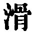
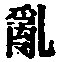
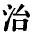
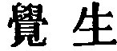
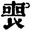

  
[Intangible Textual Heritage](../../index)  [Taoism](../index) 
[Index](index)  [Previous](sbe39136)  [Next](sbe39138) 

------------------------------------------------------------------------

p. 368

## BOOK XVI.

### PART II. SECTION IX.

### Shan Hsing, or 'Correcting the Nature [1](#fn_557).'

1\. Those who would correct their nature by means of the vulgar
learning [2](#fn_558), seeking to restore it to
its original condition, and those who would regulate [3](#fn_559) their desires, by the vulgar ways of
thinking, seeking thereby to carry their intelligence to perfection,
must be pronounced to be deluded and ignorant people. The ancients who
regulated the Tâo nourished their faculty of knowledge by their
placidity, and all through life abstained from employing that faculty in
action;--they must be pronounced to have (thus also) nourished their
placidity by their knowledge [4](#fn_560).

When the faculty of knowledge and the placidity

p. 369

(thus) blend together, and they nourish each other, then from the nature
there come forth harmony and orderly method. The attributes (of the Tâo)
constitute the harmony; the Tâo (itself) secures the orderly method.
When the attributes appear in a universal practice of forbearance, we
have Benevolence; when the path is all marked by orderly method, we have
Righteousness; when the righteousness is clearly manifested, and (all)
things are regarded with affection, we have Leal-heartedness; when the
(heart's) core is thus (pure) and real, and carried back to its (proper)
qualities, we have Music; when this sincerity appears in all the range
of the capacity, and its demonstrations are in accordance with what is
elegant, we have Ceremony. If Ceremonies and Music are carried out in an
imperfect and one-sided manner, the world is thrown into confusion. When
men would rectify others, and their own virtue is beclouded, it is not
sufficient to extend itself to them. If an attempt be made so to extend
it, they also will lose their (proper) nature.

2\. The men of old, while the chaotic condition was yet
undeveloped [1](#fn_561), shared the placid
tranquillity which belonged to the whole world. At that time the Yin and
Yang were harmonious and still; their resting and movement proceeded
without any disturbance; the four seasons had their definite times; not
a single thing received any injury, and no living being came to a
premature end. Men might be

p. 370

possessed of (the faculty of) knowledge, but they had no occasion for
its use. This was what is called the state of Perfect Unity. At this
time, there was no action on the part of any one, but a constant
manifestation of spontaneity.

This condition (of excellence) deteriorated and decayed, till Sui-zän
and Fû-hsî arose and commenced their administration of the world [1](#fn_562); on which came a compliance (with their
methods), but the state of unity was lost. The condition going on to
deteriorate and decay, Shän Näng and Hwang-Tî arose, and took the
administration of the world, on which (the people) rested (in their
methods), but did not themselves comply with them. Still the
deterioration and decay continued till the lords of Thang and Yü [2](#fn_563) began to administer the world. These
introduced the method of governing by transformation, resorting to the
stream (instead of to the spring) [3](#fn_564),
thus vitiating the purity and destroying the simplicity (of the nature).
They left the Tâo, and substituted the Good for it, and pursued the
course of Haphazard Virtue. After this they forsook their nature and
followed (the promptings of) their minds. One mind and another
associated their knowledge, but were unable to give rest to the world.
Then they added to this knowledge (external

p. 371

and) elegant forms, and went on to make these more and more numerous.
The forms extinguished the (primal) simplicity, till the mind was
drowned by their multiplicity. After this the people began to be
perplexed and disordered, and had no way by which they might return to
their true nature, and bring back their original condition.

3\. Looking at the subject from this point of view, we see how the world
lost [1](#fn_565) the (proper) course, and how
the course (which it took) only led it further astray [1](#fn_565). The world and the Way, when they came
together, being (thus) lost to each other, how could the men of the Way
make themselves conspicuous in the world? and how could the world rise
to an appreciation of the Way? Since the Way had no means to make itself
conspicuous in the world, and the world had no means of rising to an
appreciation of the Way, though sagely men might not keep among the
hills and forests, their virtue was hidden;--hidden, but not because
they themselves sought to hide it.

Those whom the ancients called 'Retired Scholars' did not conceal their
persons, and not allow themselves to be seen; they did not shut up their
words, and refuse to give utterance to them; they did not hide away
their knowledge, and refuse to bring it forth. The conditions laid on
them by the times were very much awry. If the conditions of the times
had allowed them to act in the world on a great scale, they would have
brought back the state of unity without any trace being perceived (of
how

p. 372

they did so), When those conditions shut them up entirely from such
action, they struck their roots deeper (in themselves), were perfectly
still and waited. It was thus that they preserved (the Way in) their own
persons.

4\. The ancients who preserved (the Way in) their own persons did not
try by sophistical reasonings to gloss over their knowledge; they did
not seek to embrace (everything in) the world in their knowledge, nor to
comprehend all the virtues in it. Solitary and trembling they remained
where they were, and sought the restoration of their nature. What had
they to do with any further action? The Way indeed is not to be pursued,
nor (all) its characteristics to be known on a small scale. A little
knowledge is injurious to those characteristics; small doings are
injurious to the Way;--hence it is said, 'They simply rectified
themselves.' Complete enjoyment is what is meant by 'the Attainment of
the Aim.'

What was anciently called 'the Attainment of the Aim' did not mean the
getting of carriages and coronets [1](#fn_566);
it simply meant that nothing more was needed for their enjoyment.
Now-a-days what is called 'the Attainment of the Aim' means the getting
of carriages and coronets. But carriages and coronets belong to the
body; they do not affect the nature as it is constituted. When such
things happen to come, it is but for a time; being but for a time, their
coming cannot be obstructed and their going cannot be stopped [2](#fn_567) . Therefore we should not

p. 373

because of carriages and coronets indulge our aims, nor because of
distress and straitness resort to the vulgar (learning and thinking);
the one of these conditions and the other may equally conduce to our
enjoyment, which is simply to be free from anxiety. If now the departure
of what is transient takes away one's enjoyment, this view shows that
what enjoyment it had given was worthless. Hence it is said, 'They who
lose themselves in their pursuit of things, and lose their nature in
their study of what is vulgar, must be pronounced people who turn things
upside down.'

------------------------------------------------------------------------

### Footnotes

[368:1](sbe39137.htm#fr_609) See pp.
[147](sbe39103.htm#page_147), [148](sbe39104.htm#page_148).

[368:2](sbe39137.htm#fr_610) 'Vulgar' must mean
'common,' and 'the vulgar learning' is the teaching popular in the time
of our author, and which he regarded as contrary to the principles of
Tâoism, of which he was an adherent. The Chinese critics say that
'vulgar' here is used as the opposite of 'true.'

[368:3](sbe39137.htm#fr_611)   is generally explained by
 , 'to confuse,' but I
cannot construe the sentence with that meaning of the term. In the
Khang-hsî dictionary which I have followed, the character is defined by
  with special reference
to this passage.

[368:4](sbe39137.htm#fr_612) This sentence is
the clue to the author's aim in the whole Book. The 'knowledge' is
defined by  , 'the faculty
of perception and apprehension.'

[369:1](sbe39137.htm#fr_613) These 'men of old'
were what we may call 'primeval men;' men in the lowest stage of
development; but which our author considered to be the highest or
paradisiacal condition of their nature.

[370:1](sbe39137.htm#fr_614) Kwang-dze gives no
hint of how long he considered this highest condition to have lasted.
Sui-zän, 'the man of the Burning Speculum,' 'the Fire-producer,' whom
Williams calls 'the Prometheus of China,' appears before Fû-hsî, as the
first in the line of the Rulers of the world, who broke up the Primal
Unity.

[370:2](sbe39137.htm#fr_615) These were Yâo and
Shun, named from the principalities over which their fathers ruled.

[370:3](sbe39137.htm#fr_616) 'The streams' were
the methods of culture that arose after the simple virtues and
spontaneity of the Tâo were lost.

[371:1](sbe39137.htm#fr_618) It is the same
character in the text which I have been obliged to translate thus
differently,-- .

[372:1](sbe39137.htm#fr_619) That is, worldly
distinction.

[372:2](sbe39137.htm#fr_620) Because they
depend on others. Compare Mencius VI, i, ch. 17, 2.

------------------------------------------------------------------------

[Next: Book XVII: Khiû Shui, or 'The Floods of Autumn.'](sbe39138)
