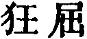
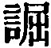
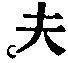
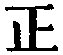
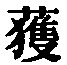

  
[Intangible Textual Heritage](../../index)  [Taoism](../index.md) 
[Index](index)  [Previous](sbe4005)  [Next](sbe4007.md) 

------------------------------------------------------------------------

p. 57

## BOOK XXII.

### PART II. SECTION XV.

### Kih Pei Yû, or 'Knowledge Rambling in the North [1](#fn_111.md).'

1\. Knowledge [2](#fn_112.md) had rambled
northwards to the region of the Dark Water [3](#fn_113.md), where he ascended the height of
Imperceptible Slope [3](#fn_113.md), when it
happened that he met with Dumb Inaction [2](#fn_112.md) . Knowledge addressed him, saying, 'I
wish to ask you some questions:--By what process of thought and anxious
consideration do we get to know the Tâo? Where should we dwell and what
should we do to find our rest in the Tâo? From what point should we
start and what path should we pursue to make the Tâo our own?' He asked
these three questions, but Dumb Inaction [2](#fn_112.md) gave him no reply. Not only did he not
answer, but he did not know how to answer.

Knowledge [2](#fn_112.md), disappointed by the
fruitlessness of his questions, returned to the south of the Bright

p. 58

\[paragraph continues\] Water [1](#fn_114.md), and
ascended the height of the End of Doubt [1](#fn_114.md) where he saw Heedless Blurter, to whom
he put the same questions, and who replied, 'Ah! I know, and will tell
you.' But while he was about to speak, he forgot what he wanted to say.

Knowledge, (again) receiving no answer to his questions, returned to the
palace of the Tî [2](#fn_115.md), where he saw
Hwang-Tî [3](#fn_116.md), and put the questions to
him. Hwang-Tî said, 'To exercise no thought and no anxious consideration
is the first step towards knowing the Tâo; to dwell nowhere and do
nothing is the first step towards resting in the Tâo; to start from
nowhere and pursue no path is the first step towards making the Tâo your
own.'

Knowledge then asked Hwang-Tî, saying, 'I and you know this; those two
did not know it; which of us is right?' The reply was, 'Dumb
Inaction [3](#fn_116.md) is truly right; Heedless
Blurter has an appearance of being so; I and you are not near being so.
(As it is said), "Those who know (the Tâo) do not speak of it; those who
speak of it do not know it [4](#fn_117.md);" and
"Hence the sage conveys his instructions without the use of speech [4](#fn_117.md)." The Tâo cannot be made ours by
constraint; its characteristics will not come to us (at our call).
Benevolence may be practised; Righteousness may be partially attended
to; by Ceremonies men impose on one another. Hence it

p. 59

is said, "When the Tâo was lost, its Characteristics appeared. When its
Characteristics were lost, Benevolence appeared. When Benevolence was
lost, Righteousness appeared. When Righteousness was lost, Ceremonies
appeared. Ceremonies are but (the unsubstantial) flowers of the Tâo, and
the commencement of disorder [1](#fn_118.md)."
Hence (also it is further said), "He who practises the Tâo, daily
diminishes his doing. He diminishes it and again diminishes it, till he
arrives at doing nothing. Having arrived at this non-inaction, there is
nothing that he does not do [1](#fn_118.md)." Here
now there is something, a regularly fashioned utensil;--if you wanted to
make it return to the original condition of its materials, would it not
be difficult to make it do so? Could any but the Great Man accomplish
this easily [2](#fn_119.md)?

'Life is the follower of death, and death is the predecessor of life;
but who knows the Arranger (of this connexion between them) [3](#fn_120.md)? The life is due to the collecting of
the breath. When that is collected, there is life; when it is dispersed,
there is death. Since death and life thus attend on each other, why
should I account (either of) them an evil?

'Therefore all things go through one and the same experience. (Life) is
accounted beautiful because it is spirit-like and wonderful, and death
is accounted ugly because of its foetor and putridity. But the foetid
and putrid is transformed again into the spirit-like and wonderful, and
the spirit-like and wonderful is transformed again into the foetid and

p. 60

putrid. Hence it is said, "All under the sky there is one breath of
life, and therefore the sages prized that unity [1](#fn_121.md),"'

Knowledge [2](#fn_122.md) said to Hwang-Tî [2](#fn_122.md), 'I asked Dumb Inaction [2](#fn_122.md), and he did not answer me. Not only did
he not answer me, but he did not know how to answer me. I asked Heedless
Blurter, and while he wanted to tell me, he yet did not do so. Not only
did he not tell me, but while he wanted to tell me, he forgot all about
my questions. Now I have asked you, and you knew (all about them);--why
(do you say that) you are not near doing so?' Hwang-Tî replied, 'Dumb
Inaction [2](#fn_122.md) was truly right, because
he did not know the thing. Heedless Blurter [2](#fn_122.md) was nearly right, because he forgot it.
I and you are not nearly right, because we know it.' Heedless
Blurter [2](#fn_122) heard of (all this.md), and
considered that Hwang-Tî [2](#fn_122.md) knew how
to express himself (on the subject).

2\. (The operations of) Heaven and Earth proceed in the most admirable
way, but they say nothing about them; the four seasons observe the
clearest laws, but they do not discuss them; all things have their
complete and distinctive constitutions, but they say nothing about
them [3](#fn_123.md).

The sages trace out the admirable operations of Heaven and Earth, and
reach to and understand the distinctive constitutions of all things; and
thus it is that the Perfect Man (is said to) do nothing and the Greatest
Sage to originate nothing, such language showing that they look to
Heaven and Earth as

p. 61

their model [1](#fn_124.md). Even they, with their
spirit-like and most exquisite intelligence, as well as all the tribes
that undergo their transformations, the dead and the living, the square
and the round, do not understand their root and origin, but nevertheless
they all from the oldest time by it preserve their being.

Vast as is the space included within the six cardinal points, it all
(and all that it contains) lies within (this twofold root of Heaven and
Earth); small as is an autumn hair, it is indebted to this for the
completion of its form. All things beneath the sky, now rising, now
descending, ever continue the same through this. The Yin and Yang, and
the four seasons revolve and move by it, each in its proper order. Now
it seems to be lost in obscurity, but it continues; now it seems to
glide away, and have no form, but it is still spirit-like. All things
are nourished by it, without their knowing it. This is what is called
the Root and Origin; by it we may obtain a view of what we mean by
Heaven [2](#fn_125.md).

3, Nieh Khüeh [3](#fn_126.md) asked about the Tâo
from Phei-î who replied,' If you keep your body as it should be, and
look only at the one thing, the Harmony of Heaven will come to you. Call
in your knowledge, and make your measures uniform, and the spiritual
(belonging to you) will come and lodge with you; the Attributes (of the
Tâo) will be your beauty, and the Tâo (itself) will be your
dwelling-place. You will have the simple look of a new-born calf, and

p. 62

will not seek to know the cause (of your being what you are).' Phei-î
had not finished these words when the other dozed off into a sleep.

Phei-î was greatly pleased, and walked away, singing as he went,

Like stump of rotten tree his frame,

Like lime when slaked his mind became [1](#fn_127.md). Real is his wisdom, solid, true,

Nor cares what's hidden to pursue. O dim and dark his aimless mind! No
one from him can counsel find. What sort of man is he?'

4\. Shun asked (his attendant) Khäng [2](#fn_128.md), saying, 'Can I get the Tâo and hold it
as mine?' The reply was, 'Your body is not your own to hold; how then
can you get and hold the Tâo?' Shun resumed, 'If my body be not mine to
possess and hold, who holds it?' Khäng said, 'It is the bodily form
entrusted to you by Heaven and Earth. Life is not yours to hold. It is
the blended harmony (of the Yin and Yang), entrusted to you by Heaven
and Earth. Your nature, constituted as it is, is not yours to hold. It
is entrusted to you by Heaven and Earth to act in accordance with it.
Your grandsons and sons are not yours to hold. They are the
exuviae [3](#fn_129.md) entrusted to you by Heaven
and Earth. Therefore when we walk, we should not know where we are
going; when we stop and rest, we should not know what to occupy
ourselves with

p. 63

when we eat, we should not know the taste of our food;--all is done by
the strong Yang influence of Heaven and Earth [1](#fn_130). How then can you get (the Tâo.md), and
hold it as your own?'

5\. Confucius asked Lao Tan, saying, 'Being at leisure to-day, I venture
to ask you about the Perfect Tâo.' Lâo Tan replied, 'You must, as by
fasting and vigil, clear and purge your mind, wash your spirit white as
snow, and sternly repress your knowledge. The subject of the Tâo is
deep, and difficult to describe;--I will give you an outline of its
simplest attributes.

'The Luminous was produced from the Obscure; the Multiform from the
Unembodied; the Spiritual from the Tâo; and the bodily from the seminal
essence. After this all things produced one another from their bodily
organisations. Thus it is that those which have nine apertures are born
from the womb, and those with eight from eggs [2](#fn_131.md)

But their coming leaves no trace, and their going no monument; they
enter by no door; they dwell in no apartment [3](#fn_132.md):--they are in a vast arena reaching in
all directions. They who search for and find (the Tâo) in this are
strong in their limbs, sincere and far-reaching in their thinking, acute
in their hearing, and clear in their seeing. They exercise their minds
without being toiled; they respond to everything aright without regard
to place or circumstance. Without this heaven would not be high, nor
earth

p. 64

broad; the sun and moon would not move, and nothing would
flourish:--such is the operation of the Tâo.

'Moreover, the most extensive knowledge does not necessarily know it;
reasoning will not make men wise in it;--the sages have decided against
both these methods. However you try to add to it, it admits of no
increase; however you try to take from it, it admits of no
diminution;--this is what the sages maintain about it. How deep it is,
like the sea! How grand it is, beginning again when it has come to an
end! If it carried along and sustained all things, without being
overburdened or weary, that would be like the way of the superior man,
merely an external operation; when all things go to it, and find their
dependence in it;--this is the true character of the Tâo.

'Here is a man (born) in one of the middle states [1](#fn_133.md). He feels himself independent both of
the Yin and Yang [2](#fn_134.md), and dwells
between heaven and earth; only for the present a mere man, but he will
return to his original source. Looking at him in his origin, when his
life begins, we have (but) a gelatinous substance in which the breath is
collecting. Whether his life be long or his death early, how short is
the space between them! It is but the name for a moment of time,
insufficient to play the part of a good Yâo or a bad Kieh in.

'The fruits of trees and creeping plants have their distinctive
characters, and though the relationships

p. 65

of men, according to which they are classified, are troublesome, the
sage, when he meets with them, does not set himself in opposition to
them, and when he has passed through them, he does not seek to retain
them; he responds to them in their regular harmony according to his
virtue; and even when he accidentally comes across any of them, he does
so according to the Tâo. It was thus that the Tîs flourished, thus that
the kings arose.

'Men's life between heaven and earth is like a white [1](#fn_135.md) colt's passing a crevice, and suddenly
disappearing. As with a plunge and an effort they all come forth; easily
and quietly they all enter again. By a transformation they live, and by
another transformation they die. Living things are made sad (by death),
and mankind grieve for it; but it is (only) the removal of the bow from
its sheath, and the emptying the natural satchel of its contents. There
may be some confusion amidst the yielding to the change; but the
intellectual and animal souls are taking their leave, and the body will
follow them:--This is the Great Returning home.

'That the bodily frame came from incorporeity, and will return to the
same, is what all men in common know, and what those who are on their
way to (know) it need not strive for. This is what the multitudes of men
discuss together. Those whose (knowledge) is complete do not discuss
it;--such discussion shows that their (knowledge) is not complete. Even
the most clear-sighted do not meet

p. 66

\[paragraph continues\] (with the Tâo);--it is better to be silent than
to reason about it. The Tâo cannot be heard with the ears;--it is better
to shut the ears than to try and hear it. This is what is called the
Great Attainment.'

6\. Tung-kwo Dze [1](#fn_136.md) asked Kwang-dze,
saying, 'Where is what you call the Tâo to be found?' Kwang-dze replied,
'Everywhere.' The other said, 'Specify an instance of it. That will be
more satisfactory.' 'It is here in this ant.' 'Give a lower instance.'
'It is in this panic grass.' 'Give me a still lower instance.' 'It is in
this earthenware tile.' 'Surely that is the lowest instance?' 'It is in
that excrement [2](#fn_137.md).' To this Tung-kwo
Dze gave no reply.

Kwang-dze said, 'Your questions, my master, do not touch the fundamental
point (of the Tâo). They remind me of the questions ad-dressed by the
superintendents of the market to the inspector about examining the value
of a pig by treading on it, and testing its weight as the foot descends
lower and lower on the body [3](#fn_138.md). You
should not specify any particular thing. There is not a single thing
without (the Tâo). So it is with the Perfect Tâo. And if we call it the
Great (Tâo), it is just the same. There are the three
terms,--"Complete," "All-embracing," "the Whole." These names are
different,

p. 67

but the reality (sought in them) is the same referring to the One
thing [1](#fn_139.md).

'Suppose we were to try to roam about in the palace of No-where;--when
met there, we might discuss (about the subject) without ever coming to
an end. Or suppose we were to be together in (the region of)
Non-action;--should we say that (the Tâo was) Simplicity and Stillness?
or Indifference and Purity? or Harmony and Ease? My will would be
aimless. If it went nowhere, I should not know where it had got to; if
it went and came again, I should not know where it had stopped; if it
went on going and coming, I should not know when the process would end.
In vague uncertainty should I be in the vastest waste. Though I entered
it with the greatest knowledge, I should not know how inexhaustible it
was. That which makes things what they are has not the limit which
belongs to things, and when we speak of things being limited, we mean
that they are so in themselves. (The Tâo) is the limit of the unlimited,
and the boundlessness of the unbounded.

'We speak of fulness and emptiness; of withering and decay. It produces
fulness and emptiness, but is neither fulness nor emptiness; it produces
withering and decay, but is neither withering nor decay. It produces the
root and branches, but is neither root nor branch; it produces
accumulation and dispersion, but is itself neither accumulated nor
dispersed.'

7\. A-ho Kan [2](#fn_140.md) and Shän Näng studied
together

p. 68

under Läo-lung Kî. Shän Näng [1](#fn_141.md) was
leaning forward on his stool, having shut the door and gone to sleep in
the day time. At midday A-ho Kan pushed open the door and entered,
saying, 'Lâo-lung is dead.' Shän Näng leant forward on his stool, laid
hold of his staff and rose. Then he laid the staff aside with a clash,
laughed and said, ‘That Heaven knew how cramped and mean, how arrogant
and assuming I was, and therefore he has cast me off, and is dead. Now
that there is no Master to correct my heedless words, it is simply for
me to die!' Yen Kang, (who had come in) to condole, heard these words,
and said, 'It is to him who embodies the Tâo that the superior men
everywhere cling. Now you who do not understand so much as the tip of an
autumn hair of it, not even the ten-thousandth part of the Tâo, still
know how to keep hidden your heedless words about it and die;--how much
more might he who embodied the Tâo do so! We look for it, and there is
no form; we hearken for it, and there is no sound. When men try to
discuss it, we call them dark indeed. When they discuss the Tâo, they
misrepresent it.'

Hereupon Grand Purity [2](#fn_142.md) asked
Infinitude [2](#fn_142.md), saying, 'Do you know
the Tâo?' 'I do not know it,' was the reply. He then asked
Do-nothing [2](#fn_142.md), Who replied, 'I know
it.' 'Is your knowledge of it determined

p. 69

by various points?' 'It is.' 'What are they?' Do-nothing [1](#fn_143.md) said, 'I know that the Tâo may be
considered noble, and may be considered mean, that it may be bound and
compressed, and that it may be dispersed and diffused. These are the
marks by which I know it.' Grand Purity took the words of those two, and
asked No-beginning [1](#fn_143.md), saying, 'Such
were their replies; which was right? and which was wrong? Infinitude's
saying that he did not know it? or Do-nothing's saying that he knew it?'
No-beginning said, 'The "I do not know it" was profound, and the "I know
it" was shallow. The former had reference to its internal nature; the
latter to its external conditions. Grand Purity looked up and sighed,
saying, 'Is "not to know it" then to know it? And is "to know it" not to
know it? But who knows that he who does not know it (really) knows it?'
No-beginning replied, 'The Tâo cannot be heard; what can be heard is not
It. The Tâo cannot be seen; what can be seen is not It. The Tâo cannot
be expressed in words; what can be expressed in words is not It. Do we
know the Formless which gives form to form? In the same way the Tâo does
not admit of being named.'

No-beginning (further) said, 'If one ask about the Tâo and another
answer him, neither of them knows it. Even the former who asks has never
learned anything about the Tâo. He asks what does not admit of being
asked, and the latter answers where answer is impossible. When one asks
what does not admit of being asked, his questioning is in (dire)

p. 70

extremity. When one answers where answer is impossible, he has no
internal knowledge of the subject. When people without such internal
knowledge wait to be questioned by others in dire extremity, they show
that externally they see nothing of space and time, and internally know
nothing of the Grand Commencement [1](#fn_144.md).
Therefore they cannot cross over the Khwän-lun [2](#fn_145.md), nor roam in the Grand Void.'

8\. Starlight [3](#fn_146.md) asked
Non-entity [3](#fn_146.md), saying, 'Master, do
you exist? or do you not exist?' He got no answer to his question,
however, and looked stedfastly to the appearance of the other, which was
that of a deep void. All day long he looked to it, but could see
nothing; he listened for it, but could hear nothing; he clutched at it,
but got hold of nothing [4](#fn_147.md). Starlight
then said, 'Perfect! Who can attain to this? I can (conceive the ideas
of) existence and non-existence, but I cannot (conceive the ideas of)
non-existing non-existence, and still there be a non-existing existence.
How is it possible to reach to this?'

9\. The forger of swords for the Minister of War had reached the age of
eighty, and had not lost a hair's-breadth of his ability [5](#fn_148.md). The Minister said to

p. 71

him, 'You are indeed skilful, Sir. Have you any method that makes you
so?' The man said, 'Your servant has (always) kept to his work. When I
was twenty, I was fond of forging swords. I looked at nothing else. I
paid no attention to anything but swords. By my constant practice of it,
I came to be able to do the work without any thought of what I was
doing. By length of time one acquires ability at any art; and how much
more one who is ever at work on it! What is there which does not depend
on this, and succeed by it?'

10\. Zän Khiû [1](#fn_149.md) asked Kung-nî,
saying, 'Can it be known how it was before heaven and earth?' The reply
was, 'It can. It was the same of old as now.' Zän Khiû asked no more and
withdrew. Next day, however, he had another interview, and said,
'Yesterday I asked whether it could be known how it was before heaven
and earth, and you, Master, said, "It can. As it is now, so it was of
old." Yesterday, I seemed to understand you clearly, but to-day it is
dark to me. I venture to ask you for an explanation of this.' Kung-nî
said, 'Yesterday you seemed to understand me clearly, because your own
spiritual nature had anticipated my reply. Today it seems dark to you,
for you are in an unspiritual mood, and are trying to discover the
meaning. (In this matter) there is no old time and no present; no
beginning and no ending. Could it be that there were grandchildren and
children before there were (other) grandchildren and children [2](#fn_150.md)?

p. 72

Zän Khiû had not made any reply, when Kung-nî went on, 'Let us have
done. There can be no answering (on your part). We cannot with life give
life to death; we cannot with death give death to life. Do death and
life wait (for each other)? There is that which contains them both in
its one comprehension [1](#fn_151.md). Was that
which was produced before Heaven and Earth a thing? That which made
things and gave to each its character was not itself a thing. Things
came forth and could not be before things, as if there had (previously)
been things;--as if there had been things (producing one another)
without end. The love of the sages for others, and never coming to an
end, is an idea taken from this [2](#fn_152.md).'

11\. Yen Yüan asked Kung-nî, saying, 'Master, I have heard you say,
"There should be no demonstration of welcoming; there should be no
movement to meet;"--I venture to ask in what way this affection of the
mind may be shown.' The reply was, 'The ancients, amid (all) external
changes, did not change internally; now-a-days men change internally,
but take no note of external changes. When one only notes the changes of
things, himself continuing one and the same, he does not change. How
should there be (a difference between) his changing and not changing?
How should he put himself in contact with (and come under the influence
of) those external changes? He is sure, however,

p. 73

to keep his points of contact with them from being many. The park of
Shih-wei [1](#fn_153.md), the garden of Hwang-Tî,
the palace of the Lord of Yü, and the houses of Thang and Wû;--(these
all were places in which this was done). But the superior men (so
called, of later days), such as the masters of the Literati and of
Mohism, were bold to attack each other with their controversies; and how
much more so are the men of the present day! Sages in dealing with
others do not wound them; and they who do not wound others cannot be
wounded by them. Only he whom others do not injure is able to welcome
and meet men.

'Forests and marshes make me joyful and glad; but before the joy is
ended, sadness comes and succeeds to it. When sadness and joy come, I
cannot prevent their approach; when they go, I cannot retain them. How
sad it is that men should only be as lodging-houses for things, (and the
emotions which they excite)! They know what they meet, but they do not
know what they do not meet; they use what power they have, but they
cannot be strong where they are powerless. Such ignorance and
powerlessness is what men cannot avoid. That they should try to avoid
what they cannot avoid, is not this also sad? Perfect speech is to put
speech away; perfect action is to put action away; to digest all
knowledge that is known is a thing to be despised.'

------------------------------------------------------------------------

### Footnotes

[57:1](sbe4006.htm#fr_123.md) See vol. xxxix, p.
152.

[57:2](sbe4006.htm#fr_129.md) All these names are
metaphorical, having more or less to do with the qualities of the Tâo,
and are used as the names of personages, devoted to the pursuit of it.
It is difficult to translate the name Khwang Khü ( ). An old reading is  , which Medhurst explains by
'Bent or Crooked Discourse.' 'Blurter,' though not an elegant English
term, seems to express the idea our author would convey by it. Hwang-Tî
is different from the other names, but we cannot regard him as here a
real personage.

[57:3](sbe4006.htm#fr_126.md) These names of
places are also metaphorical and Tâoistic.

[58:1](sbe4006.htm#fr_131.md) See note
 [3](#fn_113.md), on preceding page.

[58:2](sbe4006.htm#fr_132.md) Tî might seem to be
used here for 'God,' but its juxtaposition with Hwang-Tî is against our
translating it so.

[58:3](sbe4006.htm#fr_134.md) See note
 [2](#fn_112.md), on preceding page.

[58:4](sbe4006.htm#fr_136.md) See the Tâo Teh
King, chaps. 56 and 2. Kwang-dze is quoting, no doubt, these two
passages, as he vaguely intimates I think by the  , with which the sentence
commences.

[59:1](sbe4006.htm#fr_138.md) See the Tâo Teh
King, chaps. 38 and 48.

[59:2](sbe4006.htm#fr_139.md) This sentence is
metaphorical of the Tâo, whose spell is broken by the intrusion of
Knowledge.

[59:3](sbe4006.htm#fr_140.md) This 'Arranger' is
the Tâo.

[60:1](sbe4006.htm#fr_141.md) have not been able
to trace this quotation to its source.

[60:2](sbe4006.htm#fr_148.md) See note
 [2](#fn_112.md), p. 57.

[60:3](sbe4006.htm#fr_149.md) Compare Analects
XVII, xix, 3.

[61:1](sbe4006.htm#fr_150.md) Compare the Tâo Teh
King, ch. 25.

[61:2](sbe4006.htm#fr_151.md) The binomial 'Heaven
and Earth' here gives place to the one term 'Heaven,' which is often a
synonym of Tâo.

[61:3](sbe4006.htm#fr_152.md) See his character in
Book XII, par. 5, where Phei-î also is mentioned.

[62:1](sbe4006.htm#fr_153.md) See the account of
Nan-kwo Dze-khî in Book II, par. 1.

[62:2](sbe4006.htm#fr_154.md) Not the name of a
man, but an office.

[62:3](sbe4006.htm#fr_155.md) The term in the text
denotes the cast-off skin or shell of insects, snakes, and crabs. See
the account of death and life in par. 1.

[63:1](sbe4006.htm#fr_156.md) It is an abstruse
point why only the Yang is mentioned here, and described as ‘strong.'

[63:2](sbe4006.htm#fr_157.md) It is not easy to
see the pertinence of this illustration.

[63:3](sbe4006.htm#fr_158.md) Hû Wän-ying says,
'With this one word our author sweeps away the teaching of Purgatorial
Sufferings.'

[64:1](sbe4006.htm#fr_159.md) The commentators
suppose that by ‘the man' here there is intended 'a sage;' and they
would seem to be correct.

[64:2](sbe4006.htm#fr_160.md) Compare the second
sentence in the Tâo Teh King, ch. 42.

[65:1](sbe4006.htm#fr_161.md) Why is it the colt
here is 'white?' Is it to heighten the impression made by his speedy
disappearing? or is it merely the adoption of the phrase from the Shih,
II, iv, 2?

[66:1](sbe4006.htm#fr_162.md) Perhaps the Tung-kwo
Shun-dze of Bk. XXI, par. 1.

[66:2](sbe4006.htm#fr_163.md) A contemptuous
reply, provoked by Tung-kwo's repeated interrogation as to where the Tâo
was to, be found, the only question being as to what it was.

[66:3](sbe4006.htm#fr_164.md) We do not know the
practices from which our author draws his illustrations here
sufficiently to make out his meaning clearly. The signification of the
characters   and   may be gathered indeed from
the Î Lî, Books 7-9; but that is all.

[67:1](sbe4006.htm#fr_165.md) The meaning of this
other illustration is also very obscure to me; and much of what follows
to the end of the paragraph.

[67:2](sbe4006.htm#fr_166.md) We can hardly be
said to know anything more of the first and third of these men than what
is mentioned here.

[68:1](sbe4006.htm#fr_167.md) Shän Näng is well
known, as coming in the chronological list between Fû-hsî and Hwang-Tî;
and we are surprised that a higher place is not given to him among the
Tâoist patriarchs than our author assigns to him here.

[68:2](sbe4006.htm#fr_170.md) These names, like
those in the first paragraph of the Book, are metaphorical, intended, no
doubt, to set forth attributes of the Tâo, and to suggest to the reader
what it is or what it is not.

[69:1](sbe4006.htm#fr_172.md) See note
 [2](#fn_142.md) on last page.

[70:1](sbe4006.htm#fr_173.md) The first beginning
of all things or of anything.

[70:2](sbe4006.htm#fr_174.md) The Khwän-lun may be
considered the Sacred Mountain of Tâoism.

[70:3](sbe4006.htm#fr_176.md) The characters Kwang
Yâo denote the points of light all over the sky, ‘dusted with stars.' I
can think of no better translation for them, as personified here, than
'starlight.' 'Non-entity' is a personification of the Tâo; as no
existing thing, but the idea of the order that pervades and regulates
throughout the universe.

[70:4](sbe4006.htm#fr_177.md) A quotation from the
Tâo Teh King, ch. 14.

[70:5](sbe4006.htm#fr_178.md) Compare the case of
the butcher in Bk. Ill, and other similar passages.

[71:1](sbe4006.htm#fr_179.md) One of the disciples
of Confucius:--Analects VI, 3.

[71:2](sbe4006.htm#fr_180.md) Hû Wän-ying says,
'Before there can be grandsons and sons there -must be grandfathers and
fathers to transmit them, so before p. 72
there were (the present) heaven and earth, there must have been another
heaven and earth.' But I am not sure that he has in this remark exactly
caught our author's meaning.

[72:1](sbe4006.htm#fr_181.md) Meaning the Tâo.

[72:2](sbe4006.htm#fr_182.md) An obscure remark.

[73:1](sbe4006.htm#fr_183.md) This personage has
occurred before in Bk. VI, par. 7,--at the head of the most ancient
sovereigns, who were in possession of the Tâo. His 'park' as a place for
moral and intellectual inquiry is here mentioned;--so early was there a
certain quickening of the mental faculties in China.

------------------------------------------------------------------------

[Next: Book XXIII. Käng-sang Khû.](sbe4007.md)
