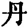

  
[Intangible Textual Heritage](../../index)  [Taoism](../index.md) 
[Index](index)  [Previous](sbe4013)  [Next](sbe4015.md) 

------------------------------------------------------------------------

p. 186

## BOOK XXX.

### PART III. SECTION VIII.

### Yüeh Kien, or 'Delight in the Sword-fight [1](#fn_385.md).'

Formerly, king Wän of Kâo [2](#fn_386.md)
delighted in the sword-fight. More than three thousand men, masters of
the weapon, appeared as his guests, lining the way on either side of his
gate, and fighting together before him day and night. Over a hundred of
them would die or be (severely) wounded in the course of a year, but he
was never weary of looking on (at their engagements), so fond was he of
them. The thing continued for three years, when the kingdom began to
decay, and other states to plan measures against it.

The crown-prince Khwei [3](#fn_387.md) was
distressed, and laid the case before his attendants, saying, 'If any one
can persuade the king, and put an end to these swordsmen, I will give
him a thousand ounces of

p. 187

silver.' His attendants said, '(Only) Kwang-dze is able to do this.'
Thereupon the prince sent men with a thousand ounces of silver to offer
to Kwang-dze, who, however, would not accept them, but went with the
messengers. When he saw the prince, he said, 'O prince, what have you to
say to Kâu, and why would you give me the silver?' The prince replied,
'I have heard that you, master, are sagacious and sage. I sent you
respectfully the thousand ounces of silver, as a prelude to the silks
and other gifts [1](#fn_388.md). But as you
decline to receive them, how dare I now tell you (what I wished from
you)?' Kwang-dze rejoined, 'I have heard, O prince, that what you wanted
me for was to wean the king from what is his delight. Suppose that in
trying to persuade his Majesty I should offend him, and not fulfil your
expectation, I shall be punished with death;--and could I then enjoy
this silver? Or suppose that I shall succeed in persuading his Majesty,
and accomplish what you desire, what is there in the kingdom of Kâo that
I might ask for which I would not get?'

The crown-prince said, 'Yes; but my (father), the king, will see none
but swordsmen.' Kwang-dze replied, 'I know; but I am expert in the use
of the sword.' 'That is well,' observed the prince; 'but the swordsmen
whom his Majesty sees all have their hair in a tangle, with whiskers
projecting out. They wear slouching caps with coarse and unornamented
tassels, and their coats are cut short behind. They have staring eyes,
and talk about the hazards of

p. 188

their game. The king is delighted with all this; but now you are sure to
present yourself to him in your scholar's dress, and this will stand
greatly in the way of your success.'

Kwang-dze said, 'I will then, with your leave, get me a swordsman's
dress.' This was ready in three days, and when he appeared in it before
the prince, the latter went with him to introduce him to the king, who
then drew his sword from its scabbard and waited for him. When Kwang-dze
entered the door of the hall, he did not hurry forward, nor, when he saw
the king, did he bow. The king asked him, 'What do you want to teach me,
Sir, that you have got the prince to mention you beforehand?' The reply
was, 'I have heard that your Majesty is fond of the sword-fight, and
therefore I have sought an interview with you on the ground of (my skill
in the use of) the sword.' 'What can you do with your sword against an
opponent?' 'Let me meet with an opponent every ten paces, my sword would
deal with him, so that I should not be stopped in a march of a thousand
lî.' The king was delighted with him, and said, 'You have not your match
in the kingdom.' Kwang-dze replied, 'A good swordsman first makes a
feint (against his opponent), then seems to give him an advantage, and
finally gives his thrust, reaching him before he can return the blow. I
should like to have an opportunity to show you my skill.' The king said,
'Stop (for a little), Master. Go to your lodging, and wait for my
orders. I will make arrangements for the play, and then call you.'

The king accordingly made trial of his swordsmen for seven days, till
more than sixty of them were

p. 189

killed, or (severely) wounded. He then selected five or six men, and
made them bring their swords and take their places beneath the hall,
after which he called Kwang-dze, and said to him, 'To-day I am going to
make (you and) these men show what you can do with your swords.' 'I have
long been looking for the opportunity,' replied Kwang-dze. The king then
asked him what would be the length of the sword which he would use; and
he said, 'Any length will suit me, but I have three swords, any one of
which I will use, as may please your Majesty. Let me first tell you of
them, and then go to the arena.' 'I should like to hear about the three
swords,' said the king; and Kwang-dze went on, 'There is the sword of
the Son of Heaven; the sword of a feudal prince; and the sword of a
common man.'

'What about the sword of the Son of Heaven?'

'This sword has Yen-khî [1](#fn_389.md) and
Shih-khang [2](#fn_390.md) for its point; Khî and
(Mount) Tâi [3](#fn_391.md) for its edge; Zin and
Wei for its back; Kâu and Sung for its hilt; Han and Wei for its sheath.
It is embraced by the wild tribes all around; it is wrapped up in the
four seasons; it is bound round by the Sea of Po [4](#fn_392.md); and its girdle is the enduring hills.
It is regulated by the five elements; its wielding is by means of
Punishments and Kindness; its unsheathing is like that of

p. 190

the Yin and Yang; it is held fast in the spring and summer; it is put in
action in the autumn and winter. When it is thrust forward, there is
nothing in front of it; when lifted up, there is nothing above it; when
laid down, there is nothing below it; when wheeled round, there is
nothing left on any side of it; above, it cleaves the floating clouds;
and below, it penetrates to every division of the earth. Let this sword
be once used, and the princes are all reformed, and the whole kingdom
submits. This is the sword of the Son of Heaven [1](#fn_393.md).'

King Wän looked lost in amazement, and said again, 'And what about the
sword of a feudal lord?' (Kwang-dze) replied, 'This sword has wise and
brave officers for its point; pure and disinterested officers for its
edge; able and honourable officers for its back; loyal and sage officers
for its hilt; valiant and eminent officers for its sheath. When this
sword is thrust directly forward, as in the former case, there is
nothing in front of it; when directed upwards, there is nothing above
it; when laid down, there is nothing below it; when wheeled round, there
is nothing on any side of it. Above, its law is taken from the round
heaven, and is in accordance with the three luminaries; below, its law
is taken from the square earth, and is in accordance with the four
seasons; between, it is in harmony with the minds of the people, and in
all the parts of the state there is peace. Let this sword be once used,
and you seem to hear the crash of the thunder-peal. Within

p. 191

the four borders there are none who do not respectfully submit, and obey
the orders of the ruler. This is the sword of the feudal lord.'

'And what about the sword of the common man?' asked the king (once
more). (Kwang-dze) replied, 'The sword of the common man (is wielded by)
those who have their hair in a tangle, with whiskers projecting out; who
wear slouching caps with coarse and unornamented tassels, and have their
coats cut short behind; who have staring eyes, and talk (only) about the
hazards (of their game). They hit at one another before you. Above, the
sword slashes through the neck; and below, it scoops out the liver and
lungs. This is the sword of the common man. (The users of it) are not
different from fighting cocks; any morning their lives are brought to an
end; they are of no use in the affairs of the state. Your Majesty
occupies the seat of the Son of Heaven, and that you should be so fond
of the swordsmanship of such common men, is unworthy, as I venture to
think, of your Majesty.'

On this the king drew Kwang-dze with him, and went up to the top of the
hall, where the cook set forth a meal, which the king walked round three
times (unable to sit down to it). Kwang-dze said to him, 'Sit down
quietly, Great King, and calm yourself. I have said all I wished to say
about swords.' King Wän, thereafter, did not quit the palace for three
months, and the swordsmen all killed themselves in their own rooms [1](#fn_394.md).

------------------------------------------------------------------------

### Footnotes

[186:1](sbe4014.htm#fr_435.md) See vol. xxxix, pp.
158, 159.

[186:2](sbe4014.htm#fr_436.md) Probably king
Hui-wän (B.C. 298-265) of Kâo, one of the states into which the great
state of Zin was subdivided, and which afterwards all claimed the
sovereignty of the kingdom. In this Book Kwang-dze appears as a
contemporary of king Wän, which makes the 'formerly' with which the
paragraph commences seem strange.

[186:3](sbe4014.htm#fr_437.md) Sze-mâ Khien says
nothing of king Wän's love of the sword-fight, nor of this son Khwei. He
says that in 265 Wän was succeeded by his son Tan ( ), who appears to have been
quite young.

[187:1](sbe4014.htm#fr_438.md) This, I think, is
the meaning. It may possibly mean 'for presents to your followers in
attendance on you.'

[189:1](sbe4014.htm#fr_439.md) Some noted place in
the state of Yen, the capital of which was near the site of the present
Peking.

[189:2](sbe4014.htm#fr_440.md) A wall, north of
Yen, built as a barrier of defence against the northern tribes.

[189:3](sbe4014.htm#fr_441.md) Mount Thâi.

[189:4](sbe4014.htm#fr_442.md) A region lying
along the present gulf of Kih-lî, between the Pei-ho and the Khing-ho in
Shan-tung.

[190:1](sbe4014.htm#fr_443.md) By this sword
Kwang-dze evidently means the power of the sovereign, supported by the
strength of the kingdom, and directed by good government.

[191:1](sbe4014.htm#fr_444.md) Kwang-dze's
parables had had their intended effect. It was not in his mind to do
anything for the swordsmen. The commentators say:--'Indignant at not
being treated as they had been before, they all killed themselves.'

------------------------------------------------------------------------

[Next: Book XXXI. Yü-fû, or 'The Old Fisherman.'](sbe4015.md)
