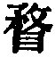
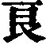
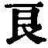
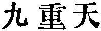

  
[Intangible Textual Heritage](../../index)  [Taoism](../index) 
[Index](index)  [Previous](sbe4015)  [Next](sbe4017) 

------------------------------------------------------------------------

p. 202

## BOOK XXXII.

### PART III. SECTION X.

### Lieh Yü-khâu [1](#fn_397).

1\. Lieh Yü-khâu had started to go to Khî, but came back when he was
half-way to it. He met Po-hwän Wû-zän [2](#fn_398), who said, 'Why have you come back?' His
reply was, 'I was frightened.' 'What frightened you?' 'I went into ten
soup-shops [3](#fn_399) to get a meal. and in
five of them the soup was set before me before (I had paid for it) [4](#fn_400).' 'But what was there in that to
frighten you?' (Lieh-dze) said, 'Though the inward and true purpose be
not set forth, the body like a spy gives some bright display of it. And
this outward demonstration overawes men's minds, and makes men on light
grounds treat one as noble or as aged, from which evil to him will be
produced. Now vendors of soup supply their commodity simply as a matter
of business, and however much they may dispose of, their profit is but
little,

p. 203

and their power is but slight; and yet they treated me as I have
said:--how much more would the lord of ten thousand chariots do so! His
body burdened with (the cares of his) kingdom, and his knowledge
overtasked by its affairs, he would entrust those affairs to me, and
exact from me the successful conduct (of its government). It was this
which frightened me.' Po-hwän Wû-zän replied, 'Admirable perspicacity!
But if you carry yourself as you do, men will flock to you for
protection.'

Not long after, Po-hwän Wû-zän went (to visit Lieh-dze), and found the
space outside his door full of shoes [1](#fn_401). There he stood with his face to the
north, holding his staff upright, and leaning his chin on it till the
skin was wrinkled. After standing so for some time, and without saying a
word, he was going away, when the door-keeper [2](#fn_402) went in, and told Lieh-dze. The latter
(immediately) took up his shoes, and ran barefoot after the visitor.
When he overtook him at the (outer) gate, he said, 'Since you, Sir, have
come, are you going away without giving me some medicine [3](#fn_403)?' The other replied, 'It is of no use. I
did tell you that men would flock to you, and they do indeed do so. It
is not that you can cause men to flock to you, but you cannot keep them
from not so coming;--of what use is (all my warning)? What influences
them and makes them glad is the display of your extraordinary
(qualities); but you must also be influenced

p. 204

in your turn, and your proper nature be shaken, and no warning can be
addressed to you. Those who associate with you do not admonish you of
this. The small words which they speak are poison to a man. You perceive
it not; you understand it not;--how can you separate yourself from them?

'The clever toil on, and the wise are sad. Those who are without ability
seek for nothing. They eat to the full, and wander idly about. They
drift like a vessel loosed from its moorings, and aimlessly wander
about [1](#fn_404).'

2\. A man of Käng, called Hwan, learned [2](#fn_405) his books in the neighbourhood of
Khiû-shih [3](#fn_406), and in no longer time
than three years became a Confucian scholar, benefiting the three
classes of his kindred [4](#fn_407) as the Ho
extends its enriching influence for nine lî. He made his younger brother
study (the principles of) Mo [5](#fn_408), and
then they two--the scholar and the Mohist--disputed together (about
their respective systems), and the father took the side of the
younger [6](#fn_409). After ten years Hwan
killed himself. (By and by) he appeared to his father in a dream,
saying, 'It was I who made your son become a

p. 205

\[paragraph continues\] Mohist; why did you not recognise that good
service [1](#fn_410)? I am become (but) the
fruit of a cypress in autumn [2](#fn_411).' But
the Creator [3](#fn_412), in apportioning the
awards of men, does not recompense them for their own doings, but
recompenses them for the (use of the) Heavenly in them. It was thus that
Hwan's brother was led to learn Mohism. When this Hwan thought that it
was he who had made his brother different from what he would have been,
and proceeded to despise his father, he was like the people of Khî, who,
while they drank from a well, tried to keep one another from it. Hence
it is said, 'Now-a-days all men are Hwans [4](#fn_413).' From this we perceive that those who
possess the characteristics (of the Tâo) consider that they do not know
them; how much more is it so with those who possess the Tâo itself! The
ancients called such (as Hwan) 'men who had escaped the punishment of
Heaven.'

3\. The sagely man rests in what is his proper rest; he does not rest in
what is not so;--the multitude of men rest in what is not their proper
rest; they do not rest in their proper rest [5](#fn_414).

4\. Kwang-dze said, To know the Tâo is easy; not to say (that you know
it) is difficult. To know it and not to speak of it is the way to attain
to the

p. 206

\[paragraph continues\] Heavenly; to know and to speak of it, is the way
to show the Human. The ancients pursued the Heavenly (belonging to
them), and not the Human.'

5\. Kû Phing-man [1](#fn_415) learned how to
slaughter the dragon [2](#fn_416) from Kih-lî
Yî, expending (in doing so) all his wealth of a thousand ounces of
silver. In three years he became perfect in the art, but he never
exercised his skill.

6\. The sage looks on what is deemed necessary as unnecessary, and
therefore is not at war [3](#fn_417) (in
himself). The mass of men deem what is unnecessary to be necessary, and
therefore they are often at war (in themselves). Therefore those who
pursue this method of (internal) war, resort to it in whatever they seek
for. But reliance on such war leads to ruin.

7\. The wisdom of the small man does not go beyond (the minutiae of)
making presents and writing memoranda, wearying his spirits out in what
is trivial and mean. But at the same time he wishes to aid in guiding to
(the secret of) the Tâo and of (all) things in the incorporeity of the
Grand Unity. In this way he goes all astray in regard to (the mysteries
of) space and time. The fetters of embodied matter keep him from the
knowledge of the Grand Beginning. (On the other hand), the perfect man
directs the energy of his spirit to what was before the Beginning, and
finds pleasure in the mysteriousness

p. 207

belonging to the region of nothingness. He is like the water which flows
on without the obstruction of matter, and expands into the Grand Purity.

Alas for what you do, (O men)! You occupy yourselves with things trivial
as a hair, and remain ignorant of the Grand Rest!

8\. There was a man of Sung, called Zhâo Shang, who was sent by the king
of Sung on a mission to Khin. On setting out, he had several carriages
with him; and the king (of Khin) was so pleased with him that he gave
him another hundred. When he returned to Sung, he saw Kwang-dze, and
said to him, 'To live in a narrow lane of a poor mean hamlet, wearing
sandals amid distress of poverty, with a weazen neck and yellow
face [1](#fn_418);--that is what I should find
it difficult to do. But as soon as I come to an understanding with the
Lord of a myriad carriages, to find myself with a retinue of a hundred
carriages,--that is wherein I excel.' Kwang-dze replied, 'When the king
of Khän is ill, the doctor whom he calls to open an ulcer or squeeze a
boil receives a carriage; and he who licks his piles receives five. The
lower the service, the more are the carriages given. Did you, Sir, lick
his piles? How else should you have got so many carriages? Begone!'

9\. Duke Âi of Lû asked Yen Ho, saying, 'If I employ Kung-nî as the
support of my government, will the evils of the state be thereby cured?'
The

p. 208

reply was, '(Such a measure) would be perilous! It would be full of
hazard! Kung-nî, moreover, will try to ornament a feather and paint it;
in the conduct of affairs he uses flowery speeches. A (mere) branch is
to him more admirable (than the root); he can bear to misrepresent their
nature in instructing the people, and is not conscious of the unreality
of his words. He receives (his inspiration) from his own mind, and rules
his course from his own spirit:--what fitness has he to be set over the
people? Is such a man suitable for you (as your minister)? Could you
give to him the nourishment (of the people)? You would do so by mistake
(but not on purpose, for a time, but not as a permanency). To make the
people leave what is real, and learn what is hypocritical--that is not
the proper thing to be shown to them; if you take thought for future
ages, your better plan will be to give up (the idea of employing
Confucius). What makes government difficult, is the dealing with men
without forgetting yourself; this is not according to the example of
Heaven in diffusing its benefits. Merchants and traffickers are not to
be ranked (with administrative officers); if on an occasion you so rank
them, the spirits (of the people) do not acquiesce in your doing so. The
instruments of external punishment are made of metal and wood; those of
internal punishment are agitation (of the mind) and (the sense of)
transgression. When small men become subject to the external punishment,
the (instruments of) metal and wood deal with them; when they become
liable to the internal punishments, the Yin and Yang [1](#fn_419) consume

p. 209

them. It is only the true man who can escape both from the external and
internal punishment.'

10\. Confucius said, 'The minds of men are more difficult of approach
than (the position defended by) mountains and rivers, and more difficult
to know than Heaven itself. Heaven has its periods of spring and autumn,
of winter and summer, and of morning and evening; but man's exterior is
thickly veiled, and his feelings lie deep. Thus the demeanour of some is
honest-like, and yet they go to excess (in what is mean); others are
really gifted, and yet look to be without ability; some seem docile and
impressible, but yet they have far-reaching schemes; others look firm,
and yet may be twisted about; others look slow, and yet they are hasty.
In this way those who hasten to do what is right as if they were thirsty
will anon hurry away from it as if it were fire. Hence the superior man
looks at them when employed at a distance to test their fidelity, and
when employed near at hand to test their reverence. By employing them on
difficult services, he tests their ability; by questioning them
suddenly, he tests their knowledge; by appointing them a fixed time, he
tests their good faith; by entrusting them with wealth, he tests their
benevolence; by telling them of danger, he tests their self-command in
emergencies; by making them drunk, he tests their tendencies [1](#fn_420); by placing them in a variety of
society, he tests their chastity:--by these nine tests the inferior man
is discovered.'

11\. When Khâo-fû, the Correct [2](#fn_421),
received the first

p. 210

grade of official rank, he walked with head bowed down; on receiving the
second, with bent back; on receiving the third, with body stooping, he
ran and hurried along the wall:--who would presume not to take him as a
model? But one of those ordinary men, on receiving his first
appointment, goes along with a haughty stride; on receiving his second,
he looks quite elated in his chariot; and on receiving the third, he
calls his uncles by their personal names;--how very different from Hsü
(Yû) in the time (of Yâo of) Thang!

Of all things that injure (men) there is none greater than the
practising of virtue with the purpose of the mind, till the mind becomes
supercilious. When it becomes so, the mind (only) looks inwards (on
itself), and such looking into itself leads to its ruin. This evil
quality has five forms, and the chief of them is that which is the
central. What do we mean by the central quality? It is that which
appears in a man's loving (only) his own views, and reviling whatever he
does not do (himself).

Limiting (men's advance), there are eight extreme conditions; securing
(that advance), there are three things necessary; and the person has its
six repositories. Elegance; a (fine) beard; tallness; size; strength;
beauty; bravery; daring; and in all these excelling others:--(these are
the eight extreme conditions) by which advance is limited. Depending on
and copying others; stooping in order to rise; and being straitened by
the fear of not equalling others:--

p. 211

these are the three things that lead to advancing. Knowledge seeking to
reach to all that is external; bold movement producing many resentments;
benevolence and righteousness leading to many requisitions;
understanding the phenomena of life in an extraordinary degree;
understanding all knowledge so as to possess an approach to it;
understanding the great condition appointed for him, and following it,
and the smaller conditions, and meeting them as they occur:--(these are
the six repositories of the person) [1](#fn_422).

12\. There was a man who, having had an interview with the king of Sung,
and been presented by him with ten carriages, showed them boastfully to
Kwang-dze, as if the latter had been a boy. Kwang-dze said to him, 'Near
the Ho there was a poor man who supported his family by weaving rushes
(to form screens). His son, when diving in a deep pool, found a pearl
worth a thousand ounces of silver. The father said, "Bring a stone, and
break it in pieces. A pearl of this value must have been in a pool nine
khung deep [2](#fn_423), and under the chin of
the Black Dragon. That you were able to get it must have been owing to
your finding him asleep. Let him awake, and the consequences to you will
not be small!" Now the kingdom of Sung is deeper than any pool of nine
khung, and its king is fiercer than the Black Dragon. That you were able
to get the

p. 212

chariots must have been owing to your finding him asleep. Let him awake,
and you will be ground to powder [1](#fn_424).'

13\. Some (ruler) having sent a message of invitation to him, Kwang-sze
replied to the messenger, 'Have you seen, Sir, a sacrificial ox? It is
robed with ornamental embroidery, and feasted on fresh grass and beans.
But when it is led into the grand ancestral temple, though it wished to
be (again) a solitary calf, would that be possible for it [2](#fn_425)?

14\. When Kwang-dze was about to die, his disciples signified their wish
to give him a grand burial. 'I shall have heaven and earth,' said he,
'for my coffin and its shell; the sun and moon for my two round symbols
of jade; the stars and constellations for my pearls and jewels; and all
things assisting as the mourners. Will not the provisions for my burial
be complete? What could you add to them?' The disciples replied, 'We are
afraid that the crows and kites will eat our master.' Kwang-dze
rejoined, 'Above, the crows and kites will eat me; below, the
mole-crickets and ants will eat me:--to take from those and give to
these would only show your partiality [3](#fn_426).'

The attempt, with what is not even, to produce what is even will only
produce an uneven result; the attempt, with what is uncertain, to make
the uncertain certain will leave the uncertainty as it

p. 213

was. He who uses only the sight of his eyes is acted on by what he sees;
it is the (intuition of the) spirit, that gives the assurance of
certainty. That the sight of the eyes is not equal to that intuition of
the spirit is a thing long acknowledged. And yet stupid people rely on
what they see, and will have it to be the sentiment of all men;--all
their success being with what is external:--is it not sad?

------------------------------------------------------------------------

### Footnotes

[202:1](sbe4016.htm#fr_447) See vol. xxxix, pp.
160-162.

[202:2](sbe4016.htm#fr_448) The same teacher,
no doubt, who is mentioned in II, par. 2, and XXI, par. 2, though the Wû
in Wû-zän is here  , and
there  .

[202:3](sbe4016.htm#fr_449) Like the tea and
congee shanties, I suppose, which a traveller in China finds still on
the road-side.

[202:4](sbe4016.htm#fr_450) The meaning is not
plain. There must have been something in the respect and generosity of
the attendants which made Lieh-dze feel that his manner was inconsistent
with his profession of Tâoism.

[203:1](sbe4016.htm#fr_451) See the Lî Kî (vol.
xxvii, pp. 70, 71). It is still the custom in Japan for visitors to
leave their shoes outside, in order not to soil the mats.

[203:2](sbe4016.htm#fr_452) Whose business it
was to receive and announce the guests.

[203:3](sbe4016.htm#fr_453) Good advice.

[204:1](sbe4016.htm#fr_454) Was this then
Wû-zän's idea of how the Tâoist should carry himself? From 'those who
associate with you' Wû-zän's address might be rhymed.

[204:2](sbe4016.htm#fr_455) Read them aloud,
and so committed them to memory;--as Chinese schoolboys do still.

[204:3](sbe4016.htm#fr_456) The name of a
place, or, perhaps, of Hwan's schoolmaster.

[204:4](sbe4016.htm#fr_457) Probably, the
kindred of his father, mother, and wife;--through his getting office as
a scholar.

[204:5](sbe4016.htm#fr_458) Or Mih
Tî;--Mencius's heresiarch.

[204:6](sbe4016.htm#fr_459) Literally, 'of Tî,'
as if that had been the name of the younger brother, as it was that of
the heresiarch.

[205:1](sbe4016.htm#fr_460) The character for
this in the text ( ) is
explained as meaning 'a grave,' with special reference to this passage,
in the Khang-hsî dictionary.

[205:2](sbe4016.htm#fr_461) The idea of a grave
is suggested by the 'cypress,' and we need not try to find it in  .

[205:3](sbe4016.htm#fr_462) The creator was, in
Kwang-dze's mind, the Tâo.

[205:4](sbe4016.htm#fr_463) Arrogating to
themselves what was the work of the Tâo.

[205:5](sbe4016.htm#fr_464) The best editions
make this sentence a paragraph by itself.

[206:1](sbe4016.htm#fr_465) These are names
fashioned by our author.

[206:2](sbe4016.htm#fr_466) 'Slaughtering the
dragon' means 'learning the Tâo,' by expending or putting away all doing
and knowledge, till one comes to the perfect state of knowing the Tâo
and not speaking of it.

[206:3](sbe4016.htm#fr_467) Being 'at war' here
is not the conflict of arms, but of joy, anger, and desire in one's
breast. See Ziâo Hung in loc.

[207:1](sbe4016.htm#fr_468) The character for
'face' generally means 'ears;' but the Khang-hsî dictionary, with
special reference to this paragraph, explains it by 'face.'--The whole
paragraph is smart and bitter, but Lin Hsî-kung thinks it too coarse to
be from Kwang-dze's pencil.

[208:1](sbe4016.htm#fr_469) Compare the use of
'the Yin and the Yang' in XXIII, par. 8.--Yen Ho does not flatter
Confucius in his description of him.

[209:1](sbe4016.htm#fr_470) Is this equivalent
to the adage 'In vino veritas?'

[209:2](sbe4016.htm#fr_471) A famous ancestor
of Confucius in the eighth century B.C., p.
210 before the Khung family fled from Sung. See the account of
him, with some verbal alterations, in the Zo Khwan, under the seventh
year of duke Kâo.

[211:1](sbe4016.htm#fr_472) These eight words
are supplied to complete the structure of the paragraph; but I cannot
well say what they mean, nor in what way the predicates in the six
clauses that precede can be called 'the stores, or repositories of the
body or person.'

[211:2](sbe4016.htm#fr_473) = in a pool deeper
than any nine pools. Compare the expression 
.

[212:1](sbe4016.htm#fr_474) Compare paragraph
8. But Lin again denies the genuineness of this.

[212:2](sbe4016.htm#fr_475) Compare XVII, par.
11.

[212:3](sbe4016.htm#fr_476) We do not know
whether Kwang-dze was buried according to his own ideal or not. In the
concluding sentences we have a strange descent from the grandiloquence
of what precedes.

------------------------------------------------------------------------

[Next: Book XXXIII. Thien Hsiâ](sbe4017)
