  
[Intangible Textual Heritage](../../index)  [Taoism](../index) 
[Index](index)  [Previous](sbe4018)  [Next](sbe4020) 

------------------------------------------------------------------------

p. 247

# APPENDIXES.

## APPENDIX I.

### Khing Käng King, or 'The Classic of Purity [1](#fn_483).'

So I must translate the title of this brochure, as it appears in the
'Collection of the Most Important Treatises of the Tâoist Fathers' (vol.
xxxix, p. xvii), in which alone I have had an opportunity of perusing
and studying the Text. The name, as given by Wylie (Notes, p. 178),
Balfour (Tâoist Texts.), and Faber (China Review, vol. xiii, p. 246), is
Khing King King [2](#fn_484), and signifies
'The Classic of Purity and Rest.' The difference is in the second
character, but both Khing Käng and Khing King are well-known
combinations in Tâoist writings; and it will be seen, as the translation
of the Text is pursued, that neither of them is unsuitable as the title
of the little Book.

It is, as Dr. Faber says, one of the 'mystical canons' of Tâoism; but
the mysticism of Tâoism is of a nature peculiar to itself, and different
from any mental exercises which have been called by that name in
connexion with Christianity or Mohammedanism. It is more vague and
shadowy than any theosophy or Sûfism, just as the idea of the Tâo
differs from the apprehension of a personal God, however uncertain and
indefinite that apprehension may be. Mr. Wylie says the work 'treats
under very moderate limits of the subjection of the mental faculties.'
This indeed is the consummation to which it conducts the student; a

p. 248

condition corresponding to the nothingness which Lâo-dze contended for
as antecedent to all positive existence, and out of which he said that
all existing being came, though he does not indicate how.

I give to the Treatise the first place among our appendixes here because
of the early origin ascribed to it. It is attributed to Ko Yüan (or
Hsüan) [1](#fn_485), a Tâoist of the Wû dynasty
(A.D. 222-277), who is fabled to have attained to the state of an
Immortal, and is generally so denominated [2](#fn_486). He is represented as a worker of
miracles; as addicted to intemperance, and very eccentric in his ways.
When shipwrecked on one occasion, he emerged from beneath the water with
his clothes unwet, and walked freely on its surface. Finally he ascended
to the sky in bright day [3](#fn_487). All
these accounts may safely be put down as the figments of a later time.

It will be seen that the Text ascribes the work to Lâo-dze himself, and
I find it impossible to accept the account of its origin which is
assigned by Lî Hsî-yüeh to Ko Hsüan. As quoted by Lî in the first of
some notes subjoined to his Commentary, Ko is made to say, 'When I
obtained the true Tâo, I had recited this King ten thousand times. It is
what the Spirits of heaven practise, and had not been communicated to
scholars of this lower world. I got it from the Divine Ruler of the
eastern Hwa; he received it from the Divine Ruler of the Golden Gate; he
received it from the Royal-mother of the West. In all these cases it was
transmitted from mouth to mouth, and was not committed to writing. I
now, while I am in the world, have written it out in a book. Scholars of
the highest order, understanding it, ascend and become officials of
Heaven; those of the middle order, cultivating it, are ranked among the
Immortals of the Southern Palace; those of the lowest order, possessing
it, get long years of life in the world, roam

p. 249

through the Three Regions [1a](#fn_488), and
(finally) ascend to, and enter, the Golden Gate.'

This quotation would seem to be taken from the preface to our little
classic by Ho Hsüan. If there were indeed such a preface during the time
of the Wû dynasty, the corruption of the old Tâoism must have been
rapid. The Hsî Wang-mû, or Royal-mother of the West, is mentioned once
in Kwang-dze (Bk. VI, par. 7); but no 'Divine Ruler' disfigures his
pages. Every reader must feel that in the Classic of Purity he has got
into a different region of thought from that which he has traversed in
the Tâo Teh King and in the writings of Kwang-dze.

With these remarks I now proceed to the translation and explanation of
the text of our King.

\_\_\_\_\_\_\_\_\_\_\_\_\_\_

Ch. 1. 1. Lâo the Master [1](#fn_489) said, The
Great [2](#fn_490) Tâo has no bodily form, but
It produced and nourishes heaven and earth [3](#fn_491). The Great Tâo has no passions [4](#fn_492), but It causes the sun and moon to
revolve as they do.

The Great [2](#fn_490) Tâo has no name [5](#fn_493), but It effects the growth and
maintenance of all things [3](#fn_491).

I do not know its name, but I make an effort, and call It the Tâo [6](#fn_494).

p. 250

2\. Now, the Tâo (shows itself in two forms); the Pure and the Turbid,
and has (the two conditions of) Motion and Rest [1](#fn_495). Heaven is pure and earth is turbid;
heaven moves and earth is at rest. The masculine is pure and the
feminine is turbid; the masculine moves and the feminine is still [2](#fn_496). The radical (Purity) descended, and the
(turbid) issue flowed abroad; and thus all things were produced [1](#fn_495).

The pure is the source of the turbid, and motion is the foundation of
rest.

If man could always be pure and still, heaven and earth would both
revert (to non-existence) [3](#fn_497).

p. 251

3\. Now the spirit of man loves Purity, but his mind [1](#fn_498) disturbs it. The mind of man loves
stillness, but his desires draw it away [1](#fn_498). If he could always send his desires
away, his mind would of itself become still. Let his mind be made clean,
and his spirit will of itself become pure.

As a matter of course the six desires [2](#fn_499) will not arise, and the three
poisons [3](#fn_500) will be taken away and
disappear.

4\. The reason why men are not able to attain to this, is because their
minds have not been cleansed, and their desires have not been sent away.

p. 252

If one is able to send the desires away, when he then looks in at his
mind, it is no longer his; when he looks out at his body, it is no
longer his; and when he looks farther off at external things, they are
things which he has nothing to do with.

When he understands these three things, there will appear to him only
vacancy. This contemplation of vacancy will awaken the idea of vacuity.
Without such vacuity there is no vacancy.

The idea of vacuous space having vanished, that of nothingness itself
also disappears; and when the idea of nothingness has disappeared, there
ensues serenely the condition of constant stillness. [1](#fn_501)

5\. In that condition of rest independently of place how can any desire
arise? And when no desire any longer arises, there is the True stillness
and rest.

That True (stillness) becomes (a) constant quality, and responds to
external things (without error); yea, that True and Constant quality
holds possession of the nature.

In such constant response and constant stillness there is the constant
Purity and Rest.

He who has this absolute Purity enters gradually into the (inspiration
of the) True Tâo. And

p. 253

having entered thereinto, he is styled Possessor of the Tâo.

Although he is styled Possessor of the Tâo, in reality he does not think
that he has become possessed of anything. It is as accomplishing the
transformation of all living things, that he is styled Possessor of the
Tâo.

He who is able to understand this may transmit to others the Sacred
Tâo. [5\_1](#fn_502)

2\. 1. Lâo the Master said, Scholars of the highest class do not strive
(for anything); those of the lowest class are fond of striving [1](#fn_503). Those who possess in the highest degree
the attributes (of the Tâo) do not show them; those who possess them in
a low degree hold them fast (and display them) [2](#fn_504). Those who so hold them fast and display
them are not styled (Possessors of) the Tâo and Its attributes [2](#fn_504).

2\. The reason why all men do not obtain the True Tâo is because their
minds are perverted. Their minds being perverted, their spirits become
perturbed. Their minds being perturbed, they are attracted towards
external things. Being attracted towards external things, they begin to
seek for them greedily. This greedy quest leads to perplexities and
annoyances; and these again result in disordered

p. 254

thoughts, which cause anxiety and trouble to both body and mind. The
parties then meet with foul disgraces, flow wildly on through the phases
of life and death, are liable constantly to sink in the sea of
bitterness, and for ever lose the True Tâo.

3\. The True and Abiding Tâo! They who understand it naturally obtain
it. And they who come to understand. the Tâo abide in Purity and
Stillness. [1](#fn_505)

------------------------------------------------------------------------

### Footnotes

[247:1](sbe4019.htm#fr_546)  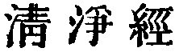.

[247:2](sbe4019.htm#fr_547)  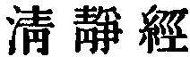.

[248:1](sbe4019.htm#fr_548)  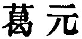 or  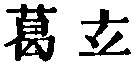.

[248:2](sbe4019.htm#fr_549)  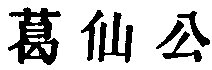.

[248:3](sbe4019.htm#fr_550) See the Accounts of
Ko in the Biographical Dictionary of Hsiâo Kih-han (1793), and Wang
Khî's supplement to the great work of Mâ Twan-lin, ch. 242.

[249:1a](sbe4019.htm#fr_551) 'The three regions
( 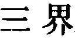)' here can hardly be
the trilokya of the Buddhists, the ethical categories of desire, form,
and formlessness. They are more akin to the Brahmanic bhuvanatraya, the
physical or cosmological categories of bhûr or earth, bhuvah or heaven,
and svar or atmosphere.

[249:1](sbe4019.htm#fr_552) The name here is
Lâo Kün ( ). I have stated
(vol. xxxix, p. 40) that, with the addition of Thâi Shang, this is the
common designation of Lâo-dze as the Father of Tâoism and deifying him,
and that it originated probably in the Thang dynasty. It might seem to
be used simply here by Ko Hsüan with the same high application; and
since in his preface he refers to different 'Divine Rulers,' it may be
contended that we ought to translate Lâo Kün by 'Lâo the Ruler.' But I
am unwilling to think that the deification of Lâo-dze p. 250 had taken place so early. The earliest
occurrence of the combination Lâo Kün which has attracted my notice is
in the history of Khung Yung, a descendant of Confucius in the twentieth
generation,--the same who is celebrated in the San Dze King, for his
fraternal deference at the age of four, and who met with a violent death
in A.D. 208. While still only a boy, wishing to obtain an interview with
a representative of the Lâo family, he sent in this message to him, 'My
honoured predecessor and the honoured Lâo, the predecessor of your Li
family, equally virtuous and righteous, were friends and teachers of
each other.' The epithet Kün is equally applied to Confucius and
Lâo-dze, and the combination Lâo Kün implies no exaltation of the latter
above the other.

[249:2](sbe4019.htm#fr_556) See Tâo Teh King,
chaps. 18, 25, 53.

[249:3](sbe4019.htm#fr_558) T. T. K., chaps. 1,
51, et al.

[249:4](sbe4019.htm#fr_555) See Kwang-dze, Bk.
II, par. 2. 'Passions,' that is, feelings, affections; as in the first
of the thirty-nine Articles.

[249:5](sbe4019.htm#fr_557) T. T. K., chaps. 1,
25, 32, 51.

[249:6](sbe4019.htm#fr_559) T. T. K., ch. 25.

[250:1](sbe4019.htm#fr_562) This paragraph is
intended to set forth 'the production of all things;' but it does so in
a way that is hardly intelligible. Comparing what is said here with the
utterances in the former paragraph, Tâo would seem to be used in two
p. 251 senses; first as an Immaterial Power
or Force, and next as the Material Substance, out of which all things
come. Li Hsî-yüeh says that in the first member of par. 1 we have 'the
Unlimited (or Infinite) producing the Grand (or Primal) Finite.' On the
Tâo in par. 2 he says nothing. The fact is that the subject of creation
in the deepest sense of the name is too high for the human mind.

[250:2](sbe4019.htm#fr_561) Compare T. T. K.,
ch. 61.

[250:3](sbe4019.htm#fr_563) I do not understand
this, but I cannot translate the Text otherwise. Mr. Balfour has:--'If a
man is able to remain pure and motionless, Heaven and Earth will both at
once come and dwell in him.' Lî explains thus:-- 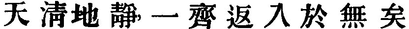. Compare T. T. K., ch. 16, and
especially Ho-shang Kung's title to it,--
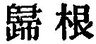.

[251:1](sbe4019.htm#fr_565) Tâoism thus
recognises in man the spirit, the mind, and the body.

[251:2](sbe4019.htm#fr_566) 'The six desires'
are those which have their inlets in the eyes, cars, nostrils, the
tongue, the sense of touch, and the imagination. The two last are
expressed in Chinese by shän, 'the body,' and î, 'the idea, or thought.'

[251:3](sbe4019.htm#fr_567) 'The three poisons'
are greed, anger, and stupidity;--see the Khang-hsî Thesaurus, under
 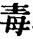.

[252:1](sbe4019.htm#fr_568) In this paragraph
we have what Mr. Wylie calls 'the subjection of the mental faculties;'
and I must confess myself unable to understand what it is. It is
probably another way of describing the Tâoist trance which we find once
and again in Kwang-dze, 'when the body becomes like a withered tree, and
the mind like slaked lime' (Bk. II, par. 1, et al.). But such a
sublimation of the being, as the characteristic of its serene stillness
and rest, is to me inconceivable.

[253:5\_1](sbe4019.htm#fr_569) This is the
consummation of the state of Purity. In explaining the former sentence
of the fifth member, Lî Hsî-yüeh uses the characters of T. T. K., ch. 4,
 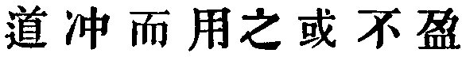, with some
variation,-- 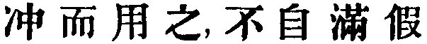.

[253:1](sbe4019.htm#fr_570) Compare the T. T.
K., ch. 41, 1.

[253:2](sbe4019.htm#fr_572) Compare the T. T.
K., ch. 38, 1.

[254:1](sbe4019.htm#fr_573) Our brief Classic
thus concludes, and our commentator Li thus sums up his remarks on
it:--'The men who understand the Tâo do so simply by means of the
Absolute Purity, and the acquiring this Absolute Purity depends entirely
on the Putting away of Desire, which is the urgent practical lesson of
the Treatise.'

I quoted in my introductory remarks Lî's account of the origin of the
Classic by its reputed author Ko Hsüan. I will now conclude with the
words which he subjoins from 'a True Man, Zo Hsüan:'--'Students of the
Tâo, who keep this Classic in their hands and croon over its contents,
will get good Spirits from the ten heavens to watch over and protect
their bodies, after which their spirits will be preserved by the seal of
jade, and their bodies refined by the elixir of gold. Both body and
spirit will become exquisitely ethereal, and be in true union with the
Tâo!'

Of this 'True Man, Zo Hsüan,' I have: not been able to ascertain
anything. The Divine Ruler of the eastern Hwa, referred to on p. 248, is
mentioned in the work of Wang Khî (ch. 241, p. 21b), but with
no definite information about him. The author says his surname was Wang,
but he knows neither his name nor when he lived.

------------------------------------------------------------------------

[Next: Appendix II. Yin Fû King, or 'Classic of the Harmony of the Seen
and the Unseen.'](sbe4020)
