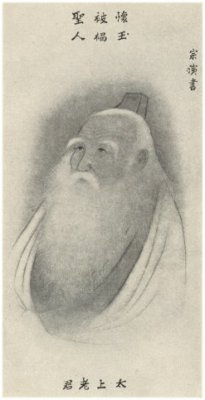

[Intangible Textual Heritage](../../index)  [Taoism](../index) 
[Index](index)  [Next](ts01) 

------------------------------------------------------------------------

# T'ai-Shang Kan-Ying P'ien

#### Treatise of the Exalted One on Response and Retribution

###### Translated from the Chinese by

## Teitaro Suzuki and Dr. Paul Carus

###### Containing Introduction, Chinese Text Verbatim Translation

###### Translation, Explanatory Notes and Moral Tales

###### Edited by

#### Dr. Paul Carus

#### With Sixteen Plates by Chinese Artists and a Frontispiece by Keichyu Yamada

La Salle, Ill. The Open Court Publishing Co.

COPYRIGHT BY THE OPEN COURT PUBLISHING

\[1906\]

{Scanned at Intangible Textual Heritage, January, 2002}

{p. 2}

------------------------------------------------------------------------

[Next: Contents](ts01)
