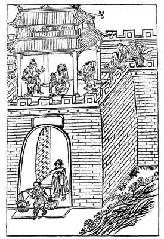

[Intangible Textual Heritage](../../index)  [Taoism](../index) 
[Index](index)  [Previous](ts19)  [Next](ts21) 

------------------------------------------------------------------------

### A RUFFIAN'S REFORM.

Wu Chien-Chiu of Shan-Yu had wonderful muscular strength, and nobody in
his town could beat him at boxing or fencing. He became so overbearing
that any person who dared affront him was sure to pay a penalty for it.
He borrowed the property of others without ever returning it, and he
compelled people to

{p. 94}

do things for him under threats of severe punishment.

One summer evening he went up to the tower to cool off in the breeze.
When the people who had gathered there saw the ruffian come they ran
away, except one old man who seemed quite indifferent to his presence.

"Why do you alone dare defy my power?" cried Wu, intending to intimidate
the old gentleman, but the latter replied:

"How profound your ignorance is! Your mother's womb sheltered you for
ten long months, and your mother's arms took tender care of you for
three more years. Your parents wanted you to grow and mature into a
good, serviceable citizen of the Empire. When you would achieve
something for the State, your family name would become known and
glorified. You have undoubtedly some unusual talents. Why, then, degrade
yourself thus and become the useless fellow you are now? The State loses
in you a serviceable citizen, and the spirits of your parents feet
disgusted with you, This is greatly to be deplored."

Wu felt so much ashamed that he had a chill of cold perspiration, and he
said: "The people have marked me as a desperate character, and I have
acted accordingly; but by

{p. 95}

your words I realize my predicament; pray tell me how to retrieve my
good name."

The old gentleman replied: "You know the story of the butcher who became
a saintly Buddhist at the instant when he repented and dropped the
knife. Follow his example. If you repent and start on a righteous march
onward, you will certainly become a just man and command the respect of
others."

Wu was serious in his reform and having joined the army was finally
promoted to the rank of general.

------------------------------------------------------------------------

[Next: The Impious Magistrate](ts21)
