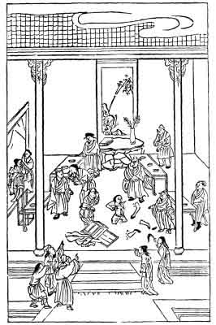

[Intangible Textual Heritage](../../index)  [Taoism](../index) 
[Index](index)  [Previous](ts23)  [Next](ts25) 

------------------------------------------------------------------------

### PUNISHMENT APPORTIONED TO CRIME.

In the garden of the city of Sieu-Shui-Siuen, there once lived a man by
the name of Fan Ki, who led a wicked life. He induced men to stir up
quarrels and lawsuits with each other, to seize by violence what did not
belong to them, and to dishonor other men's wives and daughters. When he
could not succeed easily in carrying out his evil purposes, he made use
of the most odious stratagems.

One day he died suddenly, but came back to life twenty-four hours
afterward and bade his wife gather together their relatives and
neighbors. When all were assembled he told them that he had seen the
king of the dark

{p. 104}

realm who said to him, "Here the dead receive punishment for their deeds
of evil. The living know not the lot that is reserved for them. They
must be thrown into a bed of coals whose heat is in proportion to the
extent of their crimes and to the harm they have done their fellows."

The assembled company listened to this report as to the words of a
feverish patient; they were incredulous and refused to believe the
story. But Fan Ki had filled the measure of crime, and Yama, the king of
hell, had decided to make an example of him so as to frighten men from
their evil ways. At Yama's command Fan Ki took a knife and mutilated
himself, saying, "This is my punishment for inciting men to dissolute
lives." He put out both his eyes, saying, "This is my punishment for
having looked with anger at my parents, and at the wives and daughters
of other men with guilt in my heart." He cut off his right hand, saying,
"This is my punishment for having killed a great number of animals." He
cut open his body and plucked out his heart, saying, "This is my
punishment for causing others to die under tortures." And last of all he
cut out his tongue to punish himself for lying and slandering.

The rumor of these occurrences spread

{p. 105}

afar, and people came from every direction to see the mangled body of
the unhappy man. His wife and children were overcome with grief and
shame, and closed the door to keep out the curious crowd. But Fan Ki,
still living by the ordeal of Yama, said in inarticulate sounds, "I have
but executed the commands of the king of hell, who wants my punishment
to serve as a warning to others. What right have you to prevent them
from seeing me?"

For six days the wicked man rolled upon the ground in the most horrible
agonies, and at the end of that time he died.

This story teaches us what punishments are in store for evil-doers. How
dare men act contrary to what they know to be just and right!

\[This story is taken from Julien's French version, but the Chinese
edition at our command contains a similar, though less detailed, story
of self-mutilation, for the illustration of which the accompanying
picture was originally used.\]

------------------------------------------------------------------------

[Next: The Northern Constellation](ts25)
