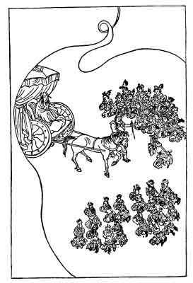

[Intangible Textual Heritage](../../index)  [Taoism](../index) 
[Index](index)  [Previous](ts28)  [Next](ts30) 

------------------------------------------------------------------------

### THE ANTS.

Ho Kwan of Kuang Nan was a kindhearted man and never killed any living
thing. He had a jar containing one thousand pieces of silver which he
kept in a casket. The white ants, of which there were so many in his
district, invaded the casket and ate part of the silver. When his family
found what had happened, they traced the ants to a hollow cave where
millions of them were living. They thought if they put all of these ants
in a crucible, perhaps they could recover a part of the lost silver. But
Ho objected to the scheme, saying: "I cannot bear to see all these many
creatures killed on account of a small sum of silver."

So they let the matter drop. That night he dreamed that scores of
soldiers in white armor came to him, asking him to enter a carriage
which they had with them and to come to the palace of their king. Ho
Kwan proceeded with the soldiers to a town where the people looked
prosperous and the buildings were all magnificent. Numerous officers
came to meet him and took him to a splendid palace.

{p. 127}

The king, clad in royal fashion, descended from the throne, and,
cordially saluting Ho Kwan, said: "By your benevolent acts we have been
saved from our enemy. While not forgetting your kindness, the lack of
strict discipline among my people caused you some trouble recently, but
by your mercy they have again been saved from calamity. How could I let
your kindness go unrequited this time? There is a certain tree near your
residence readily identified, under which in olden times a certain
person buried a jar full of silver. Just dig that out and keep it for
yourself. You are the unicorn of mankind (the emblem of perfect
goodness) that will never hurt any living soul. It is a pity that you
are now too old to enjoy the fruits of your kindness yourself, but your
descendents will reap what you have sown."

After this Ho Kwan was escorted back to his own house as before, by
armed soldiers. When he awoke he meditated on the dream and found it to
be the work of the ants. So he dug up the place as told by their king
and recovered a jar buried therein these many years. His son became an
eminent scholar.

\[Our picture is an instance of the method used by Chinese artists to
represent dreams. The spirit of the sleeper is supposed to go out into
the distance.

{p. 128}

Sometimes we find the dreamer pictured in a sleeping posture with the
dream curves which envelope the vision proceeding from his head.\]

------------------------------------------------------------------------

[Next: The Cruel Hunters](ts30)
