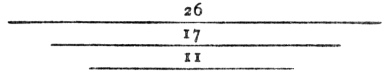
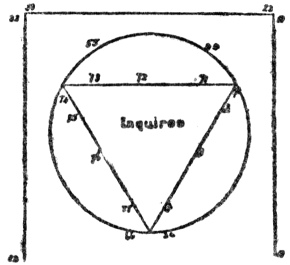

  
[Intangible Textual Heritage](../../index)  [Tarot](../index) 
[Index](index)  [Previous](ftc20) 

------------------------------------------------------------------------

[Buy this Book at
Amazon.com](https://www.amazon.com/exec/obidos/ASIN/0879800356/internetsacredte)

------------------------------------------------------------------------

*Fortune Telling by Cards*, by P.R.S. Foli, \[1915\], at Intangible
Textual Heritage

------------------------------------------------------------------------

p. 117

### CHAPTER XIX

#### Etteilla's Method

*The Major Arcana—The Minor Arcana—General rules—The
second deal—The third deal or great figure—The fourth deal*.

THE Tarot pack is divided into two parts, called the major and minor
arcana, the first consisting of twenty-two cards and the latter of
fifty-six, which are again divided into four suits.

We will take first the major arcana, and here we are confronted by some
curious figures, each bearing a distinct meaning, typical of man himself
and his moral and material life. The first seven cards refer to the
intellectual side or mental power of man, the second seven to the moral
side, or his attitude towards his fellow-man, whilst the third seven are
relative to the various events of his material life. The remaining card
is the symbol of the greatest heights it is given to man to reach.

The first step is to learn the actual meaning of each separate card, and
remember to which group it belongs.

#### The Major Arcana.

##### FIRST.

|                |                                   |
|----------------|-----------------------------------|
| The Juggler    | Male inquirer.                    |
| High Priestess | Woman.                            |
| Empress.       | Action; initiative.               |
| Emperor.       | Will.                             |
| Pope or Priest | Inspiration.                      |
| Lovers         | Love.                             |
| Chariot        | Triumph; Providential protection. |

p. 118

##### SECOND.

|                      |                     |
|----------------------|---------------------|
| Justice              | Justice.            |
| The Hermit           | Prudence.           |
| The Wheel of Fortune | Destiny.            |
| Strength             | Fortitude; courage. |
| The Hanged Man       | Trial or sacrifice. |
| Death                | Death.              |
| Temperance           | Temperance.         |

##### THIRD.

|                  |                               |
|------------------|-------------------------------|
| The Devil        | Immense force or illness.     |
| The Struck Tower | Ruin and deception.           |
| The Stars        | Hope.                         |
| Moon             | Hidden enemies; danger.       |
| Sun              | Material happiness; marriage. |
| Judgment         | Change of position.           |
| The Foolish Man  | Inconsiderate actions.        |
| The Universe     | Success.                      |

#### The Minor Arcana.

This consists of four suits, known as sceptres, cups, swords, and
pentacles, which correspond to the four suits of the pack of playing
cards in general use. Each suit also bears a symbolical meaning, which I
give—

|           |               |           |          |             |
|-----------|---------------|-----------|----------|-------------|
| Sceptres  | correspond to | diamonds, | and mean | enterprise. |
| Cups      | „             | hearts    | „        | love.       |
| Swords    | „             | spades    | „        | misfortune. |
| Pentacles | „             | clubs     | „        | interest.   |

The court cards consist of king, queen, knight, and knave, and represent
respectively man, woman, youth, and childhood. These also have another
meaning, which is interesting—

p. 119

|        |                                          |
|--------|------------------------------------------|
| King   | Divine world (spirituality).             |
| Queen  | Human world (vitality).                  |
| Knight | Material world (materiality).            |
| Knave  | Transition stage, *i.e.* life passed on. |

The remaining cards in each suit count from one to ten inclusively, and
these must be considered in relation to the suit and their face value.
"Papus," in his "Key to Occult Science," has given a few suggestions
which considerably simplify fortune-telling with the Tarot pack.

By dividing the ten cards of each suit into four sets, we get the
relation which they bear to the court cards. The first three, 1, 2, 3,
relate to man, which signifies creation and enterprise. The second
division, 4, 5, 6, pertain to woman, in opposition to man, that is,
reflection and negation. The third division, 7, 8, 9, represent youth
and materialism, whilst the ten in each suit makes the fourth set, and
relates to the knave or childhood, a transitory or neuter period.

Having thoroughly studied the meaning of each section and each card, it
is now necessary to consider some of the methods of divination.

#### General Rules.

As stated in the preceding chapter, Etteilla, the famous cartomancer,
used the Tarot pack, and we can scarcely do better than follow his
general rules and method.

The whole pack of seventy-eight cards is to be shuffled and cut into
three packs, each consisting of twenty-six cards. Take the centre pack
and place it to the right. Then the inquirer must again shuffle the
remaining cards and divide into three packs of seventeen cards. Take
again the centre pack and place on the right hand, keeping it separate,
however, from the first. Another shuffle, and again cut into three packs
of eleven cards each, and take the centre pack.

Before proceeding further, it is necessary to explain what to do with
the cards that are over. 78 will divide into three times 26 evenly; but
three times 17 = 51, therefore there is one card over. This card is to
be shuffled with the pack for the third time, and when cut there will be
found two over,

p. 120

which two cards must remain as a discard until the centre pack of eleven
has been selected. There will now be three packs of cards on the right
hand—one of twenty-six, one of seventeen, and one of eleven; the discard
will consist of twenty-four cards.

Take the first pack of 26 and draw off each card separately, laying it
on the table from right to left. The second and third packs must be
dealt with in similar fashion, only placing them under the first, thus—

 

The cards being placed, and the signification of each card being kept in
mind, the reading can be given. In this figure the lowest line refers to
the body or material needs of the inquirer; the second or middle line to
the minds or to the affairs on which the thoughts are more specially
directed; and the upper line to the unseen or spiritual sense.

#### The Second Deal.

Shuffle the whole pack and let the inquirer cut once. Then draw off the
first seventeen cards, and look at the eighteenth and also at the last
card in the pack. These two cards will show you if you have established
any sympathy between yourself and the inquirer—a fact which must be
judged from the signification the cards bear to the inquirer.

Lay out the seventeen cards selected, and place them in order from right
to left, then give the interpretation. Pair, by taking the 1st and the
17th, 2nd and 16th, and so on to the end. The pairing should either
enhance or modify the deductions already drawn.

#### The Third Deal or Great Figure.

This method is more elaborate than any of the others. Let all the cards
be well shuffled and cut by the inquirer, then arrange in the following
order:—

On your right hand, working upwards, place eleven cards.

p. 121

\[paragraph continues\] Opposite to the
first card, but leaving a space between (see diagram), place the 12th
card, and work upwards from that until you have arranged another column
of eleven cards.

From the 11th card on the right, begin and place eleven cards across,
which arrangement will give you the three sides of a square formed by
thirty-three cards. Then form the circle by commencing with the 34th
card, and placing it in a line with the centre card of the top row.
Sixty-six cards will now have been used. One card must represent the
inquirer, and should be placed in the centre, and the more satisfactory
plan is to take the juggler to represent a man, and the high priestess a
woman, instead of simply drawing any card by

 

chance. Eleven cards now remain, and with these the triangle inside the
circle can be formed. The apex of the triangle will be towards the
manipulator, as shown in the diagram.

This figure will give a reading of the past, present, and future—the
right referring to the events that have passed, the left to things as
they are at present known, and the third to what is to come.

The first card placed on the square and the first card placed on the
circle are paired, then the 2nd and the 35th, the 3rd and 36th, and so
on until you have taken all the cards on the right, which will give you
a reading of the past. Pair the 23rd card with the 45th, and proceed
until you have finished with the section referring to the present.

p. 122

For the future, take the 12th card and the 66th, and read the indication
of events to come.

The triangle formed of the eleven cards is an innovation on Etteilla's
method, but, read in reference to the deductions made, it will probably
confirm the cartomancer's opinions. This figure requires much attention
and patience, especially if the more symbolical meaning of the cards is
studied.

#### The Fourth Deal.

This refers only to the wish. Let the inquirer shuffle the cards, then
draw off the first seven and lay them from right to left, and read
according to the meaning.
