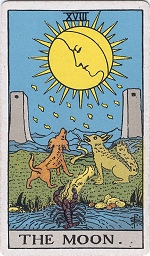

  
[Intangible Textual Heritage](../../index)  [Tarot](../index) 

------------------------------------------------------------------------

[Buy this Book at
Amazon.com](https://www.amazon.com/exec/obidos/ASIN/0879800356/internetsacredte)

------------------------------------------------------------------------

<table width="75%">
<colgroup>
<col style="width: 50%" />
<col style="width: 50%" />
</colgroup>
<tbody>
<tr class="odd">
<td width="50%" data-valign="TOP"></td>
<td width="50%" data-valign="CENTER"><h1 id="fortune-telling-by-cards" data-align="CENTER">Fortune-Telling by Cards</h1>
<h2 id="by-p.r.s.-foli" data-align="CENTER">by P.R.S. Foli</h2>
<h4 id="section" data-align="CENTER">[1915]</h4></td>
</tr>
</tbody>
</table>

------------------------------------------------------------------------

[Contents](#contents)    [Start Reading](ftc00)    [Page
Index](pageidx)    [Text \[Zipped\]](ftc.txt.gz)

|                                                                                                                           |
|---------------------------------------------------------------------------------------------------------------------------|
|  |

This is a short book on telling fortunes, primarily with a standard deck
of playing cards. There is a short two-chapter section at the end about
the Tarot. Described are several different spreads, including the
32-card method, the French and Italian methods, the Grand Star, and
Etteilla's Tarot spread.

------------------------------------------------------------------------

 [Title Page](ftc00)  
[Contents](ftc01)  
[Introduction](ftc02)  
[Chapter I](ftc03)  
[Chapter II](ftc04)  
[Chapter III. The Selected Pack of Thirty-two Cards](ftc05)  
[Chapter IV. The Signification of Quartettes, Triplets, and
Pairs](ftc06)  
[Chapter V. What the Cards can Tell of the Past, the Present, and the
Future](ftc07)  
[Chapter VI. Your Fortune in Twenty-one Cards](ftc08)  
[Chapter VII. Combination of Sevens](ftc09)  
[Chapter VIII. Another Method](ftc10)  
[Chapter IX. A French Method](ftc11)  
[Chapter X. The Grand Star](ftc12)  
[Chapter XI. Important Questions](ftc13)  
[Chapter XII. How They Tell Fortunes in Italy](ftc14)  
[Chapter XIII. The Master Method](ftc15)  
[Chapter XIV. Signification of Suits in the Master Method](ftc16)  
[Chapter XV. Combination of Nines](ftc17)  
[Chapter XVI. Your Heart's Desire](ftc18)  
[Chapter XVII. A Rhyming Divination](ftc19)  
[Chapter XVIII. The Tarots](ftc20)  
[Chapter XIX. Etteilla's Method](ftc21)  
