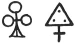
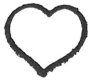
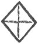
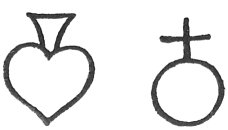
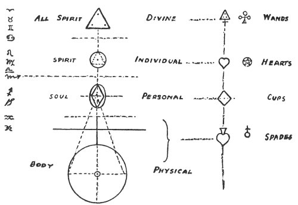
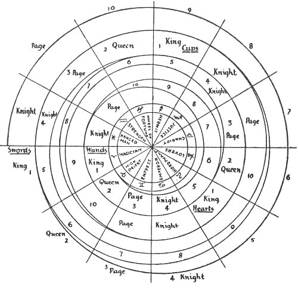

  
[Intangible Textual Heritage](../../index)  [Tarot](../index.md) 
[Index](index)  [Previous](gbt03)  [Next](gbt05.md) 

------------------------------------------------------------------------

[Buy this Book at
Amazon.com](https://www.amazon.com/exec/obidos/ASIN/0766157350/internetsacredte.md)

------------------------------------------------------------------------

*General Book of the Tarot*, by A. E. Thierens, \[1930\], at Intangible
Textual Heritage

------------------------------------------------------------------------

### THE LESSER ARCANA

The pack of cards of the Lesser Arcana has been generally acknowledged
as the origin of our ordinary playing-cards, though subsequent
authorities do not wholly agree upon this point. Thus we find Dr. Papus
saying:

". . . wands have become the clubs (or trèfles) of our present
playing-cards, cups have become hearts, swords have become spades and
pentacles have become diamonds." (Chapter I.)

Mr. Waite in his *Key* says:

". . . wands or sceptres . . . diamonds . . . cups correspond to hearts
. . . swords answer to clubs . . ."

and finally pentacles "which are the prototype of spades." (P. 37.)

p. 16

In MacGregor Mathers' booklet we find *in extenso* the following table:

<table data-border="1">
<colgroup>
<col style="width: 25%" />
<col style="width: 25%" />
<col style="width: 25%" />
<col style="width: 25%" />
</colgroup>
<tbody>
<tr class="odd">
<td data-valign="top">
<em>Italian</em>
</td>
<td data-valign="top">
<em>French</em>
</td>
<td data-valign="top">
<em>English</em>
</td>
<td data-valign="top">
<em>Answering to</em>
</td>
</tr>
<tr class="even">
<td data-valign="top">
Bastoni
</td>
<td data-valign="top">
Bâtons
</td>
<td data-valign="top">
Wands, Sceptres 
or Clubs
</td>
<td data-valign="top">
Diamonds
</td>
</tr>
<tr class="odd">
<td data-valign="top">
Coppé
</td>
<td data-valign="top">
Coupes
</td>
<td data-valign="top">
Cups, Chalices 
or Goblets
</td>
<td data-valign="top">
Hearts
</td>
</tr>
<tr class="even">
<td data-valign="top">
Spadé
</td>
<td data-valign="top">
Epées
</td>
<td data-valign="top">
Swords
</td>
<td data-valign="top">
Spades
</td>
</tr>
<tr class="odd">
<td data-valign="top">
Denari
</td>
<td data-valign="top">
Deniers
</td>
<td data-valign="top">
Money, Circles 
or Pentacles
</td>
<td data-valign="top">
Clubs
</td>
</tr>
</tbody>
</table>

\[paragraph continues\] The discrepancies
are evident. Furthermore questions may arise as to how one writer could
call swords, clubs, while linguistically a wand and a club originally
mean the same thing, and cover the same meaning, viz. that of a detached
part of a living tree; and how is it that another could see wands
answering to diamonds and a third make pentacles clubs? Evidently a
sword must be a 'spade' and a wand must be a 'club,' the names being
virtually identical. There seems, however, some difficulty regarding the
other two. I object to the usage as given by Papus and MacGregor Mathers
and can easily bring forward proof against it. Important differences
like these, found in the writings of the principal authors on the
subject, show that something is wanting in the understanding of the
doctrine itself and the 'why' has been lost, or at least partially. The
quest for this doctrine must be fully worth the trouble--and we shall
endeavour, in the following pages, to follow it up to its origin in
general cosmological principles.

 

Now the first thing we wish to point out is this: the system of the
Tarot is so important, that no explanation

p. 17

can be accepted as satisfactory other than that which acknowledges it as
a general outline of Creation itself, which ever was, and ever
continues, pervading every creature and everything with its principles
as a divine immanence.

Therefore Papus is quite right in stating, that "each card of the Tarot
represents a symbol, a number and an idea."

At the basis of Creation are the Four Cosmic Elements, as they were
symbolically mentioned by visionaries such as Ezechiel and St. John of
Patmos, and taught by astrology of old. It requires no extraordinary
intuition of the occult student to recognise in the four colours of our
playing-cards or the four suits of the Tarot's Lesser Arcana those four
basic Elements: Fire, Earth, Air and Water. The question remains
however: Which is which?

There must have been a time when knowledge about these matters was
nearer at hand than is the case nowadays; the symbols speak for it. A
student of Occultism has to pay attention to symbols above all. So what
do they tell us?

 

WANDS.--As a matter of fact, curiously enough, all authors agree in
naming wands or clubs in the first place. In our set of playing cards
the figurative symbol for it is the trefoil (French
*trèfle*)--*tri-folio*--and Mr. Ouspensky draws the wands bearing leaves
which in many instances appear to be threefold--at least they should be.
The trefoil or shamrock has always been considered a luck-charm,
*Porte-bonheur*. [\*](#fn_5.md)

p. 18

\[paragraph continues\] It is built upon
the scheme of the triangle, symbol of Trinity, and the totality of the
figure appears also in the masonic 'trefoil,' which is an emblem of the
Divine Trinity together with the principle of activity, indicated by the
staff or wand itself, eventually crossed as in the ancient emblem.

 

In a way we must regard this symbol as revealing the highest conception
of Creation: Trinity pure and simple with only the rudiment of activity
indicated, standing still above the circle, as far or as soon as the
latter suggests Motion. So wands, clubs or trèfles are most certainly
meant as the symbol of the highest element in Creation.

The question has often been put as to whether, in the astrological idea
of creation, Air or Fire ought to be regarded as the highest element.
The answer depends upon the standpoint we take. In the highest
cosmological or cosmo-philosophical sense it is Fire; in a
cosmo-practical or cosmo-natural sense it is Air, as the *Secret
Doctrine* undoubtedly makes us understand, where the dissolution of
cosmos at the end of a Manvantara is treated of and it is said that the
Earth is dissolved or engulfed by the Waters, Water evaporated by Fire,
and finally Fire disappearing in the Air. Here Air is acting as the
atmosphere of the globe or system disappearing. So for all practical
uses, in astrology as well, it is Air which is able to give the highest
expression of the Divine. As the atmosphere of a globe it is the link
between

p. 19

it and the Ether of space, carrying the rays of the divine solar centre
as well as those of the relatively 'demoniacal' surroundings to the
other elements, constituting the existence of the globe. In a similar
way the suit of wands will appear to be something of a link between the
Lesser and the Greater Arcana. This will be dealt with later.

Taken in this way Air is 'the bearer of the Message' from the Divine
(Ether) or Unmanifest to the terrestrial or manifested worlds. And wands
are the significators of the messages in detail and of intelligences,
which astrologically correspond to Air, consequently of higher thought
and mental processes.

The magic wand is used to convey the divine or at least semi-divine
will-power of the Self acting as a magician into the world of phenomena.

As in Macrocosm the Message goes out to the Water (the emotional element
of experience in the Soul), and Metals (sensatory elements of
understanding in the Body), so in microcosm, on Earth, a wand may be
used to find out water and metals in the soil. This may seem curious,
but is pure analogy.

From days of old a wand or staff was used to 'chastise,' i.e. to render
chaste or pure, the undisciplined or disobedient, a penalty as much
symbolical as corporeal, the staff being at the same time the insignum
of a superior will-power or supervision.

Hermes-Mercury, Lord of the Element of Air, of Knowledge and
Understanding, Bearer of the Message of the Gods, carried as his emblem,
his well-known Wand encompassed by two snakes and bearing a cup on top.
He was called Trismegistus, the 'threefold' Great (or the Great Trefoil
which

p. 20

might also be translated as Lord or Magister of the register of Trefoil,
King of the Wands.

And the pilgrim, who went to hear the word of deliverance and to gather
knowledge, took up a staff, not only as a walking-stick but also as a
symbol of his quest. The latter finds illustration in the legend of
Tannhauser, whose 'sin' (ignorance) was so great, that its expiation
could be expected as little as the budding of new leaves on his (dead)
pilgrim's staff, the latter being evidently taken as an image of the
principle of the 'wand' in his own soul. And when, by the force of Love,
a higher understanding budded forth in himself, this fact was symbolised
by the apparition of a fresh green leaf on hip staff.

The ancient Norsemen, highly susceptible to symbolism, wrote their signs
of communication or messages on *stafe*, wands, which became the origin
of the later word *Buchstabe* in German.

 

PENTACLES.--Generally cups are named in the second place but are at the
same time identified with hearts. We agree that the hearts come in the
second place of the hierarchy of the Tarot suits, but do not see, that
they should be 'cups.' Of course we understand that the heart has been
said to be the 'cup' receiving and containing the divine life, etc. But
still we disagree and even think the parable rather superficial, for it
leaves the mutual relation of the three remaining elements in a
distorted condition. Moreover the symbolical names, as given by the
different authors mentioned, do not agree.

If, taken as a whole, wands stand for the Message of the Macrocosm or
Ideation, as Air transfers the message from the Ether, and if we take
for granted,

p. 21

that the imagination of the Tarot system was meant and given for
cosmo-practical or cosmo-natural usage, then we must be prepared to find
in the remaining three suits the elements of (say: 'human') spirit, soul
and body incarnate (i.e. as they appear in the manifested world), thus
constituting together the microcosm *in toto*. Astrology gives for the
three the symbols: Sun, Moon and Ascendant (Earth). We should rather
say: the Fifth, the Ninth and the First house in the horoscopic circle.
Compare our second volume on Cosmology, entitled *Elements of
Astrology*.

If now, to indicate these three principles, we dispose of a pentacle, a
cup and a sword, it is most surely the pentacle on the coin of gold or
within the circle, which relates to the heart and the principle of
spirit, located in the Fifth house. For here the human spirit with its
fivefold nature originates and here the *fivefold* magic or creative
force resides. It is difficult to see what other meaning the pentacle
could have than the symbolising of the Fifth house in Creation, which is
the heart to every living being. There is not the least shade of doubt
that in the horoscope the beginning of the spiritual spiral lies in the
Fifth house. Gold is the metal ruled by the Sun, lord of the Fifth sign,
Leo, the heart of the solar system. So pentacles or golden coins are the
hearts in playing-cards and correspond to the element Fire.

 

The symbol in playing-cards is drawn in the natural likeness of a heart.
There is as little doubt concerning

p. 22

the element Fire, because, as every astrologer knows and realises,
spirit, soul and body stand in the same relation as Fire, Water and
Earth. Compare the *Secret Doctrine*, where 'a centre of Fire and Water'
is the origin for a new incarnation on Earth. Curiously enough,
divination never has interpreted 'hearts' in any other way than as
symbolising things belonging to the heart or coming forth from it. In so
far this 'colour' has been well understood. But its gold is a spiritual
symbol and has as yet nothing to do with 'money.' It is in the soul and
not in the spirit, that the idea of repayment is forged, though no doubt
the spiritual gold may be said to be the origin of all that will later
on appear as vulgar money.

 

CUPS.--The soul is ruled by the Moon and the element Water, as is well
known in astrology. It is in the cosmic principle of Soul, or in other
words: in the Cosmic Soul, that the truth of the philosophic statement,
*Panta Rei* (everything in the world is flowing), is revealed. And there
is no better symbol for the specific nature of the soul *in concreto*
than that of a cup or chalice, which contains the Liquor of Life. The
cup is really suggestive enough with regard to the element Water.

When Jesus prayed: "Lord let this chalice pass from me," He indicated
something which He feared would fill his *soul* with bitterness. And in
the Last Supper He passed along the chalice of brotherhood amongst the
disciples, as a sign of *soul*-union, a custom still followed by the
churches of Christianity and in days of old by King Arthur at the
meetings of the Round Table. The Christian churches lay much stress on
the mystic happenings with the Holy

p. 23

\[paragraph continues\] Chalice on the
altar, the receiver of Divine Light and Blessings. Herein we may see a
demonstration of the mystery of Christ, Son of the Heart (that is, the
Sun in the Solar system), *Divine Soul* (the 'Father' being Divine
Spirit) using the persona of Jesus as Its Cup or vessel (*vahana*).

In one of the masonic High Grades the cup reappears with the symbolic
'supper' of brotherhood.

The quest of the Holy Graal--the legendary Holy Chalice or Cup of
Felicity--shadowed forth in the ritual of the church--is well known to
represent the thirst or solicitude of the *soul* for the spiritual water
or wine of Life Divine. The Graal itself symbolises the shape of a human
or superhuman personality, a soul of human nature, filled or 'fulfilled'
by this Divine Essence, by which it becomes a Holy One, a Master or
Elder Brother. So it means the quest of the common human soul for the
Master Soul.

Cups or beakers are used throughout the world to drink 'welcome' and
friendship, i.e. to express the idea of soul-union: something like "my
soul drinks from the same liquor as yours," viz. the liquor of life or
of renovation of life; "my soul meets yours in the drinking of the wine
divine, and so knows that we are brothers."

Among playing-cards cups cannot be anything else but diamonds--in
French: *carreaux*--the two different names giving expression to exactly
the same idea: that of the soul or *persona* of the spirit. The diamond
is a jewel which allows the light to pass almost without any loss; the
purer its 'water' the less the loss and the higher its value, which is
the reason why Occultists call a perfected soul a 'Diamond-Soul.' The
French and the Dutch use the same simile in a

p. 24

somewhat more prosaic though still very pretty way, when they compare
the soul with a little window through which God is looking downstairs
(Flemish: *vensterke*) into the lower worlds. The same is said of the
human eye, which is styled the little window or *vensterke* of the soul
in its turn. This is the origin of the French *carreaux* and the Dutch
*ruiten*. Its symbolic figure is clear enough:

 

Without a shadow of doubt cups stand for diamonds or *carreaux* and for
the element Water.

Ordinary divination correctly ascribes to cups the property of ruling
money matters, because the soul is, in fact, the producer of work, which
results in the production of 'money.'

The figure for diamonds in playing-cards is a square standing on one
point, the opposite point reaching upwards. This symbolises the soul in
its chief characteristic, standing on one end, one-pointedly directed
towards Heaven or spirit and on the other hand one-pointedly directed
towards Earth or matter, and squaring the Two within itself. One who
really understands this may well be called a 'square man.'

 

SWORDS.--Not much choice is left with regard to the fourth suit or
colour. Perhaps a sword looks more like a magic instrument than a spade,
but both are made of iron, which 'cleaves' the Earth or 'the body of
Earth.'

p. 25

When in the *Bhagavad Gîtâ*, the evident intention is to make it clear,
that Shri Krishna did not appear in a 'body of Earth' or physical body,
one of the images used to express this meaning is: "weapons cleave Him
not."

Originally the sword and spade had the same meaning. Compare the Spanish
*espada* and the French *épée* for sword. A later meaning of 'spade'
became that of the agricultural tool.

In one way, viz. as a physical instrument, the emblem of executive
power, the sword has much the same meaning as the wand or club: both are
instruments of command, compelling obedience. The difference lies in the
nature of the element used: wands compel by reason, intelligence,
understanding, moral force; swords enforce obedience to laws of Earth,
material necessity, actual resistance. This means also, that wands open
moral, intellectual and reasonable possibilities, swords give material
opportunities.

Both these suits start from the First house or Aries, as will be worked
out further hereafter, the one leading up from the beginning of
Intelligence, the other from the beginning of activity in Matter.

The swords wound or even kill, they sever the rotten limb from the
otherwise healthy body, for which reason the sword became the symbol for
discrimination between practical usefulness and practical uselessness.
From this, practical ideas of Right and Wrong, Good and Evil spring into
being.

To wound and to kill is to destroy partially or wholly a body of Earth.
This must not be regretted, as Shri Krishna explains, because it is only
destroying *maya*, misleading appearances. That which is an

p. 26

inner reality can never be killed; it is Life itself. So the swords may
mean destruction to some form or body, formula or limited existence,
they may inflict pain, detriment, loss, sorrow upon bodily existence and
material possessions or conditions. On the other hand they may mean
renovation, birth and rebirth, the removing of obstacles, a clearance of
the way and of the field of action, as the spade clears and turns the
soil of the garden for a new sowing. So Jesus might well say: "I have
not come to bring peace, but a sword." And even so, where the I or Self
manifests in the world of outer phenomena, it will be obliged to take
either the sword or the spade in hand to kill out wrongs, illusions,
obstacles or turn the soil for a new sowing. Sometimes it may have to
cut away what is not wanted, in order to keep the rest pure and straight
and healthy; just as the sculptor works on the marble. So also sorrow
and pain will be inflicted upon the body of Earth so long as the hand of
the Heavenly Sculptor is upon it.

The symbolic figure drawn for spades in playing-cards is the reverse of
that for hearts, plus a design at the top reminding us of the cross upon
the circle

 

in the symbol of the planet Mars: it appears also to signify something
in the nature of the heart oppressed by the cross of matter.

That ordinary divination takes spades as malific as it makes hearts
benefic, will be clear from the above.

p. 27

\[paragraph continues\] From an inner
standpoint it is not seen in the same way; this also will be clear.

 

The colours of the spades and wands are always given as *black*, hearts
and cups as *red*. The symbology of the Tarot is too pure for such a
detail to be an accident, though the ordinary pack of playing-cards
might be considered to some extent as a sort of 'profanation' of the
original Tarot. These colours, however, bear an essential meaning, as
does everything in the Tarot.

 

Wands take their black colour from the 'Black Wisdom' (compare the
*Secret Doctrine*);

Swords or spades are black from the Earth, which has no light of its
own;

Hearts are coloured red by the 'blood' and cups by the 'wine,' the
liquor of life in the body and in the soul respectively, and both
bearing light. So the Wine imparts the Holy Communion of the spirit to
the soul, and the blood renders the same service, relatively, to the
particles of the body, to which it imparts the life of the Ego or rather
of its soul.

 

As I have explained in my previous book referred to above, Evolution may
well be represented by a spiral starting from the spiritual centre and
descending through the twelve houses of zodiacal ideation and formation
into the 'worlds'--spiritual, psychical, physical.

This Spiral of Evolution may be divided into at least three parts, that
is, three different beginnings may be seen. There is the Divine
Beginning,

p. 28

starting in Aries, the sign of Initiation and highest abstraction, *the
divine cycle* being completed in Pisces, where it is handed over or
'offered' or sacrificed to the world of appearances.

The cycle of the spiritual in Man begins in the fifth sign, Leo, the
*individual cycle* being that of the Spark or the Ego, and it runs from
this sign of the heart to Cancer, the sign of memories.

Subsequently: a cycle of the personal being of the Ego, the cycle of the
soul in Man, which we may call the *personal cycle*, starts from
Sagittarius, the sign of thought and manifestation, and ends in Scorpio,
the sign of death.

Then there is the *cycle of the body*, body of Earth, with the etheric
initiative in Aries once more at the same point but lower down in the
scale, and ending in Pisces as the house of the 'Universal Solvent,'
applying also to the body of Earth, for here personal separateness is
solved into the physical surroundings of the Universe from which it was
built up.

After this the physical *organs in the body* of Earth will be built up
and have their own cycle, starting again in Leo and building them
between the heart and the stomach: Cancer.

And in Sagittarius the *physical manifestations* in happenings, deeds,
facts, proceedings, etc., begin their cycle in co-operation with their
surroundings. This cycle again ends in Scorpio, where life's lessons or
experiences are drawn out of the materials.

Divine Intelligence being the beginning of all that to our conception
means Evolution, the Spiral of Evolution must necessarily open with the
suit of Wands, thus ruling the First to the Twelfth house. They stand
for intelligence in general and 'intelligences'

p. 29

in Nature, for messages and communications, relations, connections,
plans and ideas, for knowledge and insight. They work through the head
and have to do with 'mutations.'

Then follow hearts, representing the individual cycle, from the Fifth to
the Fourth house. They rule in this cycle the fiery force of the spirit
and represent power, goodness, love, fixed purpose, desire, well-being,
virtue, warmth and heat, generation, development, they work through the
heart.

The cups rule the cycle of the soul, or personal cycle, and represent,
working from the Ninth to the Eighth house, the emotions and motives,
the activity of the soul, its experiences from the highest philosophy
and religion down to the merest lust or sensation. They work through the
senses and the organs of motion.

They have what may be described as an undulating movement, and they may
be favourable or unfavourable. But they move and cause growth and death,
rise and decline; they mould life into physical circumstances and forms;
they 'influence' everything and this is their particular business.

The body of Earth is built up by the elements of Earth, represented by
the suit of swords, running from the First house again up to the
Twelfth. They speak of birth in matter, of facts, formations and
resistance, of material good luck and bad fortune, achievements and
failure in material respect; of afflictions and pain, but also of the
effects produced by this suffering.

Again comes the cycle of hearts, now in the significance of the round of
physical organs. This is very strict and can be absolutely relied upon.
Every

p. 30

astrologer can tell you the relationship between the houses and the
organs of the body. But it must be borne in mind that this rulership
first relates to the ethereal centres or chakras, the fiery wheels in
the etheric body. So the Fifth house rules the solar plexus and the
heart . . . etc.

Finally the cups rule the cycle of events, happenings, movements. From
the Ninth to the Eighth house again.

In a general way the cups will relate to water, as the hearts to fire,
the wands to air, and the spades to earth in the practice of daily life
as well as in a philosophical sense.

It appears further that each of the three cycles come twice into play:
the cycle of Aries--Pisces by wands and swords; that of Leo--Cancer by
hearts on two different *niveaux*; and that of Sagittarius-Scorpio in
the same way twice by cups.

 

Astrologers may wonder perhaps, how and why it is that the 'mutable'
suits of wands and spades start from the 'moveable' sign Aries, while
the 'moveable' suit of cups starts from the 'mutable' sign Sagittarius.
We can only answer that the facts are as they are, but may add, that
evidently every suit has something of a particular sort of accent, which
does not necessarily fall on the first sign or house, but on that in
which house and suit coincide with regard to element and property
(*guna*). Thus:

 

Spades, earth and mutable, will have their accent in the sign Virgo,
mutable sign of earth, in which discrimination is said to be born;

Cups, water and moveable, in the moveable sign of water Cancer, which in
fact is the proper sign

p. 31

of the moon and in which all properties of the soul can be said to be
gathered or hidden;

Hearts, fire and fixed, in the fixed and fiery sign Leo; the suit of
hearts appears to be the only one out of the four to have its particular
accent on the first 'card' or house, which naturally confirms the
essential being of hearts as interpreting fire and the centre of things;

Wands, air and mutable, have their accent on the airy and mutable sign
Gemini, the sign of the Messenger.

 

The subsequent cycles are so many suits of Principles in the process of
Building the Cosmos, Houses in the Holy City of the Great Architect of
the Universe. They represent happenings in the proceedings of Evolution
and experiences on the side of Involution at the same time.

If the suits of colours in the Tarot system convey any meaning at all,
it must be this, and there cannot be anything else to represent except
these principles and houses, happenings and experiences. We shall see
hereafter, how the Greater Arcana falls in with them, and may now
proceed to explain the rôle of the Lesser Arcana.

Each suit of cards has been given as a set of *fourteen*, viz. *ten*
numbered cards, ace to ten, and four 'court cards' named King, Queen,
Page or Knave, and Knight. The latter has been omitted in the ordinary
playing-cards. Now whereas the cosmological cycle consists of twelve
houses, these sets or suits have ten or fourteen cards--just as we
choose to take it. Still--if we take for granted--that the analogy
exists, each principle must be represented in a card and *vice* 

p. 32

*versa*. If it were not so, the Tarot system would be found wanting, and
we have sufficient reasons not to accept this supposition beforehand,
both by reason of theoretical and practical tests, the traditional
renderings of the cards confirming the experience.

We need not trouble about the question *why* the Initiates, who
presented the Western World with such an inheritance, chose to number up
to ten only instead of going to Twelve. The 'Chosen People' were given
only ten commandments for their guidance. They who understand astrology
in its essential meaning, can perceive something of the reason;
afterwards when the Preacher of Divine Life came to the same chosen
people, He gave a double new commandment to complete the ancient Law:
that of Brotherhood (Aquarius--eleven) and Love (Pisces--twelve).

In each suit of Tarot cards the numbering is from the one or ace up to
the ten; the King is to be considered in some way as a higher octave of
the *one*, the Queen or Dame as the same of the *two*, whereas the Page
or Knave is a representative of the 'relation between the two' and
consequently is a higher octave of *three*, while the Knight is the
higher octave of the *four* and the other side of the same 'relation.'
This absolutely covers the general and conventional meanings of Pages
and Knights in the Tarot system and its divination, the Pages being said
to be always something of messengers, and the Knights to be signifies of
transition, conversion, transmission, changing from one condition into
another. But at the same time we find the intimation, that the Page as
well as the Knight 'bears a double meaning.' Now, as they stand for 'the
relation between the two' they already bear an inherent

p. 33

\[paragraph continues\] 'double meaning'
or significance of a double nature. But 'double meaning' implies
something else and something more.

The Page and the Knight are also the figures standing for the XIth and
XIIth principles, in the Eleventh and Twelfth houses, conveying the
commandments of their King and Queen, as their messengers or officers,
and at the same time standing as it were for the whole suit
collectively, while in the former meaning, viz. as higher octaves of the
3 and 4, they are the messenger and bridge from one suit to the next
one.

 

To give the analogy between the cards of the Tarot's Lesser Arcana and
the zodiacal houses categorically:

<table style="width:100%;" data-border="0">
<colgroup>
<col style="width: 14%" />
<col style="width: 14%" />
<col style="width: 14%" />
<col style="width: 14%" />
<col style="width: 14%" />
<col style="width: 14%" />
<col style="width: 14%" />
</colgroup>
<tbody>
<tr class="odd">
<td data-valign="top">
WANDS:
</td>
<td data-valign="top">
 
</td>
<td data-valign="top">
 
</td>
<td data-valign="top">
 
</td>
<td data-valign="top">
 
</td>
<td data-valign="top">
 
</td>
<td data-valign="top">
 
</td>
</tr>
<tr class="even">
<td data-valign="top">
1
</td>
<td data-valign="top">
and
</td>
<td data-valign="top">
King
</td>
<td data-valign="top">
Aries
</td>
<td data-valign="top">
or
</td>
<td data-valign="top">
I
</td>
<td data-valign="top">
house
</td>
</tr>
<tr class="odd">
<td data-valign="top">
2
</td>
<td data-valign="top">
„
</td>
<td data-valign="top">
Queen
</td>
<td data-valign="top">
Taurus
</td>
<td data-valign="top">
„
</td>
<td data-valign="top">
II
</td>
<td data-valign="top">
„
</td>
</tr>
<tr class="even">
<td data-valign="top">
3
</td>
<td data-valign="top">
„
</td>
<td data-valign="top">
Page
</td>
<td data-valign="top">
Gemini
</td>
<td data-valign="top">
„
</td>
<td data-valign="top">
III
</td>
<td data-valign="top">
„
</td>
</tr>
<tr class="odd">
<td data-valign="top">
4
</td>
<td data-valign="top">
„
</td>
<td data-valign="top">
Knight
</td>
<td data-valign="top">
Cancer
</td>
<td data-valign="top">
„
</td>
<td data-valign="top">
IV
</td>
<td data-valign="top">
„
</td>
</tr>
<tr class="even">
<td data-valign="top">
5
</td>
<td data-valign="top">
 
</td>
<td data-valign="top">
 
</td>
<td data-valign="top">
Leo
</td>
<td data-valign="top">
„
</td>
<td data-valign="top">
V
</td>
<td data-valign="top">
„
</td>
</tr>
<tr class="odd">
<td data-valign="top">
6
</td>
<td data-valign="top">
 
</td>
<td data-valign="top">
 
</td>
<td data-valign="top">
Virgo
</td>
<td data-valign="top">
„
</td>
<td data-valign="top">
VI
</td>
<td data-valign="top">
„
</td>
</tr>
<tr class="even">
<td data-valign="top">
7
</td>
<td data-valign="top">
 
</td>
<td data-valign="top">
 
</td>
<td data-valign="top">
Libra
</td>
<td data-valign="top">
„
</td>
<td data-valign="top">
VII
</td>
<td data-valign="top">
„
</td>
</tr>
<tr class="odd">
<td data-valign="top">
8
</td>
<td data-valign="top">
 
</td>
<td data-valign="top">
 
</td>
<td data-valign="top">
Scorpio
</td>
<td data-valign="top">
„
</td>
<td data-valign="top">
VIII
</td>
<td data-valign="top">
„
</td>
</tr>
<tr class="even">
<td data-valign="top">
9
</td>
<td data-valign="top">
 
</td>
<td data-valign="top">
 
</td>
<td data-valign="top">
Sagittarius
</td>
<td data-valign="top">
„
</td>
<td data-valign="top">
IX
</td>
<td data-valign="top">
„
</td>
</tr>
<tr class="odd">
<td data-valign="top">
10
</td>
<td data-valign="top">
 
</td>
<td data-valign="top">
 
</td>
<td data-valign="top">
Capricornus
</td>
<td data-valign="top">
„
</td>
<td data-valign="top">
X
</td>
<td data-valign="top">
„
</td>
</tr>
<tr class="even">
<td data-valign="top">
 
</td>
<td data-valign="top">
 
</td>
<td data-valign="top">
Page
</td>
<td data-valign="top">
Aquarius
</td>
<td data-valign="top">
„
</td>
<td data-valign="top">
XI
</td>
<td data-valign="top">
„
</td>
</tr>
<tr class="odd">
<td data-valign="top">
 
</td>
<td data-valign="top">
 
</td>
<td data-valign="top">
Knight
</td>
<td data-valign="top">
Pisces
</td>
<td data-valign="top">
„
</td>
<td data-valign="top">
XII
</td>
<td data-valign="top">
„
</td>
</tr>
<tr class="even">
<td data-valign="top">
 
HEARTS:
</td>
<td data-valign="top">
 
</td>
<td data-valign="top">
 
</td>
<td data-valign="top">
 
</td>
<td data-valign="top">
 
</td>
<td data-valign="top">
 
</td>
<td data-valign="top">
 
</td>
</tr>
<tr class="odd">
<td data-valign="top">
1
</td>
<td data-valign="top">
and
</td>
<td data-valign="top">
King
</td>
<td data-valign="top">
Leo
</td>
<td data-valign="top">
or
</td>
<td data-valign="top">
V
</td>
<td data-valign="top">
house
</td>
</tr>
<tr class="even">
<td data-valign="top">
2
</td>
<td data-valign="top">
„
</td>
<td data-valign="top">
Queen
</td>
<td data-valign="top">
Virgo
</td>
<td data-valign="top">
„
</td>
<td data-valign="top">
VI
</td>
<td data-valign="top">
„
</td>
</tr>
<tr class="odd">
<td data-valign="top">
3
</td>
<td data-valign="top">
„
</td>
<td data-valign="top">
Page
</td>
<td data-valign="top">
Libra
</td>
<td data-valign="top">
„
</td>
<td data-valign="top">
VII
</td>
<td data-valign="top">
„ p. 34
</td>
</tr>
<tr class="even">
<td data-valign="top">
4
</td>
<td data-valign="top">
and
</td>
<td data-valign="top">
Knight
</td>
<td data-valign="top">
Scorpio
</td>
<td data-valign="top">
or
</td>
<td data-valign="top">
VIII
</td>
<td data-valign="top">
house
</td>
</tr>
<tr class="odd">
<td data-valign="top">
5
</td>
<td data-valign="top">
 
</td>
<td data-valign="top">
 
</td>
<td data-valign="top">
Sagittarius
</td>
<td data-valign="top">
„
</td>
<td data-valign="top">
IX
</td>
<td data-valign="top">
„
</td>
</tr>
<tr class="even">
<td data-valign="top">
6
</td>
<td data-valign="top">
 
</td>
<td data-valign="top">
 
</td>
<td data-valign="top">
Capricornus
</td>
<td data-valign="top">
„
</td>
<td data-valign="top">
X
</td>
<td data-valign="top">
„
</td>
</tr>
<tr class="odd">
<td data-valign="top">
7
</td>
<td data-valign="top">
 
</td>
<td data-valign="top">
 
</td>
<td data-valign="top">
Aquarius
</td>
<td data-valign="top">
„
</td>
<td data-valign="top">
XI
</td>
<td data-valign="top">
„
</td>
</tr>
<tr class="even">
<td data-valign="top">
8
</td>
<td data-valign="top">
 
</td>
<td data-valign="top">
 
</td>
<td data-valign="top">
Pisces
</td>
<td data-valign="top">
„
</td>
<td data-valign="top">
XII
</td>
<td data-valign="top">
„
</td>
</tr>
<tr class="odd">
<td data-valign="top">
9
</td>
<td data-valign="top">
 
</td>
<td data-valign="top">
 
</td>
<td data-valign="top">
Aries
</td>
<td data-valign="top">
„
</td>
<td data-valign="top">
I
</td>
<td data-valign="top">
„
</td>
</tr>
<tr class="even">
<td data-valign="top">
10
</td>
<td data-valign="top">
 
</td>
<td data-valign="top">
 
</td>
<td data-valign="top">
Taurus
</td>
<td data-valign="top">
„
</td>
<td data-valign="top">
II
</td>
<td data-valign="top">
„
</td>
</tr>
<tr class="odd">
<td data-valign="top">
 
</td>
<td data-valign="top">
 
</td>
<td data-valign="top">
Page
</td>
<td data-valign="top">
Gemini
</td>
<td data-valign="top">
„
</td>
<td data-valign="top">
III
</td>
<td data-valign="top">
„
</td>
</tr>
<tr class="even">
<td data-valign="top">
 
</td>
<td data-valign="top">
 
</td>
<td data-valign="top">
Knight
</td>
<td data-valign="top">
Cancer
</td>
<td data-valign="top">
„
</td>
<td data-valign="top">
IV
</td>
<td data-valign="top">
„
</td>
</tr>
<tr class="odd">
<td data-valign="top">
 
CUPS:
</td>
<td data-valign="top">
 
</td>
<td data-valign="top">
 
</td>
<td data-valign="top">
 
</td>
<td data-valign="top">
 
</td>
<td data-valign="top">
 
</td>
<td data-valign="top">
 
</td>
</tr>
<tr class="even">
<td data-valign="top">
1
</td>
<td data-valign="top">
and
</td>
<td data-valign="top">
King
</td>
<td data-valign="top">
Sagittarius
</td>
<td data-valign="top">
or
</td>
<td data-valign="top">
IX
</td>
<td data-valign="top">
house
</td>
</tr>
<tr class="odd">
<td data-valign="top">
2
</td>
<td data-valign="top">
„
</td>
<td data-valign="top">
Queen
</td>
<td data-valign="top">
Capricornus
</td>
<td data-valign="top">
„
</td>
<td data-valign="top">
X
</td>
<td data-valign="top">
„
</td>
</tr>
<tr class="even">
<td data-valign="top">
3
</td>
<td data-valign="top">
„
</td>
<td data-valign="top">
Page
</td>
<td data-valign="top">
Aquarius
</td>
<td data-valign="top">
„
</td>
<td data-valign="top">
XI
</td>
<td data-valign="top">
„
</td>
</tr>
<tr class="odd">
<td data-valign="top">
4
</td>
<td data-valign="top">
„
</td>
<td data-valign="top">
Knight
</td>
<td data-valign="top">
Pisces
</td>
<td data-valign="top">
„
</td>
<td data-valign="top">
XII
</td>
<td data-valign="top">
„
</td>
</tr>
<tr class="even">
<td data-valign="top">
5
</td>
<td data-valign="top">
 
</td>
<td data-valign="top">
 
</td>
<td data-valign="top">
Aries
</td>
<td data-valign="top">
„
</td>
<td data-valign="top">
I
</td>
<td data-valign="top">
„
</td>
</tr>
<tr class="odd">
<td data-valign="top">
6
</td>
<td data-valign="top">
 
</td>
<td data-valign="top">
 
</td>
<td data-valign="top">
Taurus
</td>
<td data-valign="top">
„
</td>
<td data-valign="top">
II
</td>
<td data-valign="top">
„
</td>
</tr>
<tr class="even">
<td data-valign="top">
7
</td>
<td data-valign="top">
 
</td>
<td data-valign="top">
 
</td>
<td data-valign="top">
Gemini
</td>
<td data-valign="top">
„
</td>
<td data-valign="top">
III
</td>
<td data-valign="top">
„
</td>
</tr>
<tr class="odd">
<td data-valign="top">
8
</td>
<td data-valign="top">
 
</td>
<td data-valign="top">
 
</td>
<td data-valign="top">
Cancer
</td>
<td data-valign="top">
„
</td>
<td data-valign="top">
IV
</td>
<td data-valign="top">
„
</td>
</tr>
<tr class="even">
<td data-valign="top">
9
</td>
<td data-valign="top">
 
</td>
<td data-valign="top">
 
</td>
<td data-valign="top">
Leo
</td>
<td data-valign="top">
„
</td>
<td data-valign="top">
V
</td>
<td data-valign="top">
„
</td>
</tr>
<tr class="odd">
<td data-valign="top">
10
</td>
<td data-valign="top">
 
</td>
<td data-valign="top">
 
</td>
<td data-valign="top">
Virgo
</td>
<td data-valign="top">
„
</td>
<td data-valign="top">
VI
</td>
<td data-valign="top">
„
</td>
</tr>
<tr class="even">
<td data-valign="top">
 
</td>
<td data-valign="top">
 
</td>
<td data-valign="top">
Page
</td>
<td data-valign="top">
Libra
</td>
<td data-valign="top">
„
</td>
<td data-valign="top">
VII
</td>
<td data-valign="top">
„
</td>
</tr>
<tr class="odd">
<td data-valign="top">
 
</td>
<td data-valign="top">
 
</td>
<td data-valign="top">
Knight
</td>
<td data-valign="top">
Scorpio
</td>
<td data-valign="top">
„
</td>
<td data-valign="top">
VIII
</td>
<td data-valign="top">
„
</td>
</tr>
<tr class="even">
<td data-valign="top">
 
SWORDS:
</td>
<td data-valign="top">
 
</td>
<td data-valign="top">
 
</td>
<td data-valign="top">
 
</td>
<td data-valign="top">
 
</td>
<td data-valign="top">
 
</td>
<td data-valign="top">
 
</td>
</tr>
<tr class="odd">
<td data-valign="top">
1
</td>
<td data-valign="top">
and
</td>
<td data-valign="top">
King
</td>
<td data-valign="top">
Aries
</td>
<td data-valign="top">
or
</td>
<td data-valign="top">
I
</td>
<td data-valign="top">
house
</td>
</tr>
<tr class="even">
<td data-valign="top">
2
</td>
<td data-valign="top">
„
</td>
<td data-valign="top">
Queen
</td>
<td data-valign="top">
Taurus
</td>
<td data-valign="top">
„
</td>
<td data-valign="top">
II
</td>
<td data-valign="top">
„
</td>
</tr>
<tr class="odd">
<td data-valign="top">
3
</td>
<td data-valign="top">
„
</td>
<td data-valign="top">
Page
</td>
<td data-valign="top">
Gemini
</td>
<td data-valign="top">
„
</td>
<td data-valign="top">
III
</td>
<td data-valign="top">
„
</td>
</tr>
<tr class="even">
<td data-valign="top">
4
</td>
<td data-valign="top">
,,
</td>
<td data-valign="top">
Knight
</td>
<td data-valign="top">
Cancer
</td>
<td data-valign="top">
„
</td>
<td data-valign="top">
IV
</td>
<td data-valign="top">
„
</td>
</tr>
<tr class="odd">
<td data-valign="top">
5
</td>
<td data-valign="top">
 
</td>
<td data-valign="top">
 
</td>
<td data-valign="top">
Leo
</td>
<td data-valign="top">
„
</td>
<td data-valign="top">
V
</td>
<td data-valign="top">
„
</td>
</tr>
<tr class="even">
<td data-valign="top">
6
</td>
<td data-valign="top">
 
</td>
<td data-valign="top">
 
</td>
<td data-valign="top">
Virgo
</td>
<td data-valign="top">
„
</td>
<td data-valign="top">
VI
</td>
<td data-valign="top">
„
</td>
</tr>
<tr class="odd">
<td data-valign="top">
7
</td>
<td data-valign="top">
 
</td>
<td data-valign="top">
 
</td>
<td data-valign="top">
Libra
</td>
<td data-valign="top">
„
</td>
<td data-valign="top">
VII
</td>
<td data-valign="top">
„
</td>
</tr>
<tr class="even">
<td data-valign="top">
8
</td>
<td data-valign="top">
 
</td>
<td data-valign="top">
 
</td>
<td data-valign="top">
Scorpio
</td>
<td data-valign="top">
„
</td>
<td data-valign="top">
VIII
</td>
<td data-valign="top">
„ p. 35
</td>
</tr>
<tr class="odd">
<td data-valign="top">
9
</td>
<td data-valign="top">
 
</td>
<td data-valign="top">
 
</td>
<td data-valign="top">
Sagittarius
</td>
<td data-valign="top">
or
</td>
<td data-valign="top">
IX
</td>
<td data-valign="top">
house
</td>
</tr>
<tr class="even">
<td data-valign="top">
10
</td>
<td data-valign="top">
 
</td>
<td data-valign="top">
 
</td>
<td data-valign="top">
Capricornus
</td>
<td data-valign="top">
„
</td>
<td data-valign="top">
X
</td>
<td data-valign="top">
„
</td>
</tr>
<tr class="odd">
<td data-valign="top">
 
</td>
<td data-valign="top">
 
</td>
<td data-valign="top">
Page
</td>
<td data-valign="top">
Aquarius
</td>
<td data-valign="top">
„
</td>
<td data-valign="top">
XI
</td>
<td data-valign="top">
„
</td>
</tr>
<tr class="even">
<td data-valign="top">
 
</td>
<td data-valign="top">
 
</td>
<td data-valign="top">
Knight
</td>
<td data-valign="top">
Pisces
</td>
<td data-valign="top">
„
</td>
<td data-valign="top">
XII
</td>
<td data-valign="top">
„
</td>
</tr>
</tbody>
</table>

A diagram of the Spiral of Evolution will be added with its suits of
cards. It will be seen, that:

|                 |                   |       |
|-----------------|-------------------|-------|
| King, 1, 5, 9,  | fall on houses of | Fire  |
| Queen, 2, 6, 10 |      „     „      | Earth |
| Page, 3, 7      |      „     „      | Air   |
| Knight, 4, 8,   |      „     „      | Water |

\[paragraph continues\] Astrologers will
be able to draw immediate conclusions from these coincidences, which are
absolutely natural.

 

One other detail may be added in this part:

The cards of the heart-suit must relate to *years*, to the day-time and
summer, those of the cup-suit to *months*, to night-time and winter, the
swords to days (in duration: i.e.--axial rotations of the Earth), while
wands do not seem to have much relation to time and may consequently
mean, that a thing will not happen at all, will remain in the realm of
ideas, or is in the act of happening itself at the very moment. These
particulars may be useful in the practice of divination.

Further, hearts relate to gold, cups to silver and to money in general,
wands may relate to paper money and effects, shares, bonds, acts. Swords
relate to material objects, and in general may indicate the cost or
price of things, losses, debt, as well as the things bought by money.

p. 36

In proportion to the more or less exoteric standpoint of the consulent
and . . . the professor of divination, hearts will specially indicate
'good' and 'yes,' spades 'bad' and 'no,' while wands may mean
'indifferent, perhaps, doubtful, relatively, undecided as yet,' and cups
do not appear to confer any special meaning with relation to these
things, except that they may make the feelings pervert the facts. They
also give the sentiment with which the facts will be received or
encountered.

Hearts are 'sunny' and more or less venusian; cups are jovial, sometimes
neptunian, and may become 'loony' in weak cases; spades are martial and,
by reflex, saturnian; wands are mercurial and sometimes uranian.

 

To conclude these considerations on the Lesser Arcana, it will be
interesting to compare a general figure or diagram of the process of
Creation with the four suits of the Tarot, and it will be seen that even
the symbolic figures of our playing-cards are very distinctly to be
recognised in it.

p. 37

The four court-cards of each suit make together the full zodiac. When
the soul reaches perfection, the oval form becomes a circle, and the
nearer this state is approached, the more the two focal points of the
ellipse draw together and the inscribed quadrangle approaches to the
square.

 

------------------------------------------------------------------------

### Footnotes

[17:\*](gbt04.htm#fr_5.md) In a very special way the
four-bladed shamrock is considered to convey luck. This evidently means
that the luck will be effective or real, practical, when "the Three fall
into the Four" according to the old saying in the Stanza's of Dzyan.

------------------------------------------------------------------------

[Next: The Greater Arcana](gbt05.md)
