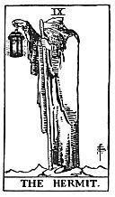

  
[Intangible Textual Heritage](../../index)  [Tarot](../index.md) 
[Index](index)  [Previous](gbt15)  [Next](gbt17.md) 

------------------------------------------------------------------------

[Buy this Book at
Amazon.com](https://www.amazon.com/exec/obidos/ASIN/0766157350/internetsacredte.md)

------------------------------------------------------------------------

*General Book of the Tarot*, by A. E. Thierens, \[1930\], at Intangible
Textual Heritage

------------------------------------------------------------------------

 

#### IX. The Hermit. Sagittarius.

*P*.: "Humanity fulfilling the function of God the Holy Spirit. The
human creative force." Indeed this is clearly Sagittarius for every
astrologer. The author might have mentioned in the same line that the
Hierophant (Leo) represents God the Son.

The Hebrew letter "*Thet* represents a roof and suggests the idea of
safety and protection . . . protection ensured by wisdom." The
astrologer says: the Ninth house is the house of the Master--idea of
wisdom and protection in one; the Master in fact shields his disciples
like a roof . . . in some way.

The sign is that of thought-power, creative mind, idealism, which throw
their own light on the things below, and consequently the Sagittarian is
remarkable for always seeing things in his own light and trying to throw
light on things in order to instruct other people. He is the eternal
traveller, the indefatigable walker. And mentally he is always more or
less lonely. All this is very distinctly symbolised in the card of the
Hermit, which stands for ideas, perspectives, spiritual or moral
influences and for light thrown upon the objects of this earth-life. In
divination it stands for teachers, legal authorities, advisers and
guides, and with the guiding principles in everything and questions, in
relation to the querent.

p. 62

\[paragraph continues\] But above all it
is his own idealism, etc. The direction in which his thoughts are
running.

In the older cards the Hermit is shielding his light on one side with
his mantle. This may be indicative of the habit of Sagittarians to evade
and disarm contradiction beforehand, knowing by intuition the power of
darkness. He is leaning on the staff of knowledge with regard to earthy
matters.

*W*. is perfectly right in saying, that "Prudence is the least of its
meanings and the most negligible." Some authors (*M*.) held this card to
be the symbol of 'prudence,' but indeed the Sagittarian is not very
famous for this virtue, though the card is truly Sagittarian and nothing
else. This is again proved by the striking explanation of *W*.: "His
beacon intimates that 'where I am, you also may be.'" This is the
stereotyped way in which a Sagittarian thinks.

------------------------------------------------------------------------

[Next: X. The Wheel of Fortune. Capricorn](gbt17.md)
