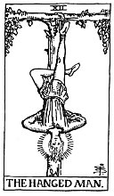
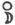
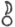

  
[Intangible Textual Heritage](../../index)  [Tarot](../index) 
[Index](index)  [Previous](gbt18)  [Next](gbt20) 

------------------------------------------------------------------------

[Buy this Book at
Amazon.com](https://www.amazon.com/exec/obidos/ASIN/0766157350/internetsacredte)

------------------------------------------------------------------------

*General Book of the Tarot*, by A. E. Thierens, \[1930\], at Intangible
Textual Heritage

------------------------------------------------------------------------

 

#### XII. The Hanged Man. Pisces.

This twelfth sign of house, closing the cycle of the zodiac, means loss
to the outer world, solution, handing over the results of one cycle to
the following one, whence comes the meaning of treachery in common
astrology. This house contains the things which we have not yet mastered
and those whom we have failed to understand or who have failed to
understand us. So either this remains for the next cycle, or it will
tempt us to waste our last forces. In the eyes of the world it is the
sign of waste, spoil, mishap. Viewed from the other side it is the sign
of the *Golem*, in which the outer world loses its importance or even
reality, and the consciousness is opened to inner truth. This is the
reversing of consciousness, which makes things change their significance
in such a way that they appear to turn upside down: the world is now
viewed from the other side. And this is the significance of the hanged
man.'

It is also the sign of Judas, who, as far as the outer world is able to
judge, did not understand the significance

p. 66

of Jesus and handed Him over to His enemies, the most mysterious of the
disciples and apparently the fiend within the circle. What, however, is
his treason or despair when viewed from the other side? It is an act of
'perversion,' the result of human nature being too weak to carry on in
this world the heavy load of spiritual revelation; or even a mystic
message, which till now has never been understood and will never be
understood by the profane world. However this may be, we may feel pretty
sure, that none of the others who remained in this world to preach the
Gospel understood or, let us say rather, underwent the Message like
Judas, who hanged himself.

Well may *W*. say: "It is a card of profound significance, but all the
significance is veiled." Perhaps we might even add: it is the symbol of
the veil itself and of everything that is and remains veiled in this
world, and, in divination, to the querent, *ad hoc*.

*P*. tries to identify the Hanged Man with the Hebrew letter *Lamed*
which "designates the arm" . . . but fails utterly in his effort to
explain this. We should say, if this identification be true, it may be
because of the power to embrace and to execute. The arms *hang*, when
not *raised*. We shall not try to explain it any further here.

The man is shown hanging in a sling on one foot. Astrology teaches that
the feet are ruled by the sign Pisces. The crossing of the legs is a
symbol of 'crossing' in general.

 

Among the other cards of the Greater Arcana, nine of which symbolise
planetary principles and

p. 67

functions, three only are given in full as heavenly bodies: Sun, Moon
and the--(eight-pointed)--'Flaming Star,' while the significance of the
others is clothed in allegorical images.

Now the question why only these three and not the other planetary
principles should have been given in full, is difficult to answer. In a
way the 'Flaming Star' stands for the stars in general and so this
trinity means: Sun, Moon and Stars. On the other hand, ancient priests
and astrologer-initiates appear not to have chosen to communicate more
of the significance of the planets than just a few of their apparent
effects, while in 'Sun, Moon and Star' they strongly expressed the idea
of a Heavenly Trinity, viz. that of the positive or masculine creative
power, radiating life; that of a feminine or negative power, which rules
formation, and of a uniting principle, he it under the name of Law, Love
or Union. The latter was always represented as specifically benefic. It
is evidently the idea of the planet Venus, the beautiful morning and
evening star, which was known to, and adored by, all peoples in all
ages.

This trinity contains more meaning than a superficial astrological
consideration could reveal. From such a standpoint it might even appear
more or less arbitrary. So, for instance, the question might be asked,
Why has not Mercury, nearer to the Sun even than Venus, been chosen as a
member of the trinity? It would take us too far from our main road if we
tried to explain this in detail, but it may be stated that in some
respect the Moon represents and conveys the vibrations of Mercury to the
Earth. The astrological symbols for the visible sun and for the planet
we

p. 68

know under the name of Mercury, but which could as well have been named
Vulcan, should be   and
  respectively instead of
☉ and ☿. I have explained this in another volume. (*Cosmology* II,
*Elements of Astrology*.) Further we might point out, that to the Earth
and its inhabitants, the Sun, the Moon and Venus are, in fact, of some
sort of *primary* importance; the Sun and the Moon (of the Earth) as the
representatives to us of the primary polar powers of the positive and
the negative in Cosmos; Venus as the planet representing the first step
in evolution next to the Earth, consequently of primary importance to
our evolution.

The Sun, Moon and 'Flaming Star' are not only one of the most striking
and beautiful expressions of the Divine Trinity among our present-day
Freemasons, as every handbook on Freemasonry shows us, but have been so
for long ages. A specimen of it is to be found on a couple of
border-stones or steles, put along the frontier of his territory by the
Chaldean king Melichikou (1144-1130 B.C.). [\*](#fn_6) The heads of these steles bear a
representation of the king and his daughter before a goddess (of
Justice?) and above these figures are the images of the Sun, the Moon
and the (eight-pointed) Flaming Star, which evidently mean, that the
king, eventually for the benefit of his daughter as well, invokes the
Heavenly Powers of the Trinity to protect his kingdom against invasion.
Another borderstone with the same figures of Sun, Moon and eight-pointed
Flaming Star, even dates as far back as the year 1380 B.C., under the
reign of King Nazi-Maraddach. So three thousand years ago the three
Heavenly Lights appear to have been

p. 69

bearing the same significance and to have been used in this same mutual
relation as at present in Freemasonry and in our Tarot system. We may
accept this as pretty sure proof of the antiquity of both Freemasonry
and Tarot.

------------------------------------------------------------------------

### Footnotes

[68:\*](gbt19.htm#fr_6) Musée du Louvre, Paris.

------------------------------------------------------------------------

[Next: XIII. Death. Saturn](gbt20)
