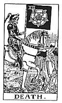

  
[Intangible Textual Heritage](../../index)  [Tarot](../index.md) 
[Index](index)  [Previous](gbt19)  [Next](gbt21.md) 

------------------------------------------------------------------------

[Buy this Book at
Amazon.com](https://www.amazon.com/exec/obidos/ASIN/0766157350/internetsacredte.md)

------------------------------------------------------------------------

*General Book of the Tarot*, by A. E. Thierens, \[1930\], at Intangible
Textual Heritage

------------------------------------------------------------------------

 

#### XIII. Death. Saturn.

The picture speaks for itself--as indeed most of them do--but still
there is more in it than we might suppose at first sight. Beyond all
doubt it is a sort of allegorical representation of Father Chronos,
Time, who, while creating, consumes his own children, and was very often
pictured as a warning of death or a remembrance of mortality. But on the
other hand Time marks the beginning, and birth is not less under his
government than death. The ancient edition of this card shows the figure
harvesting heads and limbs of human bodies upon a field. This may be an
expression of an old superstition, which said that those limbs with
which man sinned would grow out of his grave. Probably a distorted
teaching of the Law of Karma or cosmic reaction, which is also ruled by
Saturn, at least in the execution. And in this function he is the old
God of Israel, whose law was "an eye for an eye and a tooth for a
tooth."

But Saturn is more. He is the planet or cosmic function (let us say
planet for convenience sake) of Formation, which means also
determination in Place and Time, limitation, definition, etc.

Now let us see what *P*. says. He identifies the card with the principle
of the Hebrew letter *Mem*, who "is a woman, the companion of man," and
therefore gives rise to ideas of fertility, formation.

p. 70

\[paragraph continues\] "It is
pre-eminently the material and female, the local and plastic sign, an
image of external and passive action." It is really a great pity, that
this occultist never realised what he was saying, astrologically or
cosmically. "*Mem* is one of the three mother-letters."

Saturn is the ruler of the Tenth house, Capricorn, which as such is
called the house of the 'married woman' in Hindu astrology.

That Saturn, the Christian Satan, has close relations with woman and
even that he used her as his favourite vehicle or agent, is one of the
Christian 'teachings,' in which we recognise distorted or perverted
occult knowledge.

Death certainly is only relative and the death of the form may mean the
commencement of life on another plane. Birth down here may be seen as a
sort of death of a higher existence. "The veil and mask of life is
perpetuated in change, transformation and passage from lower to higher .
. ." (*W*.) Higher to lower as well. *W*. shows the figure on horseback,
which is not inadequate for the ruler of Capricorn, which succeeds to
Sagittarius: action and definition in space and time are born from
thought. ". . . perpetual rebirth of the Being in the domain of Time."
(*P*.)

------------------------------------------------------------------------

[Next: XIV. Temperance. Mercury](gbt21.md)
