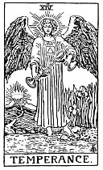

  
[Intangible Textual Heritage](../../index)  [Tarot](../index) 
[Index](index)  [Previous](gbt20)  [Next](gbt22) 

------------------------------------------------------------------------

[Buy this Book at
Amazon.com](https://www.amazon.com/exec/obidos/ASIN/0766157350/internetsacredte)

------------------------------------------------------------------------

*General Book of the Tarot*, by A. E. Thierens, \[1930\], at Intangible
Textual Heritage

------------------------------------------------------------------------

 

#### XIV. Temperance. Mercury.

". . . the Genius of the Sun holding two cups and pouring from the one
into the other the liquor which holds life." (*P*.)--" A winged angel
with the sign of the sun upon his forehead . . . pouring the essences of
life from chalice to chalice." (*W*.) Another version has: ". . . pours
the fluid of Life from a

p. 71

golden vase into a silver one." (*P*.) This is evidently the cosmic
function next to the Sun, messenger of the same: Mercury or Vulcan, lord
of the sphere of Virgo, surrounding the solar Leo-sphere. Other
traditional descriptions confirm this: "It is the symbol of
combinations, working incessantly in all regions of Nature." (*P*.) On
his breast this angel bears a square with inscribed triangle, reminding
us of the passage of the cosmological *Stanzas of Dzyan*, "The Three
fall into the Four," which means the beginning of Manifestation. "Entry
of Spirit into Matter and reaction of Matter upon Spirit." (*P*.) So on
the subject of this card there seems to be perfect understanding.
"Incarnation of Life," *P*. adds. This is Mercury, who has to do with
the distribution of life-currents from the Sun farther on into the
solar-system and from the heart and solar-plexus farther on into our
physical body. The golden vase and the silver one illustrate this
distribution from higher to lower regions.

So this card signifies all sorts of distribution, from the nervous
system and its workings of co-ordination to correspondence by the post
office, letters and communications, and the latter not only limited to
this physical world but extended to other planes of existence. The
function of Mercury is that of the mind in its concrete activities and
imparts knowledge, learning, which after all is the beginning or
potentiality of all our further relations in this world.

*P*. seeks to establish relation between it and the Hebrew letter *Nun*,
which means "the offspring of the female--(we said rightly, that Mercury
has much to do with the Moon)--a son, the fruit of any kind . . . the
image of the being produced or reflected. . ."

p. 72

\[paragraph continues\] Yes: reflection
and above all reproduction. The name 'Temperance' appears to have been
chosen because of the transposition from one plane to another, or one
centre to another, which has much to do with 'time' also. The latter is
the proper reason for naming this principle directly after that of
Saturn.

------------------------------------------------------------------------

[Next: XV. The Devil. Mars](gbt22)
