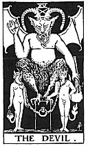

  
[Intangible Textual Heritage](../../index)  [Tarot](../index) 
[Index](index)  [Previous](gbt21)  [Next](gbt23) 

------------------------------------------------------------------------

[Buy this Book at
Amazon.com](https://www.amazon.com/exec/obidos/ASIN/0766157350/internetsacredte)

------------------------------------------------------------------------

*General Book of the Tarot*, by A. E. Thierens, \[1930\], at Intangible
Textual Heritage

------------------------------------------------------------------------

 

#### XV. The Devil. Mars.

The goat-like figure recalls the sign Capricorn in which astrology
teaches that the planet Mars has its exaltation, the name 'devil' means
the evil, as is well known, and this alliteration holds good not only in
English. It is the symbol of that which to exoteric human understanding
is as much of a malefic nature as Venus is benefic. The counterpart of
Venus: Mars, planet of pain and struggle, passion and sex-nature, but
also of the energy necessary for the process of formation and generation
in Nature. Allusion to sex-problems is found in the two human figures,
man and woman, chained to the pedestal on which the diabolic figure is
seated. That sex-nature binds man, is a natural fact of a more or less
occult order.

So it has to do with generation in Nature in every sense and kingdom,
though astrology teaches that Mars has a special connection with the
animal kingdom and animal passion--passion which drives to the
preservation of the body as well as of the race; fighting for existence
in both senses of the term. So Mars always figured as the War-lord. Not
only sexual energy, but every energy in Nature chains the result to the
cause and object to subject. It is unnecessary to work this out any
further. We shall

p. 73

be safe in interpreting this card as energy, desire, lust, war,
struggle, difficulties, pain, loss, etc. But also as exercise, training;
tests to which the personality will be subject.

The torch in the hand of the figure denotes, of course, the fire of
passion and desire, which may rise to anger, etc. So it may well be said
to represent the condition of "Adam and Eve after the Fall" (*W*.) The
struggle for existence, in short.

*P*. in regard to this card points to the Hebrew letter "*Samech* which
expresses the same hieroglyphic sign as the *Zain* (7th arcanum) . . .
etc., a weapon of any kind . . ." We can see, that this generative force
has much to do with the house of marriage.

------------------------------------------------------------------------

[Next: XVI. The Tower. Uranus](gbt23)
