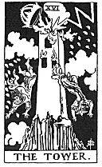

  
[Intangible Textual Heritage](../../index)  [Tarot](../index) 
[Index](index)  [Previous](gbt22)  [Next](gbt24) 

------------------------------------------------------------------------

[Buy this Book at
Amazon.com](https://www.amazon.com/exec/obidos/ASIN/0766157350/internetsacredte)

------------------------------------------------------------------------

*General Book of the Tarot*, by A. E. Thierens, \[1930\], at Intangible
Textual Heritage

------------------------------------------------------------------------

 

#### XVI. The Tower. Uranus.

"Occult explanations attached to this card are meagre and mostly
disconcerting." (*W*.) The reason for this is easily seen: the
principles of Uranus and Neptune were not much known in antiquity save
that they were the general principles of the Heavens (the Air or also
the atmosphere) and the Ocean, and as such we find them in the Pantheon
and in the original Tarot, not yet as the much later discovered planets,
which personify these general cosmic principles. Later ages added very
little, if anything at all, to those original explanations. Still
Ouranos and Poseidon were known in Greece as well as Dourga and Varouna
in India.

And the stone tower struck by a flash of lightning is another version of
the legend of Ouranos mutilating his son Chronos, which means, that
Heaven is not content with a body of fixed dimensions and form, nor any
heavenly force with the limitations put to it

p. 74

by physical authorities or architects. This may warn man, not to build
upon physical existence alone or to think himself safe upon a material
basis, however high and solid it may appear from a material point of
view. The general meaning, however, is not incidental but essential. ".
. . the ruin of the house of life, when evil has prevailed therein"
(*W*.) is one of many possible occurrences; it may signify 'blighted
ambitions and hopes,' etc. (*P*.), but the universal and every day
significance is: the renewal of the form, or rather of embodied life, by
the force of Heaven, and of microcosm by the life of macrocosm, which
incidentally of course breaks up forms here and there, if they are no
longer fit for survival; the house of doctrine as well as every
structure made by vanity, dogmatism and separativeness.

The Hebrew letter *Ayin* is addicted to this card. *P*. utterly fails in
giving any elucidation of this relationship. *W*. has put it very
clearly in this quotation: "Except the Lord build the house, they labour
in vain that build it."

So the card of the Tower signifies the relation between macro- and
micro-cosm and will mean rupture, sudden disillusion, disenchantment,
but also it symbolises intuition, renewal, help from above and clear
insight in relation to vanity and sham projects, illusion and
meaningless formalism.

------------------------------------------------------------------------

[Next: XVII. The Star. Venus](gbt24)
