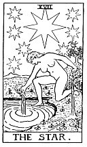

  
[Intangible Textual Heritage](../../index)  [Tarot](../index.md) 
[Index](index)  [Previous](gbt23)  [Next](gbt25.md) 

------------------------------------------------------------------------

[Buy this Book at
Amazon.com](https://www.amazon.com/exec/obidos/ASIN/0766157350/internetsacredte.md)

------------------------------------------------------------------------

*General Book of the Tarot*, by A. E. Thierens, \[1930\], at Intangible
Textual Heritage

------------------------------------------------------------------------

 

#### XVII. The Star. Venus.

"The figure expresses eternal youth and beauty." No astrologer will
hesitate to recognise Venus. "The Star is the *étoile flamboyante*,
which appears in Masonic symbolism, but has been confused herein."
(*W*.) And "gifts of the spirit," which *au fond* means

p. 75

beauty, are the gifts administered by Venus, who in the solar system
hands over the vibrations or 'gifts' coming from the Sun, to our Earth.
The picture on the card shows it quite clearly: a naked girl,
demonstrating undoubtedly the beauty of the human body, symbol of beauty
in the nature of man, pouring "the fluids of Life upon the Earth (and
the sea: i.e. into soul and body--Th.) from two cups, the one of gold
and the other of silver." (*P*.) "The genius of the Sun has now
descended to Earth under the form of this young girl, the image of
eternal Youth." (*P*.) Well, then it is the image of this planet of
beauty and eternal youth, which has its place between the Sun and
Mercury on one side and our Earth on the other, the third
personification of the genius of the Sun. The ibis and the butterfly
connect the idea 'of immortality with this figure, in perfect accord
with the mystic teaching which says, that love extends beyond the grave.

"The *Phe*--identified with this card--expresses the same hieroglyphic
value as the *Beth* (second card), but in a more extended sense." It is
said to represent speech. (*P*.) Now Venus has in so far to do with the
second sign, that it rules this sign. The 'more extended sense' may
perhaps be thought of as this planetary rulership, as "the Word in
action in Nature with all its consequences." (*P*.) Venus could perhaps
be seen in the sense it has in the Gospel of St. John: "The Word which
became the Light of men." Venus indeed is the representative of the
ruler of Light on Earth and in Nature: third aspect of the Solar Logos.

"The Word in action in Nature with all its consequences," we should like
to correct in this way:

p. 76

it is Venus, the ruler of the signs Taurus and Libra, houses of riches,
art, beauty, and of the organised body. In the latter it represents the
Law of Harmony between the Self and the Not-self.

In divination it means of course benefit, well-doing, organisation,
co-operation, love, beauty, peace, concord, etc. The reverse of the card
of Mars. As the contrary of energy it may mean laziness, indolence,
rest, weakness.

------------------------------------------------------------------------

[Next: XVIII. The Moon](gbt25.md)
