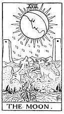

  
[Intangible Textual Heritage](../../index)  [Tarot](../index.md) 
[Index](index)  [Previous](gbt24)  [Next](gbt26.md) 

------------------------------------------------------------------------

[Buy this Book at
Amazon.com](https://www.amazon.com/exec/obidos/ASIN/0766157350/internetsacredte.md)

------------------------------------------------------------------------

*General Book of the Tarot*, by A. E. Thierens, \[1930\], at Intangible
Textual Heritage

------------------------------------------------------------------------

 

#### XVIII. *The Moon*.

Everything that has been said in astrology about the Moon might be
repeated here, as there exists no controversy whatever on the point of
identity. "The card represents life of the imagination apart from life
of the spirit." (*W*.)

This card consequently means the life of the soul in particular, the
feelings and sentiments, emotions (not only fear, etc.), changes wrought
in existence by them, water and the female element in general. In the
horoscopic figure it may be the mother or some other woman prominent in
the life of the querent; it may signify women in general (and morally or
psychically, while Saturn means physical woman). It is the sign of
*panta rei*: everything passing, flowing or ebbing away in life,
consequently uncertainty. It may relate to dreams, to exhibitions,
popular plays, and games, theatres, and to the lower class of people.
Physically it means the brain and the stomach.

The hieroglyphic value of the Hebrew letter *Tzaddi*, connected with
this card, "is the same as that of *Thet* (ninth card) . . . which
perhaps may account for the relationship of the Moon with that

p. 77

house, as pointed out by us before. It should mean a term, an aim, an
end." (*P*.) But this does not make it much clearer.

*P*. has only one good thing on it, and after all this is only on a
particular and not very high level: "Servile spirits (the dog), savage
souls (the wolf), and crawling creatures (the crayfish) are all present
watching the fall of the soul, hoping to aid in its destruction." That
is true. And it may happen to us, that a lower current of the Moon
brings our way people who have no higher aim than to 'aid in our
destruction' even if we ourselves have no intention whatever of
'falling'.

------------------------------------------------------------------------

[Next: XIX. The Sun](gbt26.md)
