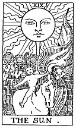

  
[Intangible Textual Heritage](../../index)  [Tarot](../index.md) 
[Index](index)  [Previous](gbt25)  [Next](gbt27.md) 

------------------------------------------------------------------------

[Buy this Book at
Amazon.com](https://www.amazon.com/exec/obidos/ASIN/0766157350/internetsacredte.md)

------------------------------------------------------------------------

*General Book of the Tarot*, by A. E. Thierens, \[1930\], at Intangible
Textual Heritage

------------------------------------------------------------------------

 

#### XIX. The Sun.

"The walls indicate, that we are still in the visible, or material
world." (*P*.) This relates to the picture which shows a child on
horseback--or two children as in the older editions of the card--playing
beneath the bright Sun and evidently within a walled enclosure. So far
so good: we are and we remain in this world. And for the rest the Sun is
the Sun and this card means everything that astrology can tell about the
Sun, in every respect and on all planes. It means the positive or
masculine elements in general, the power and function of will and
concentration, great benefit and mighty protection in spiritual as well
as in mundane life and matters. It may signify the father of the querent
and high authorities, king, president, ruler, etc. The spiritual centre
of man and the centre of importance in everything is indicated by it.
Physically it indicates the heart and the solar-plexus.

The protecting power of the Sun is well illustrated

p. 78

by "the hieroglyphic value of the Hebrew letter *Quoph*, which expresses
a sharp weapon, everything that is useful to man, that defends him and
makes an effort for him." (*P*.).

In a figure laid for divination this card indicates the centre of
interest and that which is fixed, certain, assured and under protection.

------------------------------------------------------------------------

[Next: XX. The Last Judgment. Jupiter](gbt27.md)
