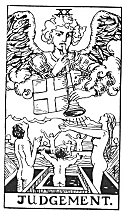

  
[Intangible Textual Heritage](../../index)  [Tarot](../index.md) 
[Index](index)  [Previous](gbt26)  [Next](gbt28.md) 

------------------------------------------------------------------------

[Buy this Book at
Amazon.com](https://www.amazon.com/exec/obidos/ASIN/0766157350/internetsacredte.md)

------------------------------------------------------------------------

*General Book of the Tarot*, by A. E. Thierens, \[1930\], at Intangible
Textual Heritage

------------------------------------------------------------------------

 

#### XX. The Last Judgment. Jupiter.

If Saturn denotes 'death' and the grave, what more natural than that his
counterpart Jupiter should stand for the resurrection from the grave?
While Saturn, Lord of the mineral kingdom, is held to 'kill' by his
crystallising effect, Jupiter, Lord of the vegetable kingdom and of all
that grows and expands and evolves, leading up to sublimation and
elevation, abstraction, etc., afterwards, is first the emblem and
function of *organic life*, later on also those of psychic and spiritual
life above the material existence, barren and naked, from which it
consequently brings deliverance. The latter meaning is chiefly viewed
when symbolising this principle in the card of the Last Judgment. "An
angel sounds his trumpet *per sepulchra regionum* and the dead arise."
(*W*.) Some people say "that it signifies renewal, which is obvious
enough . . ." and "that it is the generative force of the earth and
eternal life." (*W*.) The latter fairly covers our definition of
Jupiter's function. Again *W*. further mentions, that it "is the card
which registers the accomplishment of the great work of transformation."
Which is also in the line of Jupiter, *Io Pater*, 'Our Father that is in
the Heavens.' And every great work needs his co-operation; there is no
important or great work

p. 79

done in this world without Jupiter, the planet of ideals playing a
prominent rôle in it. Ideals, that "are the angel part of us," as
*Zanoni* tells his disciple. So this card stands for ideals, religious,
social or any other and for the elevating effect they have on man; for
ideas and leading motives, aspirations, etc., consequently for
generalisation, illumination, dispersion, elevation, for all that is
honourable on one hand but also for illusions or vain aspirations on the
other hand. It is the sign of deliverance from narrow thought and
hampering conditions in the soul as well as in the body and in life.

The card is identified with the Hebrew letter *Resh*, which "is the head
of man, and it is therefore associated with the idea of all that
possesses in itself an original, determined movement. It is the absolute
sign of motion, good or bad, and expresses the renewal of things with
regard to their innate power of motion."--"Return to the divine
world."--"Vegetable life." (*P*.) Yes. We might say: thought-power and
the idea of motion which it implies and imparts. Jupiter was the first
and chief of the Gods, *Theoi*, Movers.

------------------------------------------------------------------------

[Next: XXI. The World. Neptune](gbt28.md)
