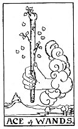

  
[Intangible Textual Heritage](../../index)  [Tarot](../index.md) 
[Index](index)  [Previous](gbt30)  [Next](gbt32.md) 

------------------------------------------------------------------------

[Buy this Book at
Amazon.com](https://www.amazon.com/exec/obidos/ASIN/0766157350/internetsacredte.md)

------------------------------------------------------------------------

*General Book of the Tarot*, by A. E. Thierens, \[1930\], at Intangible
Textual Heritage

------------------------------------------------------------------------

 

#### WANDS

#### Ace

TRADITION: Birth, source, principle, beginning, origin, cause, reason,
creation, invention. Some say also: family, but this is probably to be
taken as 'family-descent,' or parentage or origin of the family, which
is a different idea. Reversed: Fall, perdition, decadence, decline,
ruin, etc.

THEORY: The element of *Air* on the *First house* or ascendant has of
course to do with birth and beginning, because it is the coming through
of the message from above to the regions of the physical plane; the
ascendant indeed is the synthesised appearance of the heavens at the
beginning of . . . whatever it may be, and so this card signifies on one
hand the inflow of light from above into the world of matter and fact,
which can have several meanings. On the other hand, seen from the side
of light itself, it is the 'fall in matter' and the decline of the
higher, as well as the enlightening of the lower. The cards of the airy
element have always and in every instance a double meaning and not only
in the sense of right and reversed, but a meaning on two sides. And
apparently this has been wrongly introduced as 'right' or 'reversed' in
some cases. So the ace of wands will represent the effect of suddenness,
of the incidental, even accidental, showing some appearances of the
planet Uranus. It denotes

p. 89

something that is making its appearance all of a sudden; a sort of
manifestation, creation such as the birth of a child. This, by the way,
is generally considered to be a joy for the parents, etc., but may not
be for the soul, which has to accept once more the limitations of life
in a body of earth. And this is the two-sidedness of the significance.

CONCLUSION: *Birth, beginning, innovation, creation initiative, impulse,
origin, principle, source, cause reason, parentage, handing over of a
message, news revelation, initiation*. On the other hand come the
meanings derived from *fall, decline, descent, depreciation,
profanation, etc*. But it means *that which will happen once only* and
which cannot be taken back.

------------------------------------------------------------------------

[Next: Two of Wands](gbt32.md)
