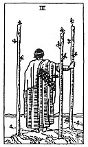

  
[Intangible Textual Heritage](../../index)  [Tarot](../index) 
[Index](index)  [Previous](gbt32)  [Next](gbt34) 

------------------------------------------------------------------------

[Buy this Book at
Amazon.com](https://www.amazon.com/exec/obidos/ASIN/0766157350/internetsacredte)

------------------------------------------------------------------------

*General Book of the Tarot*, by A. E. Thierens, \[1930\], at Intangible
Textual Heritage

------------------------------------------------------------------------

 

#### Three of Wands

TRADITION: Enterprise, effort, essay, trade, commerce, discovery,
usurpation, daring, temerity and also imprudence, interruption,
cessation and 'the end of troubles,' discontinuative.

THEORY: The rather contradictory descriptions of this card's
significance are well explained by its zodiacal position: *Air* on the
*Third house*, which doubles the influence of 'air' and of the mercurial
vibrations and effects. This card has the accent of the suit of wands.
It must consequently denote: communication, reflection and all that
comes from these. This needs little explanation.

CONCLUSION: *Communication, instruction, reflexion, message, writing,
postage and letters, superficial knowledge*,

p. 91

*airiness, passing impressions, discontinuance, interruption, change*,
perhaps a certain amount of *geniality, imprudence* also; neglect or
want of proper attention; as to 'temerity' I should say only in so far
as this means an *easy manner of overcoming obstacles, quick insight;
effort, essay, trade* are correct. Mercury being the God of merchants,
and thieves, this card may relate to *commerce, theft and loss*. "*The
end of troubles*" is indeed well said, because this card gives the key
for their solution and shows the way of escape.

------------------------------------------------------------------------

[Next: Four of Wands](gbt34)
