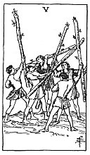

  
[Intangible Textual Heritage](../../index)  [Tarot](../index) 
[Index](index)  [Previous](gbt34)  [Next](gbt36) 

------------------------------------------------------------------------

[Buy this Book at
Amazon.com](https://www.amazon.com/exec/obidos/ASIN/0766157350/internetsacredte)

------------------------------------------------------------------------

*General Book of the Tarot*, by A. E. Thierens, \[1930\], at Intangible
Textual Heritage

------------------------------------------------------------------------

 

#### Five of Wands

TRADITION: Gold, riches, opulence, magnificence, brilliancy, luxury, the
struggle for riches, "physical, philosophical and moral sun." (*P*.) But
also process, trickery, contradiction, discussion, chicane, etc.

THEORY: *Air* on the *Fifth house*: that of the sun. The house of the
heart and of children, of speculation and love affairs, of pride and of
will-power. There is more of the richness of the heart in it than of
material abundance, though generally Leo-people know how to reach the
latter. It is a house of Fire, and the combination of Fire and Air makes
warm air,

p. 93

which may be used to heat rooms, in the same way as words, that contain
warm feelings of the heart, will do good to other people, and on the
other hand hot speech will arouse lively contradiction. Here is the same
mistake: the card is not that of contradiction, but of hot speech, very
positive expression, and contentions, suggestions, rather than
discussion, egocentric thought, from which we may conclude, that it will
evoke contradiction, or some other effect. But we have to do with the
proper meaning of a card itself. It is quite true, that the house Leo
may bring gold and presents. Thought-power taken to heart, or taking its
motives from love and from the desires and wishes of the heart, may very
often be more selfish than reasonable, but it is a real pushing power
and therefore generally is the most helpful element towards attaining
the goal. This, of course, has been the reason for ascribing riches,
etc., to this card.

CONCLUSION: *Egotism, positive speech, contention, persuasion,
suggestion, hot speech, demonstration* (*e.g. of love or desire*);
*pushing power;* all this may lead to *trickery*, to *competition*
perhaps, and to *struggle for riches* certainly; it means *speaking and
thinking to such a self-centred way, that no notice is taken of other
people's standpoint;* consequently *clashing of opinions;* sometimes it
may allude to *gold and presents, but to the promise rather than to the
fact*. There is *little or no evil* in this card. At most it may denote
*stupid and childish persistence in one's own personal opinion, e.g.
wishes*. It has something *sunny* in it and is *good for health and
wealth in a general way*, promoting both, but it *is not* 'riches' in
itself.

------------------------------------------------------------------------

[Next: Six of Wands](gbt36)
