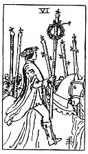

  
[Intangible Textual Heritage](../../index)  [Tarot](../index) 
[Index](index)  [Previous](gbt35)  [Next](gbt37) 

------------------------------------------------------------------------

[Buy this Book at
Amazon.com](https://www.amazon.com/exec/obidos/ASIN/0766157350/internetsacredte)

------------------------------------------------------------------------

*General Book of the Tarot*, by A. E. Thierens, \[1930\], at Intangible
Textual Heritage

------------------------------------------------------------------------

p. 94

 

#### Six of Wands

TRADITION: Servant, inferior, mercenary man, commissioner; interior of a
house, the household; it is also said to denote great news and
expectation, hope and trust, but sometimes not without some misgivings
or a slight apprehension of treachery.

THEORY: It is *Air* on the house of Virgo, the *Sixth*, house of the
servants and work, of exact science and the academy, of health and food,
of the art of decoration and the interior of the house, as well as of
the retail dealer. The element of thought (Air) on the earthy house of
Virgo must naturally bring forth knowledge of every detail and reveal
mistakes or shortcomings; it promotes efficiency, and the latter is one
of the principal meanings of the card. Here again is a double mercurial
expression, so this card must denote special abilities, capacities,
technical insight; moreover food questions and medicine, medicaments and
nursing; practical arrangement of details, but as Virgo "kills the
prophets," this card may contain some or other discrepancy in the
philosophical or logical, theoretical or strictly just side of things.

CONCLUSION: *Knowledge, exact and academical, decorative art,
efficiency, work, servitude and servants, practical solution of
problems, but at the same time perhaps some discrepancy; food, medicine,
treatment, experiment;* it may relate to *persons in every subordinate
position and to retail tradesmen;* the personal attitude under this card
is rather passive and indeed that of *expectation, attention, waiting
for orders or for the result of experiments, for the answer on question
or demand; solicitation*.

------------------------------------------------------------------------

[Next: Seven of Wands](gbt37)
