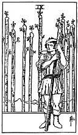

  
[Intangible Textual Heritage](../../index)  [Tarot](../index) 
[Index](index)  [Previous](gbt38)  [Next](gbt40) 

------------------------------------------------------------------------

[Buy this Book at
Amazon.com](https://www.amazon.com/exec/obidos/ASIN/0766157350/internetsacredte)

------------------------------------------------------------------------

*General Book of the Tarot*, by A. E. Thierens, \[1930\], at Intangible
Textual Heritage

------------------------------------------------------------------------

 

#### Nine of Wands

TRADITION: Obstacle, delay, suspense, adversity, slowness, contrariety,
calamity, misfortune, renvoy, trouble.

"The card signifies strength in opposition. If attacked he will meet the
onslaught boldly." (*W*.)

THEORY: The element of *Air* on the *Ninth house*, which is opposite to
that in which the particular accent of the suit of wands lies: Gemini,
the third. This opposition evidently has been the chief motive for the
qualifications given in respect of this card in the past.

There is a good deal in it, but not everything. Of course, if the third
house is the typical expression of the 'message,' the Sagittarian is the
type of the man "who is always in the opposition," but he is more. He is
also . . . himself. This card seems to be queerly veiled. It is at least
strange to find only malific expressions of the co-ordination of the
element Air and the principle of mind with the house of Sagittarius, the
thinker. This looks as if the patrons of the Tarot system did not think
it wise to tell much about this sign of the prophets to the
fortune-telling gypsies. How this may be does not concern. us any
further. Evidently the card must

p. 98

have to do with prophecy, fortune-telling, teaching, conducting, guiding
and the persons of guides, teachers, masters; it must give the notion of
travelling and far-reaching schemes, the faculty of speaking foreign
languages and of writing, but it is true, that the persons indicated by
this card find their "strength in opposition "--as *W*. has it--and very
often therefore are in search of some convenient opponent or opposing
force. It means intellectual chasing, sport, hunting, journalism and the
raising of spirits, that are not easily to be got rid of afterwards. The
latter fact accounts for all that has been said about obstacles, etc.

CONCLUSION: *Teaching, instruction, guidance, teachers, masters, guides.
Planning, travelling, sport; journalism, editors and journalists, public
lecturers, orators; prophecy and predicting*. On the other hand there
may be unruliness, waywardness and unpractical idealism. It is certain
that, where this card appears, much *controversy, contradiction,
antagonism, mental strife*, etc., will be aroused, sometimes more than
would appear necessary. There is also in it *extension of thought,
spreading of news, rumours, preaching, excitement of the people and
revolution*.

------------------------------------------------------------------------

[Next: Ten of Wands](gbt40)
