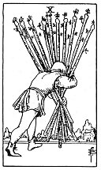

  
[Intangible Textual Heritage](../../index)  [Tarot](../index.md) 
[Index](index)  [Previous](gbt39)  [Next](gbt41.md) 

------------------------------------------------------------------------

[Buy this Book at
Amazon.com](https://www.amazon.com/exec/obidos/ASIN/0766157350/internetsacredte.md)

------------------------------------------------------------------------

*General Book of the Tarot*, by A. E. Thierens, \[1930\], at Intangible
Textual Heritage

------------------------------------------------------------------------

 

#### Ten of Wands

TRADITION: Treachery, duplicity, perfidy, falsehood, disguise,
imposture, conspiration, obstacle, surprise, dissimulation,
contrarieties, difficulties, false-seeming, oppression. ". . . and if
there is question of a lawsuit, there will be certain loss." (*W*.)

THEORY: *Air* on the house of Capricorn: the *Tenth*. It is well known
by astrologers, that the

p. 99

tenth house rules the actions, deeds and attitude. Also the name and
official position of the personality in the world and at the same time
the superiors or authorities, met with on account of position and
activities. Actions and deeds, under the influence of the double-natured
mercurial element, may easily degrade into 'double-dealing' and
everything else of that nature. But once more it appears to us, that the
gypsy tradition is rather too much exclusively on the lower side of
things. The qualities mixed here make very often an egoistic blend and a
nature which reveals several weaknesses, as soon as it comes under
trial. So the card on the one hand means certainly that the attitude of
mind or action will be untrustworthy and must not be relied upon. There
is fear and cowardice in it. But on the other hand the combination is
that of mental ability, quick perception, etc. It means also the load of
the earthy responsibility laid upon the shoulders of an airy creature,
consequently 'oppression' is a word very much to the point here. And
this explains even why weaker natures are driven to undesirable,
unreliable actions and reactions by it; they cannot stand the pressure.
Strong natures, however, accept the pressure as natural necessity,
karma, and carry their burden. This is symbolised by the man carrying
the ten wands. It is a symbol of executive ability, production, the
doing of necessary things, obedience to official order and rule;
officials, 'red tape' and burdens that appear heavier than they actually
are.

CONCLUSION: *Karma, obedience, executive ability, production and
reproduction, necessity; officials and official position*. In weaker
cases: *Duplicity, falsehood*,

p. 100

*unreliability, disguise, double-dealing, false appearance, lies and
false diplomacy, etc. Oppression and overestimating the importance of
things*.

------------------------------------------------------------------------

[Next: King of Wands](gbt41.md)
