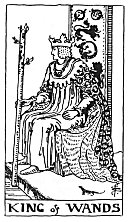

  
[Intangible Textual Heritage](../../index)  [Tarot](../index) 
[Index](index)  [Previous](gbt40)  [Next](gbt42) 

------------------------------------------------------------------------

[Buy this Book at
Amazon.com](https://www.amazon.com/exec/obidos/ASIN/0766157350/internetsacredte)

------------------------------------------------------------------------

*General Book of the Tarot*, by A. E. Thierens, \[1930\], at Intangible
Textual Heritage

------------------------------------------------------------------------

 

#### King of Wands

TRADITION: Country gentleman, man with good intentions and yet severe,
honest and conscientious; may be a peasant or agriculturist. Eteilla
calls him the father. Marriage, union.

THEORY: Higher octave of the ace, lord of the suit of *Air* and the
mind; coming on the *First house*. What may have led to the legend of
calling him a country gentleman and bringing the whole suit of wands
more or less in relation with the country, is not clear. He is the lord
of the intellectual kingdom, consequently he may denote every authority
or personality of primary importance in some or other intellectual,
mercurial or mercenary line. It must be some one representing a high
authority himself or uniting opposite interests, while he himself, on
account of the same authority he represents, may not or cannot be
contradicted.

Now we want to put in a remark here concerning the court or personal
cards in general: in the practice of divination they are generally taken
to indicate persons, and this comes out very often right enough. Still
they ought first to be considered as principles; the personification of
these principles in men and women comes in the second place only, but is
important, of course, in our daily life. So the King of Wands must
represent intellectual authority, mastership in the domain of the mind,
trade and language.

p. 101

CONCLUSION: *A governor, director of business, high official,
postmaster, solicitor, manager, independent trader, Secretary of State,
and the principles or functions for which they stand. The house of Mars
imparts austerity, security and generally initiative and honesty; in
weak cases there may be, however, some doubt with regard to his absolute
integrity. He may be the authority, who concludes a union, viz. notary,
clergyman or civil authority. In the church he is the High Priest, in
the lodge the Grand Master*.

------------------------------------------------------------------------

[Next: Queen of Wands](gbt42)
