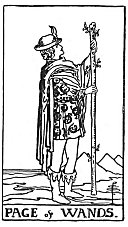

  
[Intangible Textual Heritage](../../index)  [Tarot](../index.md) 
[Index](index)  [Previous](gbt42)  [Next](gbt44.md) 

------------------------------------------------------------------------

[Buy this Book at
Amazon.com](https://www.amazon.com/exec/obidos/ASIN/0766157350/internetsacredte.md)

------------------------------------------------------------------------

*General Book of the Tarot*, by A. E. Thierens, \[1930\], at Intangible
Textual Heritage

------------------------------------------------------------------------

 

#### Page of Wands

TRADITION: Stranger, unknown man, young man in search of somebody,
extraordinary or at least uncommon man; postman, envoy, dark young man,
faithful lover. Further it denotes an announcement, instruction, advice,
tale, lesson, advertisement, something wonderful, unexpected, admirable,
unusual. A notion as well as a miracle. News.

THEORY: We have to keep in mind, that the page of *Air* relates to the
*Third* and to the *Eleventh house* both. Some of the indications show
the mark of

p. 103

aquarian, i.e. uranian parentage, others are purely mercurial. The pages
always cover the meaning of houses of Air, as we have seen the page of
the airy element--wands--is the most airy of them all. The
interpretation is easy enough, and the renderings are quite correct,
with the exception of one item: we can never see this page as a
'stranger' but rather as an acquaintance, a friend, conforming to the
connection with the eleventh house. That with the Third house even may
bring his personal standing nearer to the querent, viz. as a brother or
schoolmate.

CONCLUSION--(From the Third house): *A brother, schoolmate, messenger,
postman or envoy, functionary or official of subordinate position,
generally a younger man, sometimes on an errand; messages, letters,
communications, teaching, instruction, lesson, advertisement, advice,
announcement. News*. (From the eleventh house): *A friend, some one in
business relation with the querent, or with whom he agrees. Telegraph,
telephone and wireless. Intuitive connection, telepathy, invention.
Helpful influences in general, helpful people of all sorts, tradesmen,
purveyors, etc*.

------------------------------------------------------------------------

[Next: Knight of Wands](gbt44.md)
