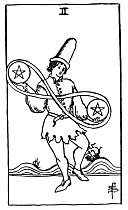

  
[Intangible Textual Heritage](../../index)  [Tarot](../index) 
[Index](index)  [Previous](gbt45)  [Next](gbt47) 

------------------------------------------------------------------------

[Buy this Book at
Amazon.com](https://www.amazon.com/exec/obidos/ASIN/0766157350/internetsacredte)

------------------------------------------------------------------------

*General Book of the Tarot*, by A. E. Thierens, \[1930\], at Intangible
Textual Heritage

------------------------------------------------------------------------

 

#### Two of Pentacles

TRADITION: Embarrassment, obstacles, obstruction, emotion, confusion,
difficulty, hindrance, unrest, etc. Reversed it is given as message,
writing, doctrine,

p. 107

literature, work, book, production, composition, epistle, elements,
principles; cheques. Another version gives: "A card of gaiety,
recreation and its connections." (*W*.)

THEORY: The *Fire* on the *Sixth house*, the house of Virgo. Now here
the so-called reversed meanings in the tradition seem to hold the most
current significances of this house. Which once more warns us against
attaching too great, if any, importance to the idea of 'reversed'
position. The tradition does not give a very clear conception here, on
the whole. The word 'emotion' is not in its place; as to embarrassment,
this is correct: the influence of the sunny and Venusian fire on this
house of infinite possibilities must naturally cause 'embarras du
choix,' the difficulty of choice, and the one possibility hindering the
other; giving too much force and attention to little or subordinate
things and persons. There can be very little harm, however, in any card
of the pentacles suit; the greatest evil done here might be that too
little profit is earned in proportion to the labour given to it. On the
other hand this card must necessarily mean good and conscientious work
and fidelity of servants, agreeable and satisfactory work, reasonable
remuneration, and consequently joy. The agreeable stimulation which it
gives to the nervous system must cause gaiety, recreation, etc. Good
health is also one of the results.

CONCLUSION: *Good work, reasonable satisfaction, satisfactory results,
agreeable occupations, but a warning to use economy in the display of
one's forces, means, money and health; difficulty of choice;
trustworthy* 

p. 108

*and good servants; good treatment of same; joy, gaiety, recreation,
etc. Feeling of physical well-being. It must denote also machinery,
technics, abilities in these*.

------------------------------------------------------------------------

[Next: Three of Pentacles](gbt47)
