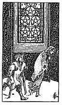

  
[Intangible Textual Heritage](../../index)  [Tarot](../index.md) 
[Index](index)  [Previous](gbt48)  [Next](gbt50.md) 

------------------------------------------------------------------------

[Buy this Book at
Amazon.com](https://www.amazon.com/exec/obidos/ASIN/0766157350/internetsacredte.md)

------------------------------------------------------------------------

*General Book of the Tarot*, by A. E. Thierens, \[1930\], at Intangible
Textual Heritage

------------------------------------------------------------------------

 

#### Five of Pentacles

TRADITION: Lover, mistress, also husband and wife, friend, beloved
person. Accord, convenience, well-being, affinity. Reversed they give:
Bad conduct, ruin even, confusion, disorder, discord, dissipation,
chaos, profligacy. Mr. *W*. says: "It foretells material trouble above
all."

THEORY: The latter saying of Mr. *W*. is probably correct in any case,
but we do not agree that the different renderings "cannot be
harmonised." The *Fire* of the heart on the *Ninth house*, that of
Sagittarius, explains them all without difficulty. It is the emanation
of love, which makes practically the lover and the mistress, e.g.
husband and wife, when regularised by civil law, and friends, when
between persons of the same sex, sympathy and popularity, enthusiasm,
hopefulness, love of travelling, roaming about, which in weaker cases
easily leads to Bohemian habits, carelessness, disorder and so on.
Society will call this in many cases bad conduct, and find much to
criticise. That the expansive nature indicated

p. 111

by this card causes 'material troubles above all,' is evident, because
it means that more is given out than received, which in matters of this
material world does in fact bring troubles. But of a sort that may be
easily forgiven, and helped, if not carried too far.

CONCLUSION: *Emanation, expansion, love-making and the consequences:
lover, mistress, husband, wife, friend; sympathy, popularity,
enthusiasm, hopefulness, well-being, affinity. Expenses, material
troubles, and in weak cases: disorder, vagrancy, roaming about without
aim, waywardness, bad conduct, profligacy, confusion, etc. It is sure to
indicate love outside the lines of a legal marriage. Strong
individualism, which however is probably ruled by a strong will and a
good heart. Brilliancy, but sometimes lack of the sense of
responsibility. Travelling or emigration will do much good*.

------------------------------------------------------------------------

[Next: Six of Pentacles](gbt50.md)
