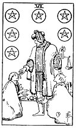

  
[Intangible Textual Heritage](../../index)  [Tarot](../index) 
[Index](index)  [Previous](gbt49)  [Next](gbt51) 

------------------------------------------------------------------------

[Buy this Book at
Amazon.com](https://www.amazon.com/exec/obidos/ASIN/0766157350/internetsacredte)

------------------------------------------------------------------------

*General Book of the Tarot*, by A. E. Thierens, \[1930\], at Intangible
Textual Heritage

------------------------------------------------------------------------

 

#### Six of Pentacles

TRADITION: The present, the actual moment, to-day; a witness,
contemporary, attention, good care, vigilance. Presents, gifts,
gratifications, prosperity. Reversed it is said to denote: Cupidity,
jealousy, desire, passion, lust and researches.

THEORY: The *Fire* of the heart on the house of Capricorn, *the Tenth*,
which is the house of the act, the deed, actuality, position and name,
superiors and authorities. Moreover it denotes the actual time in the
horoscope. The descriptions given by tradition are consequently correct
and to the point. We may add, that here, in this combination, the
heart's desire and wish, the impulses to speculate and to

p. 112

create, to make love and to do good, all become active and acute. So
this must be a card of practical things, which for the greater part will
be of a benefic nature. Good action, which may include the fulfilment of
duty as well as giving presents and alms. It means putting the heart
into your action, working, acting, doing with much pleasure, conviction
and self-confidence. This makes success almost certain. It means
good-will and noble intention proved by gracious, charitable or useful
action.

CONCLUSION: *Good, useful, charitable action, duty well executed, even
where not prescribed by written law or order; sense of moral duty;
charity, well-doing; presents, gifts, prosperity, fruitfulness. Things
being duly and well paid. Good selling. The seizing of opportunity.
There is advantage in acting at once. The present moment, to-day. In
weak cases there may be of course some sort of speculating on other
people's charity or presents, consequently something like desire,
cupidity, etc*.

------------------------------------------------------------------------

[Next: Seven of Pentacles](gbt51)
