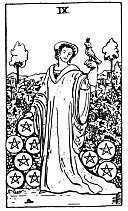

  
[Intangible Textual Heritage](../../index)  [Tarot](../index.md) 
[Index](index)  [Previous](gbt52)  [Next](gbt54.md) 

------------------------------------------------------------------------

[Buy this Book at
Amazon.com](https://www.amazon.com/exec/obidos/ASIN/0766157350/internetsacredte.md)

------------------------------------------------------------------------

*General Book of the Tarot*, by A. E. Thierens, \[1930\], at Intangible
Textual Heritage

------------------------------------------------------------------------

 

#### Nine of Pentacles

TRADITION: Effect, realisation, accomplishment; positive certain
fulfilment of what is presaged by the neighbouring cards, succeeding.
Reversed it is said to give: Deception, bad faith, vain hope, idle
promise, etc.

p. 116

THEORY: It is the *Fire* on the *ascendant*, *First house*, and
consequently must be very positive in its meaning and effect. The word
'effect' is correct here and everything in the meaning of this card must
be positive in its nature. There may be some conceit and
self-satisfaction, but not without goodness of heart; self-centredness
rather. The person indicated by this card must be a good sportsman and
honest above all. So we can see no reason whatever, even in weak cases
for addictions such as 'bad faith,' etc. Neither can we see 'prudence'
in it, as one version has it. The force in it does not tolerate
contradiction nor delay, does not reason, but acts at once.

CONCLUSION: *Honesty, positive attitude, sport, self-centredness and
confidence in one's self, self-reliance, certitude, accomplishment,
directness, no attention paid to other people's standpoint. Means to the
querent: go ahead, you will succeed. Prompt arrival of things. Strong
affirmative answer on questions. The effect is certain*.

------------------------------------------------------------------------

[Next: Ten of Pentacles](gbt54.md)
