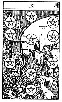

  
[Intangible Textual Heritage](../../index)  [Tarot](../index.md) 
[Index](index)  [Previous](gbt53)  [Next](gbt55.md) 

------------------------------------------------------------------------

[Buy this Book at
Amazon.com](https://www.amazon.com/exec/obidos/ASIN/0766157350/internetsacredte.md)

------------------------------------------------------------------------

*General Book of the Tarot*, by A. E. Thierens, \[1930\], at Intangible
Textual Heritage

------------------------------------------------------------------------

 

#### Ten of Pentacles

TRADITION: The house and the household, economy, gain, riches, family
matters, archives. Building --a castle as well as a hut--vessel, ship,
race, posterity. Fortune, game. Reversed it is said to give: Fatality,
destiny, opportunity, fate, gratification, dowry, pension. Also
decision.

THEORY: The element *Fire* on the house of Taurus, *the Second*,
confirms again the remarkable correctness of tradition, without giving
the astrological key to the significance. Naturally this card must have
to do with economy, gain, riches, fortune, etc., while

p. 117

\[paragraph continues\] Taurus, as the
vast field of action in the universe, actually procures that which is
called 'opportunity.' The influence of Venus and the Sun on the second
house is very favourable for art as well as for monetary matters. So
this must be a card of a great artistic value, foretelling success in
music and painting and an immense love of the beautiful. It indicates
possession without drawback or danger, domains, land, estates, but more
the 'possession' than the 'house' as such, and probably this has been
more or less mixed up in the past, because one saw a possession
consisting in a house, a castle, even a ship, etc. These very intricate
constructions themselves, however, cannot be under the rule of the vast
and monotonously extensive house of Taurus. The card must stand for
banking or insurance house, and favour both trades: banking and
insurance. It promises prosperity by means of economy, agriculture,
perhaps art-dealing. Further every collective possession.

CONCLUSION: *Fortune, riches, favourable chance in monetary matters,
economy, agriculture, art, specially music and painting, may give a
beautiful voice, advantage in worldly affairs, possessions, specially
domains, land, property; banking, insurance, art-dealing. In weak cases
the card may indicate laziness, idleness, dull luxury and the
degenerating influence of an existence without trouble or exertion: it
is like full midsummer in human life. There may be some fatality in it.
You cannot escape this good ripe fruit of karma, nor the fullness of
Nature at its height. The attitude of the wise must be: to enjoy*.

------------------------------------------------------------------------

[Next: King of Pentacles](gbt55.md)
