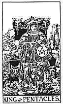

  
[Intangible Textual Heritage](../../index)  [Tarot](../index) 
[Index](index)  [Previous](gbt54)  [Next](gbt56) 

------------------------------------------------------------------------

[Buy this Book at
Amazon.com](https://www.amazon.com/exec/obidos/ASIN/0766157350/internetsacredte)

------------------------------------------------------------------------

*General Book of the Tarot*, by A. E. Thierens, \[1930\], at Intangible
Textual Heritage

------------------------------------------------------------------------

p. 118

 

#### King of Pentacles

TRADITION: Dark man, banker, trader, speculator, mathematician, master,
professor. Success in mathematics and science in general. Reversed there
are given: Vice, weakness, corruption, deformity, etc.

THEORY: Very often the 'reversed' meanings are nothing else but the
expression of the lack of the quality given as 'right.' But this
scarcely seems worth taking into account, because all qualities, which
are not indicated are wanting, and moreover there are cards which
decidedly indicate vices, as will be shown.

The King is the higher octave of the ace, and this particular king heads
the cross of fixed signs, so has to do with economy, agriculture, art,
vast business, devotional service of the church. The general effect of
this card must consequently be to afford protection, and as it shows a
very favourable attitude on the part of superiors or influential people,
though these will be rather young, or at least, not very old. There is
above all noblesse in this card, integrity, honesty above all doubt, nor
is anything in it which can be turned to evil, were it thrice reversed.
The only sort of faults that could be observed in people coming under it
would be pride coupled with some vanity, love of pomp, gambling. The
Leo-type will naturally dominate the card. Here is a man whom you must
go to see and visit, because he will never come to you. He has a
widespread influence, which is for the good of everybody who wishes to
profit by it, and against which it is hopeless to contend. The card
means further everything in the way of sanction,

p. 119

agreement, consent, etc., and gives success in love-affairs and
marriage.

CONCLUSION: *Noble, good and honest man; generally of influential
position, central power, honourable intentions, whom you may trust, but
whom you cannot counteract successfully; whom you must go out to meet
and whom you must not expect to come and visit you. May be banker,
speculator, gambler, commander, general or manager. Benefic influence,
wealth, luxury, good cheer. In weak cases vanity, pride. Success in
mechanics and machinery*.

------------------------------------------------------------------------

[Next: Queen of Pentacles](gbt56)
