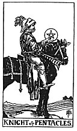

  
[Intangible Textual Heritage](../../index)  [Tarot](../index) 
[Index](index)  [Previous](gbt57)  [Next](gbt59) 

------------------------------------------------------------------------

[Buy this Book at
Amazon.com](https://www.amazon.com/exec/obidos/ASIN/0766157350/internetsacredte)

------------------------------------------------------------------------

*General Book of the Tarot*, by A. E. Thierens, \[1930\], at Intangible
Textual Heritage

------------------------------------------------------------------------

 

#### Knight of Pentacles

TRADITION: Utility, advantage, serviceableness, profit, interest, gain,
importance, necessity. Reversed it is said to give: Repose,
tranquillity, apathy, inertia, idleness, discouragement; also
recreation, etc.

THEORY: The Fire on the *Eighth* and on the *Fourth house*, personified.
The traditional renderings are not bad but far from complete. The eighth

p. 122

house is that of our debts, money of other people and of the dead in
particular. So the querent may profit by legacies or inheritance.
Consequently the benefic influence on the weak point in our material
conditions may be interpreted as: advantage, interest, etc. But the
knight is always a personification, too, and this is not given in the
traditional interpretation. We must see him as a person who is obliging,
carrying out a will, coming to the aid of the querent, secretly or
confidentially perhaps, at least not publicly, visiting him in his
house, saving him from material and financial troubles. It may be a
loan, inheritance or advance, but without any hard conditions connected
with it, so it may be a present. On the other hand the houses mentioned
give the tendency to retire from the outer world; this accounts for
renderings such as 'inactivity, inertia,' etc. . . . We should say, it
means the tendency to enjoy the good things of the heart(s) within one's
own private or family circle, in repose, in some retreat, secretly. In
weak cases there may be some danger of degeneration into idleness or
indolence, etc. In connection with the fourth house, ruling family
matters and the past, the home and the storehouse (of memory, e.g.) the
card must have to do with pleasant memories, recollections, people we
have known before; collections and collecting.

CONCLUSION: *A good help, discreet aid in financial difficulties, paying
of debts; advantage, interest, etc. And the person who brings these to
the querent. Loan, inheritance, advance, present. Happy memories,
collections and collecting, recollection; savings. Persons whom we have
known before or who stand in a neare*r 

p. 123

*relation to us than is known or announced publicly. In weak cases:
indolence, secret enjoyment, idleness, stagnation, etc*.

------------------------------------------------------------------------

[Next: Ace of Cups](gbt59)
