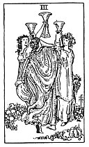

  
[Intangible Textual Heritage](../../index)  [Tarot](../index.md) 
[Index](index)  [Previous](gbt60)  [Next](gbt62.md) 

------------------------------------------------------------------------

[Buy this Book at
Amazon.com](https://www.amazon.com/exec/obidos/ASIN/0766157350/internetsacredte.md)

------------------------------------------------------------------------

*General Book of the Tarot*, by A. E. Thierens, \[1930\], at Intangible
Textual Heritage

------------------------------------------------------------------------

 

#### Three of Cups

TRADITION: Success, happy issue, lucky solution, victory,
accomplishment, cure, healing, fulfilment. Matter in plenty, perfection,
merriment. Reversed it is said to denote: Expedition of affairs,
dispatches, achievements, end, conclusion, etc.

THEORY: The *Water* on the house of friends, *the Eleventh*, must bring
concord, etc. Friendship, but on this airy house more platonic than that
of the foregoing card. It is the house of surroundings so far mastered
by the Ego and on this account 'friendly.' So the soul-life in
surroundings that have been mastered will enjoy desirable and 'good'
conditions and feel 'happy.' There is no feeling whatever of being
hampered or thwarted, or depressed. All goes well and the general
sensation is cheerful. It is the sign of a good time, good luck and
general satisfaction. As the eleventh house also rules the blood, it is
very favourable for health and eventual recuperation. Moreover this
house has to do with commerce and business, and the card favours them
beyond a doubt, giving a good understanding of opportunity and of the
character and wishes of those with whom we have to do, so that we can
supply what they ask.

CONCLUSION: *'A good time,' favourable opportunities, commercial and
intellectual friendship, success*,

p. 126

*good issue of everything; good health and eventual recuperation,
healing. Being in good relations with people. Light-heartedness, joy,
holidays*.

------------------------------------------------------------------------

[Next: Four of Cups](gbt62.md)
