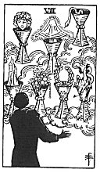

  
[Intangible Textual Heritage](../../index)  [Tarot](../index) 
[Index](index)  [Previous](gbt64)  [Next](gbt66) 

------------------------------------------------------------------------

[Buy this Book at
Amazon.com](https://www.amazon.com/exec/obidos/ASIN/0766157350/internetsacredte)

------------------------------------------------------------------------

*General Book of the Tarot*, by A. E. Thierens, \[1930\], at Intangible
Textual Heritage

------------------------------------------------------------------------

 

#### Seven of Cups

TRADITION: Thought, soul, spirit, intelligence, idea, memory,
imagination, conception, meditation, contemplation, reflexion,
deliberation, views, opinion. Reversed: Project, intention, desire,
wish, resolution, premeditation. Another version has: "Fairy favours . .
. things seen in the glass of contemplation; some attainment in these
degrees but nothing permanent or substantial is suggested." (*W*.)

p. 130

THEORY: If we eliminate 'soul . . . spirit . . . and desire,' words too
far apart from the original meaning, we find in tradition a very pure
rendering of the effects of the *Water* of the soul on the house of
Gemini, *the Third*, the house of the changeful concrete mind and
thought in which indeed nothing is permanent, and everything is passing,
ephemeral. These effects must be very varied, including the most
fantastic plans and conceptions, and 'fancy' is the most fitting word
for this card. It will denote many intellectual proceedings and has to
do with travelling for short distances, sight-seeing, considering,
gathering impressions, etc. The word 'reflexion' is really quite
appropriate in its place here, because the card represents the
conditions of mind in which the surroundings are simply reflected in the
soul. There may come seductive and suggestive images, some of which may
be realised, but others will remain just fancy. The description which is
given by *W*. is very accurate and points to the fact, that under the
third house come nature-spirits and genii, who will eventually help,
guide or mislead man.

CONCLUSION: *Thoughts, intelligence, ideas, imagination, plans,
suggestions, fancy, fantasy; reflexions and opinions, deliberations and
intentions. Much in this card will not come into physical reality. Short
travels, sight-seeing, impressions, views. Changefulness, unstable
conditions. Promise and surprise, but always much more promise than
fulfilment. 'Fairy favours.'* 

------------------------------------------------------------------------

[Next: Eight of Cups](gbt66)
