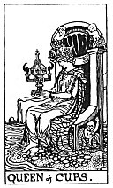

  
[Intangible Textual Heritage](../../index)  [Tarot](../index) 
[Index](index)  [Previous](gbt69)  [Next](gbt71) 

------------------------------------------------------------------------

[Buy this Book at
Amazon.com](https://www.amazon.com/exec/obidos/ASIN/0766157350/internetsacredte)

------------------------------------------------------------------------

*General Book of the Tarot*, by A. E. Thierens, \[1930\], at Intangible
Textual Heritage

------------------------------------------------------------------------

 

#### Queen of Cups

TRADITION: Fair woman, good honest and devoted; virtuous and one who
will do service to the querent; another version says: "Loving
intelligence, and hence the gift of vision; success, happiness,
pleasure, also wisdom, virtue." (*W*.) Reversed: Vice, corruption,
scandal, etc. A rich marriage.

THEORY: The personification of the soul on the house of Capricorn, the
*Tenth*, manifesting into the world that which it carries. As such this
queen is to us the image of the married woman and the mother and of all
that which woman can give to man and mankind, by her virtue both of soul
and body. So the card must also mean the realisation of hopes and
wishes, consequently success, etc. The 'wisdom'

p. 136

is here more of the practical blend, usefulness, knowing how to act with
care and prudence. The card may represent a woman, or an impersonal
power or authority, whom the querent has to obey, or to whom it will be
to his advantage to submit. It expresses a tendency to go out into the
world and make a name and position for oneself, and indicates the right
moment to do so. It is fairly certain that it will ensure some
publicity, renown, fame, or even glory or theatrical success, but of
'scandal' we see no indication whatever in the card itself, though of
course 'publicity' connected with very evil influences might end in
something like that. In such cases, however, we must not ascribe the
effect to the card, which means publicity, but to that of the evil
influences. It is a mistake, which we very often meet in the traditional
interpretations, to ascribe effects, resulting from certain combinations
of influences to one card which is only one of the composing causes.

CONCLUSION: *A good, intelligent, active and practical woman (may be
fair), whom the querent will do well to obey and who deserves his full
esteem. Type of the married woman and mother. Careful and attentive, of
much use to the querent. Loving intelligence; and practical wisdom.
Success, pleasure, happiness, virtue. Natural growth, promotion in the
world, position and name, fame or renown*.

------------------------------------------------------------------------

[Next: Page of Cups](gbt71)
